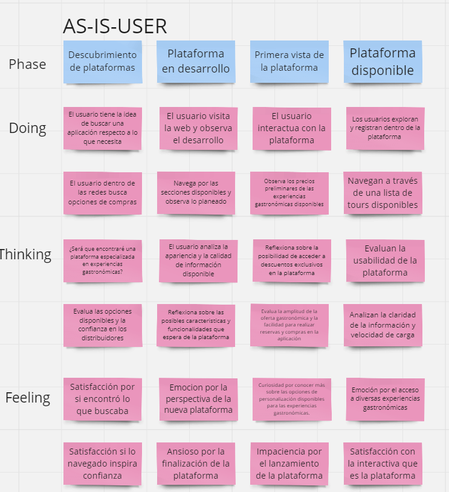
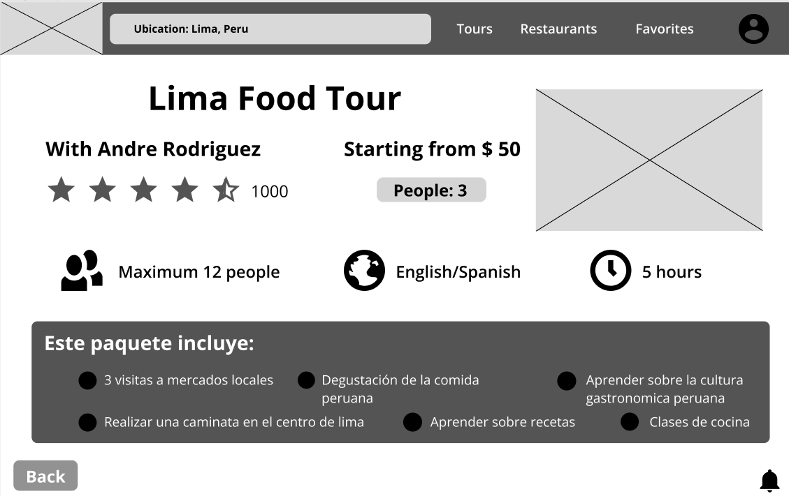
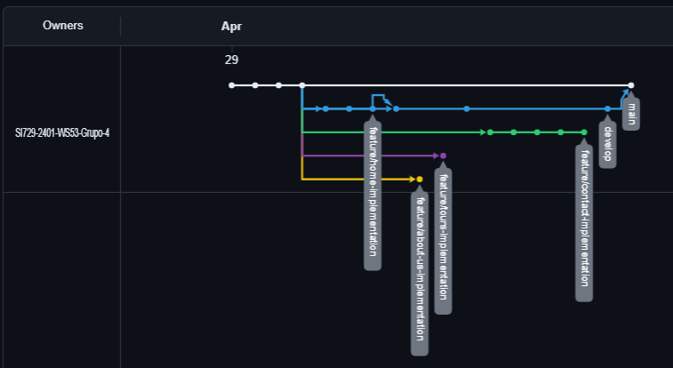
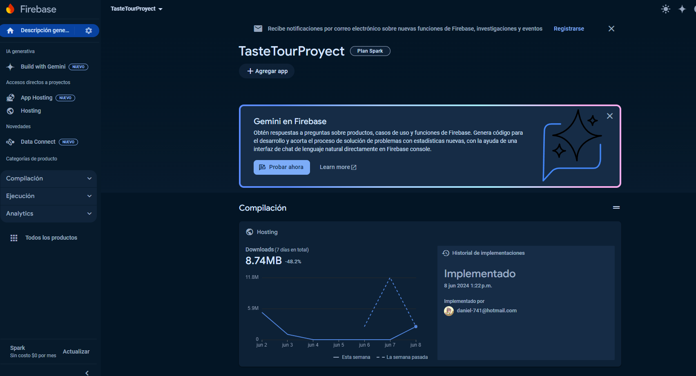
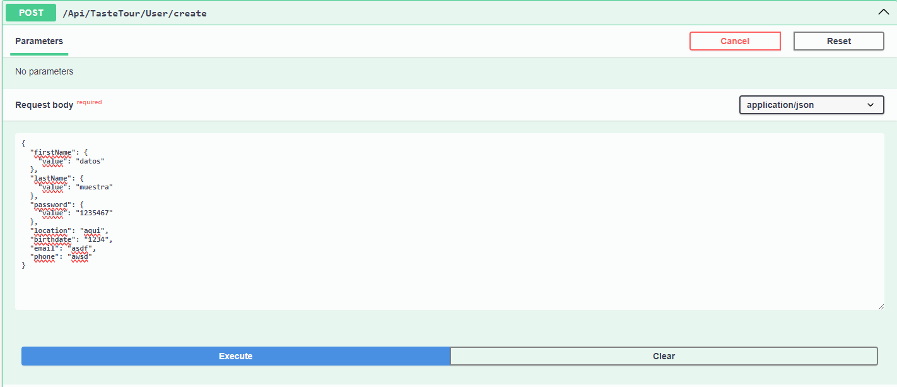
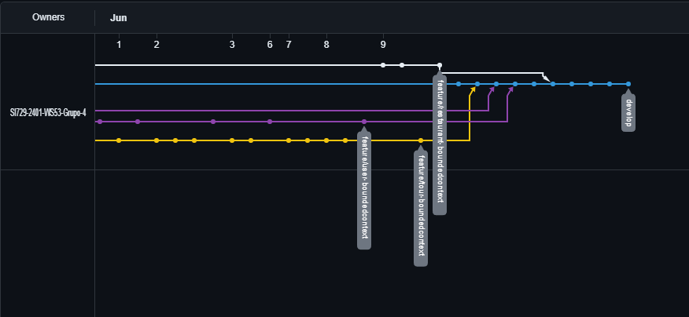
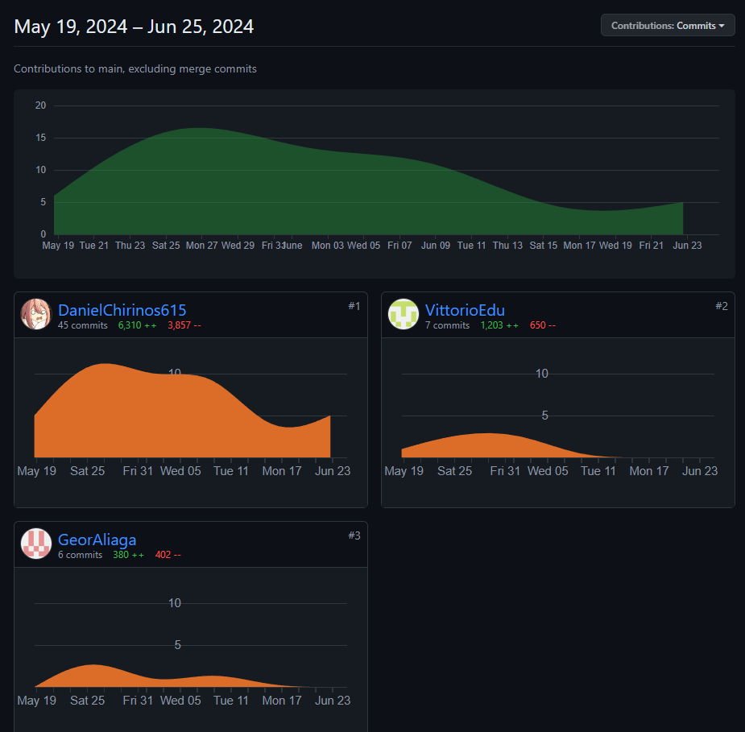

<h3 align="center"> Universidad Peruana de Ciencias Aplicadas </h3>

<h3 align="center"> Ingeniería de Software </h3>
<h3 align="center"> Ciclo 2024 - 1 </h3>

 

  

 

<h1 align="center"> TF Report </h1>

<h3 align="center"> Desarrollo de Aplicaciones Open Source - WS53 </h3>

<h3 align="center"> Docente: Juan Antonio Flores Moroco </h3>

| Member                           |    Code    |
| :------------------------------- | :--------: |
| Aliaga Pimentel, George Arturo   | U20211c273 |
| Chirinos Arevalo, Daniel Rodrigo | U202019577 |
| Vittorio Marcelo Eduardo Espinoza| u20231b547 |

<h3 align="center">2024</h3>

  

# Registro de Versiones del Informe

| Versión | Fecha | Autor | Descripción de modificación |
| :-----: | :---: | :---: | :-------------------------- |
|    TB1     |   08/04    |   Aliaga Pimentel George Arturo, Chirinos Arevalo Daniel Rodrigo, Vittorio Marcelo Eduardo Espinoza    |     Se estableció la solución propuesta, se realizó un análisis Lean UX, se definió el segmento objetivo y se recopilaron los requisitos necesarios para desarrollar las herramientas necesarias (User persona, User story, Product Backlog, Impact Mapping, entre otros) y se implementó la landing page. |
|    TP     |   28/04    |   Aliaga Pimentel George Arturo, Chirinos Arevalo Daniel Rodrigo, Vittorio Marcelo Eduardo Espinoza    |     Se corrigieron las observaciones dadas por el profesor y se realizó el frontend de acuerdo a los user stories establecidos. |
|    TB2     |   09/06    |   Aliaga Pimentel George Arturo, Chirinos Arevalo Daniel Rodrigo, Vittorio Marcelo Eduardo Espinoza  |     Se corrigieron las observaciones dadas por el profesor del trabajo parcial, tambien se realizó el avance de componentes de la Backend, dividiendolo en base a bounded context. |
|    TF     |   25/06    |   Aliaga Pimentel George Arturo, Chirinos Arevalo Daniel Rodrigo, Vittorio Marcelo Eduardo Espinoza  |     Se finaliza el proyecto final con todos los artefactos deseados. |

  

# Project Report Collaboration Insights

<td></td>

# Contenido

## Tabla de Contenidos

### [Registro de versiones del informe](#registro-de-versiones-del-informe)

### [Project Report Collaboration Insights](#project-report-collaboration-insights)

### [Contenido](#contenido)

### [Student Outcome](#student-outcome-1)

### [Capítulo I: Introducción](#capc3adtulo-i-introduccic3b3n-1)

- [1.1. Startup Profile](#11-startup-profile)
  - [1.1.1. Descripción de la Startup](#111-description-de-la-startup)
  - [1.1.2. Perfiles de integrantes del equipo](#112-perfiles-de-integrantes-del-equipo)
- [1.2. Solution Profile](#12-solution-profile)
  - [1.2.1 Antecedentes y problemática](#121-antecedentes-y-problemática)
  - [1.2.2 Lean UX Process](#122-lean-ux-process)
    - [1.2.2.1. Lean UX Problem Statements](#1221-lean-ux-problem-statements)
    - [1.2.2.2. Lean UX Assumptions](#1222-lean-ux-assumptions)
    - [1.2.2.3. Lean UX Hypothesis Statements](#1223-lean-ux-hypothesis-statements)
    - [1.2.2.4. Lean UX Canvas](#1224-lean-ux-canvas)
- [1.3. Segmentos objetivo](#13-segmentos-objetivo)

### [Capítulo II: Requirements Elicitation & Analysis](#capc3adtulo-ii-requirements-elicitation--analysis-1)

- [2.1. Competidores](#21-competidores)
  - [2.1.1. Análisis competitivo](#211-análisis-competitivo)
  - [2.1.2. Estrategias y tácticas frente a competidores](#212-estrategias-y-tácticas-frente-a-competidores)
- [2.2. Entrevistas](#22-entrevistas)
  - [2.2.1. Diseño de entrevistas](#221-diseño-de-entrevistas)
  - [2.2.2. Registro de entrevistas](#222-registro-de-entrevistas)
  - [2.2.3. Análisis de entrevistas](#223-análisis-de-entrevistas)
- [2.3. Needfinding](#23-needfinding)
  - [2.3.1. User Personas](#231-user-personas)
  - [2.3.2. User Task Matrix](#232-user-task-matrix)
  - [2.3.3. User Journey Mapping](#233-user-journey-mapping)
  - [2.3.4. Empathy Mapping](#234-empathy-mapping)
  - [2.3.5. As-is Scenario Mapping](#235-as-is-scenario-mapping)
  - [2.4. Ubiquitous Language](#24-ubiquitous-language)

### [Capítulo III: Requirements Specification](#capc3adtulo-iii-requirements-specification-1)

- [3.1. To-Be Scenario Mapping](#31-to-be-scenario-mapping)
- [3.2. User Stories](#32-user-stories)
- [3.3. Impact Mapping](#33-impact-mapping)
- [3.4. Product Backlog](#34-product-backlog)

### [Capítulo IV: Product Design](#capc3adtulo-iv-product-design-1)

- [4.1. Style Guidelines](#41-style-guidelines)
  - [4.1.1. General Style Guidelines](#411-general-style-guidelines)
  - [4.1.2. Web Style Guidelines](#412-web-style-guidelines)
- [4.2. Information Architecture](#42-information-architecture)
  - [4.2.1. Organization Systems](#421-organization-systems)
  - [4.2.2. Labeling Systems](#422-labeling-systems)
  - [4.2.3. SEO Tags and Meta Tags](#423-seo-tags-and-meta-tags)
  - [4.2.4. Searching Systems](#424-searching-systems)
  - [4.2.5. Navigation Systems](#425-navigation-systems)
- [4.3. Landing Page UI Design](#43-landing-page-ui-design)
  - [4.3.1. Landing Page Wireframe](#431-landing-page-wireframe)
  - [4.3.2. Landing Page Mock-up](#432-landing-page-mock-up)
- [4.4. Web Applications UX/UI Design](#44-web-applications-uxui-design)
  - [4.4.1. Web Applications Wireframes](#441-web-applications-wireframes)
  - [4.4.2. Web Applications Wireflow Diagrams](#442-web-applications-wireflow-diagrams)
  - [4.4.3. Web Applications Mock-ups](#443-web-applications-mock-ups)
  - [4.4.4. Web Applications User Flow Diagrams](#444-web-applications-user-flow-diagrams)
- [4.5. Web Applications Prototyping](#45-web-applications-prototyping)
- [4.6. Domain-Driven Software Architecture](#46-domain-driven-software-architecture)
  - [4.6.1. Software Architecture Context Diagram](#461-software-architecture-context-diagram)
  - [4.6.2. Software Architecture Container Diagrams](#462-software-architecture-container-diagrams)
  - [4.6.3. Software Architecture Components Diagrams](#463-software-architecture-components-diagrams)
- [4.7. Software Object-Oriented Design](#47-software-object-oriented-design)
  - [4.7.1. Class Diagrams](#471-class-diagrams)
  - [4.7.2. Class Dictionary](#472-class-dictionary)
- [4.8. Database Design](#48-database-design)
  - [4.8.1. Database Diagram](#481-database-diagram)

### [Capítulo V: Product Implementation, Validation & Deployment](#capc3adtulo-v-product-implementation-validation--deployment-1)

- [5.1. Software Configuration Management](#51-software-configuration-management)
  - [5.1.1. Software Development Environment Configuration](#511-software-development-environment-configuration)
  - [5.1.2. Source Code Management](#512-source-code-management)
  - [5.1.3. Source Code Style Guide & Conventions](#513-source-code-style-guide--conventions)
  - [5.1.4. Software Deployment Configuration](#514-software-deployment-configuration)
- [5.2. Landing Page, Services & Applications Implementation](#52-landing-page-services--applications-implementation)
  - [5.2.1. Sprint 1](#521-sprint-1)
    - [5.2.1.1. Sprint Planning 1](#5211-sprint-planning-1)
    - [5.2.1.2. Sprint Backlog 1](#5212-sprint-backlog-1)
    - [5.2.1.3. Development Evidence for Sprint Review](#5213-development-evidence-for-sprint-review)
    - [5.2.1.4. Testing Suite Evidence for Sprint Review](#5214-testing-suite-evidence-for-sprint-review)
    - [5.2.1.5. Execution Evidence for Sprint Review](#5215-execution-evidence-for-sprint-review)
    - [5.2.1.6. Services Documentation Evidence for Sprint Review](#5216-services-documentation-evidence-for-sprint-review)
    - [5.2.1.7. Software Deployment Evidence for Sprint Review](#5217-software-deployment-evidence-for-sprint-review)
    - [5.2.1.8. Team Collaboration Insights during Sprint](#5218-team-collaboration-insights-during-sprint)
   - [5.2.2. Sprint 2](#522-sprint-2)
    - [5.2.2.1. Sprint Planning 2](#5221-sprint-planning-2)
    - [5.2.2.2. Sprint Backlog 2](#5222-sprint-backlog-2)
    - [5.2.2.3. Development Evidence for Sprint Review](#5223-development-evidence-for-sprint-review)
    - [5.2.2.4. Testing Suite Evidence for Sprint Review](#5224-testing-suite-evidence-for-sprint-review)
    - [5.2.2.5. Execution Evidence for Sprint Review](#5225-execution-evidence-for-sprint-review)
    - [5.2.2.6. Services Documentation Evidence for Sprint Review](#5226-services-documentation-evidence-for-sprint-review)
    - [5.2.2.7. Software Deployment Evidence for Sprint Review](#5227-software-deployment-evidence-for-sprint-review)
    - [5.2.2.8. Team Collaboration Insights during Sprint](#5228-team-collaboration-insights-during-sprint)
   - [5.2.3. Sprint 3](#523-sprint-3)
    - [5.2.3.1. Sprint Planning 3](#5231-sprint-planning-3)
    - [5.2.3.2. Sprint Backlog 3](#5232-sprint-backlog-3)
    - [5.2.3.3. Development Evidence for Sprint Review](#5233-development-evidence-for-sprint-review)
    - [5.2.3.4. Testing Suite Evidence for Sprint Review](#5234-testing-suite-evidence-for-sprint-review)
    - [5.2.3.5. Execution Evidence for Sprint Review](#5235-execution-evidence-for-sprint-review)
    - [5.2.3.6. Services Documentation Evidence for Sprint Review](#5236-services-documentation-evidence-for-sprint-review)
    - [5.2.3.7. Software Deployment Evidence for Sprint Review](#5237-software-deployment-evidence-for-sprint-review)
    - [5.2.3.8. Team Collaboration Insights during Sprint](#5238-team-collaboration-insights-during-sprint)
    - [5.2.4. Sprint 4](#524-sprint-4)
    - [5.2.4.1. Sprint Planning 4](#5241-sprint-planning-4)
    - [5.2.4.2. Sprint Backlog 4](#5242-sprint-backlog-4)
    - [5.2.4.3. Development Evidence for Sprint Review](#5243-development-evidence-for-sprint-review)
    - [5.2.4.4. Testing Suite Evidence for Sprint Review](#5244-testing-suite-evidence-for-sprint-review)
    - [5.2.4.5. Execution Evidence for Sprint Review](#5245-execution-evidence-for-sprint-review)
    - [5.2.4.6. Services Documentation Evidence for Sprint Review](#5246-services-documentation-evidence-for-sprint-review)
    - [5.2.4.7. Software Deployment Evidence for Sprint Review](#5247-software-deployment-evidence-for-sprint-review)
    - [5.2.4.8. Team Collaboration Insights during Sprint](#5248-team-collaboration-insights-during-sprint)
    - [5.3. Validation Interviews](#53-validation-interviews)
    - [5.3.1. Diseño de entrevistas](#531-diseño-de-entrevistas)
    - [5.3.2. Registro de entrevistas](#532-registro-de-entrevistas)
    - [5.3.3. Evaluaciones según heurísticas](#533-evaluaciones-segun-heuristicas)
    - [5.4 Video About-the-Product](#54-about-the-product)

### [Conclusiones](#conclusiones-1)

- [Conclusiones y recomendaciones](#conclusiones-y-recomendaciones)

### [Bibliografía](#bibliografc3ada-1)

### [Anexos](#anexos-1)

  

# Student Outcome

Participa en equipos multidisciplinarios con eficacia, eficiencia y objetividad, en el marco de un proyecto en soluciones de ingeniería de software.

Conoce al menos un sector empresarial o dominio de aplicación de soluciones de software.

<table>
<tr>
    <td><b>Criterio específico</b></td>
    <td><b>Acciones realizadas</b></td>
    <td><b>Conclusiones</b></td>
</tr>
<tr>
    <td><b>Comunica oralmente sus ideas y/o resultados con objetividad a público de diferentes especialidades y niveles jerarquicos, en el marco del desarrollo de un proyecto en ingeniería.</b></td>
    <td>TB1 
    <b>Chirinos Arevalo, Daniel Rodrigo</b>
         
        - Realicé mis tareas asignadas en el horario correspondiente 
        - Realicé las partes importantes como el diagrama de clases, diagrama de base de datos, el Domain-Driven Sotfware Arquitecture, parte del Lean UX, user stories y aporté ideas para el trabajo. 
         
    <b>Aliaga Pimentel, George Arturo</b>
     
       - Realicé mis tareas asignadas en el horario correspondiente 
        - Realicé la parte de Problem Statements, Lean UX assumptions, User Personas, User Journey Mapping, Empathy Mapping,  As-Is-Scenario Mapping, To-Be Scenario Mapping e Impact Mapping, como tambien aporté con ideas para el trabajo. 
     
    <b>Vittorio Marcelo Eduardo Espinoza</b>
     
    - Realicé mis tareas asignadas en el horario correspondiente 
    - Realize las partes de Segmentos objetivo, User Task Matrix y Web Applications Wireflow Diagrams     
     
    TP 
    <b>Chirinos Arevalo, Daniel Rodrigo</b>
         
        - Realicé mis tareas asignadas en el horario correspondiente 
        - Realicé las correciones dadas por el docente, se pudo mejorar el diagrama de clases, base de datos, C4, Landing page wireframes/MockUps, web applications wireframes/MockUps y agregar el landing page. 
         
    <b>Aliaga Pimentel, George Arturo</b>
     
       - Realicé mis tareas asignadas en el horario correspondiente 
        - Realicé las correciones dadas por el docente, se pudo mejorar y agregar el NeedFiding, el Lean UX y agregar el landing page correctamente. 
     
    <b>Vittorio Marcelo Eduardo Espinoza</b>
     
    - Realicé mis tareas asignadas en el horario correspondiente 
    - Realicé las correciones dadas por el docente, se pudo mejorar los User stories.     
     
    TB2 
    <b>Chirinos Arevalo, Daniel Rodrigo</b>
         
        - Realicé mis tareas asignadas en el horario correspondiente 
        - Realicé las correciones dadas por el docente, se pudo integrar todo el frontend, a su vez tambien avancé con mi parte del backend el tour-bounded-context. 
         
    <b>Aliaga Pimentel, George Arturo</b>
     
        - Realicé mis tareas asignadas en el horario correspondiente 
        - Realicé las correciones dadas por el docente, se pudo integrar todo el frontend, a su vez tambien avancé con mi parte del backend el restaurant-bounded-context. 
         
     
    <b>Vittorio Marcelo Eduardo Espinoza</b>
     
        - Realicé mis tareas asignadas en el horario correspondiente 
        - Realicé las correciones dadas por el docente, se pudo integrar todo el frontend, a su vez tambien avancé con mi parte del backend el user-bounded-context. 
         
         TF 
<b>Chirinos Arevalo, Daniel Rodrigo</b>
         
        - Realicé mis tareas asignadas en el horario correspondiente 
          
<b>Aliaga Pimentel, George Arturo</b>
     
        - Realicé mis tareas asignadas en el horario correspondiente 
      
<b>Vittorio Marcelo, Eduardo Espinoza</b>
     
        - Realicé mis tareas asignadas en el horario correspondiente    
    <td>TB1 
    Se logró desarrollar la Landing page en base a las reuniones colaborativas y practicas que se tuvieron. Además, se consiguió implementarlo mediante la comprensión de metodología GitFlow. 
     TP 
    Se logró desarrollar el frontend en base a las reuniones colaborativas y practicas que se tuvieron. Además se consiguió corregir todas las observaciones dadas en la primera entrega 
     TB2 
    Se corrigieron varios artefactos que se pedían en la entrega pasada y tambien se realizó el avance de nuestro backend.
     TF 
    Se concluye el proyecto de TasteTour. Implementando la backend y el Frontend funcionales.
    </td>
    </td>

</tr>
<tr>
<td><b>Comunica en forma escrita ideas y/o resultados con objetividad a público de diferentes especialidades y niveles jerarquicos, en el marco del desarrollo de un proyecto en ingeniería.</b></td>
<td> TB1 
<b>Chirinos Arevalo, Daniel Rodrigo</b>
         
        -Desarrollé la hypothesis y canvas del Lean UX de acuerdo a nuestro problema. 
        -Realicé el diagrama de clases, base de datos y el Domain-Driven Sotfware Arquitecture de acuerdo a la plataforma realizada. 
        -Desarrollé algunos user stories y user personas de acuerdo a nuestros entrevistados. 
        -Desarrollé los Mock-ups y los user goals 
          
<b>Aliaga Pimentel, George Arturo</b>
     
    - Realicé la parte de Problem Statements, Lean UX assumptions, y los esquemas de User Personas, User Journey Mapping, Empathy Mapping,  As-Is-Scenario Mapping, To-Be Scenario Mapping e Impact Mapping, de acuerdo a la información de obtenida con las entrevistas realizadas.
      
<b>Vittorio Marcelo, Eduardo Espinoza</b>
     
    -Realize las partes de Segmentos objetivo, User Task Matrix, User Stories, Product Backlog y el Trello de acuerdo a nuestras historias de usuario realizadas     
      TP 
<b>Chirinos Arevalo, Daniel Rodrigo</b>
         
        -Desarrollé el apartado de Tours, la cual consiste en hacer que el usuario pueda reservar un tour en especifico de acuerdo a sus necesidades. 
          
<b>Aliaga Pimentel, George Arturo</b>
     
    - Desarrollé el apartado de Restaurantes y favoritos, esta pantalla sirve para que los usuarios puedan verificar los restaurantes que existen en el país. A su vez, el usuario podrá guardar en sus favoritos, un restaurante que le haya interesado dandole al boton de la estrella.
      
<b>Vittorio Marcelo, Eduardo Espinoza</b>
     
    - Realicé el apartado de profile, esta pantalla mostrará los datos de perfil de usuario, a su vez, tendrá la posibilidad de modificar su profile en cualquier momento, tambien podrá añadir un metodo de pago en su cuenta, y tambien podrá comprar el plan de suscripción. 
  TB2 
<b>Chirinos Arevalo, Daniel Rodrigo</b>
         
        -Realicé mi avance de el backend de tours, la cual sirve para que cuando el usuario confirme su compra de su reserva de tour, se pueda almacenar en la base de datos. 
          
<b>Aliaga Pimentel, George Arturo</b>
     
    -Realicé mi avance de el backend de restaurante, esta parte de mi avance sirve para que cuando el dueño quiera registrar su restaurante, automaticamente ingrese su restaurante en la base de datos.
      
<b>Vittorio Marcelo, Eduardo Espinoza</b>
     
    -Realicé mi avance de el backend de user, sirve para poder verificar la cantidad de usuarios que tenemos en la plataforma, dicha cantidad y nuevos registros se ingresarán en la base de datos. 
      TF 
<b>Chirinos Arevalo, Daniel Rodrigo</b>
         
        -Realicé la implementación de la backend con front y corregí algunas observaciones del profesor. 
          
<b>Aliaga Pimentel, George Arturo</b>
     
        -Corregí algunas observaciones del profesor y ayudé con la implementación de la backend con front. 
      
<b>Vittorio Marcelo, Eduardo Espinoza</b>
     
        -Corregí algunas observaciones del profesor y ayudé con la implementación de la backend con front.         

</td>
    <td>TB1
     
    Se identificó una oportunidad de negocio a partir de una problemática actual. A partir de ello, se comenzó a desarrollar una solución de software aplicando los conocimientos aprendidos en los diferentes cursos.
      
    TP 
    Se identificó las partes de una pagina web, tambien se pudo realizar todo el frontend de acuerdo a nuestra problematica y user stories. 
    TB2 
    Se realizó el avance de la programación interna de una pagina web de acuerdo a nuestros user stories.
     TF 
    Se concluye el proyecto de TasteTour. Gracias a la comunicación del equipo, el proyecto tastetour se pudo completar, faltaron cosas que corregir pero se logró como equipo.
    </td>
    </td>
</tr>
</table>

  

## Capítulo I: Introducción

## 1.1. StartUp Profile

### 1.1.1. Description de la StartUp

**TasteTeam** es una StartUp formada por un grupo de estudiantes de la carrera de Ingeniería de Software. El objetivo de nuestra StartUp es conseguir soluciones eficientes e innovadoras en base a la problematica, para mejorar la calidad de vida de las personas. Nuestro proyecto consistirá en una aplicación diseñada para las personas que están interesadas en la gastronomía peruana. 

**Misión**

Fomentar la creatividad y el emprendimiento a través de soluciones innovadoras que impacten positivamente en la sociedad.

**Visión**

Ser la plataforma líder en el desarrollo de soluciones tecnológicas que empoderen a las personas para que expresen su potencial creativo, emprendan sus sueños y construyan un futuro mejor.

### 1.1.2. Perfiles de integrantes del equipo

<table>
  <tr>
    <td></td>
    <td> Me llamo Daniel Chirinos Arevalo y soy de la carrera de Ingeniería de Software. Mi experiencia en la universidad es bastante normal y me encuentro cursando el sexto ciclo. A lo largo del tiempo, sí que tuve algunas dificultades con algunos cursos, pero logré enfrentarlos. Mi habilidad es ser líder en algunas ocasiones, trabajar con tiempo y lo más importante, ser siempre amistoso con el equipo.

</td>
  </tr>
</table>

<table>
 <tr>
   <td></td> 
   <td>Me llamo George Arturo Aliaga Pimentel y soy de la carrera de Ingeniería de Software. Estoy cursando el sexto ciclo. Me considero una persona cooperativa y responsable, lo cual es lo requerido para un proyecto grupal. Tengo la meta de ser un gran ingeniero y espero mejorar todo lo aprendido en la carrera.
   </td>
    </tr>
</table>

<table>
 <tr>
   <td></td> 
   <td>Me llamo Vittorio Marcelo Eduardo Espinoza y soy un estudiante de la UPC que estudia la carrera de Ingeniería de Software. Soy una persona solidaria, calmada, honesta y en la cual se puede confiar. Me esforzaré en ayudar a mi equipo en todo lo que pueda para que entre todos podamos terminarlo de manera adecuada y satisfactoria.
   </td>
    </tr>
</table>

## 1.2. Solution Profile

### 1.2.1. Antecedentes y problemática

What (¿Qué?): Una de las problemáticas que ocurre en el Perú es la crisis de inseguridad alimentaria por parte de los peruanos, la cual se evidencia mediante la reducción del consumo de alimentos peruanos a causa de la inflación. Esta problemática es muy grave porque no solo afecta a los amantes de la cocina peruana junto con los trabajadores de restaurantes peruanos, sino también a los peruanos en general, afectando más a aquellos de clase baja junto con aquellos que pierden su empleo. También está el problema de la falta de una cultura gastronómica peruana, la cual se evidencia en la limitación de consumo de alimentos peruanos, puesto que se ha visto que varios peruanos prefieren comer comida no originaria del Perú o que simplemente comen los platos típicos peruanos, en lugar de profundizar otras comidas peruanas.

When (¿Cuándo?): El problema sucede cuando ocurre una inflación y cuando los inversionistas deciden dejar de invertir en los restaurantes peruanos, haciendo que muchos restaurantes pequeños tengan que cerrar. También el problema sucede cuando hay desconocimiento de la gran variedad de alimentos y comidas peruanas. El cliente (los amantes de la cocina peruana) utiliza el servicio cuando quiera vivir la experiencia de explorar y degustar la gastronomía peruana para conocer más sus raíces y así contribuir con el turismo gastronómico peruano / la economía peruana.

Where (¿Dónde?): El cliente puede estar en cualquier lugar del Perú cuando quiera adquirir y usar el servicio. Dicho servicio no será tangible como tal al ser principalmente una experiencia que disfrutará el cliente y no tanto un producto como tal.

Who (¿Quién?): Esta problemática involucra principalmente a los amantes de la cocina peruana y a los trabajadores de restaurantes peruanos. Estos tipos de usuarios serán quienes usarán principalmente el servicio.

Why (¿Por qué?): El problema de la crisis de inseguridad alimentaria tiene múltiples causas, entre las cuales se encuentran la inflación, la pérdida de empleo y el cierre de restaurantes peruanos pequeños. La inflación porque los precios de los alimentos aumentan en demasía y si a eso le sumamos la pérdida de empleo, se hace mucho más grave porque les costaría a estas personas el pagarlo, haciendo que con menos frecuencia vayan a restaurantes, lo que a su vez ocasiona pérdidas en los restaurantes, haciendo que cierren sus locales por pérdida de clientes e incluso por no ser muy conocido en la zona. En el caso de la falta de una cultura gastronómica peruana, una causa es el desconocimiento de la variedad de platillos peruanos para probar, limitándose a las típicas comidas peruanas como el ceviche, la causa rellena y el ají de gallina.

How (¿Cómo?): Una de las cuestiones que llevó a los amantes de la cocina peruana a esta situación es cuando esta persona quiere conocer la gastronomía peruana como una experiencia enriquecedora que lo combine también con la cultura peruana. En el caso de los trabajadores de restaurantes peruanos, una de las cuestiones que los llevó a dicha situación es que debido a la inflación, muchas personas han perdido su empleo, por lo que parte de los clientes han dejado de ir a sus locales, con ello, algunos inversionistas han optado por dejar de invertir en estos restaurantes, prefiriendo invertir en restaurantes del extranjero en su lugar, conllevando a que algunos restaurantes peruanos cierren mientras que otros restaurantes necesitan ser más conocidos a nivel nacional.

How much (¿Cuánto?): Según la encuesta nacional realizada por Ipsos en 2023, los tres platos que mejor representan a la cocina peruana son el ceviche, el arroz con pato y la pachamanca con 74%, 22% y 22% respectivamente, demostrando así que los peruanos suelen limitarse a los platillos más clásicos en lugar de probar nuevas comidas peruanas. (Ipsos, 2023)

### 1.2.2. Lean UX Process

#### 1.2.2.1. Lean UX Problem Statements

Nuestra plataforma "TasteTour" busca abordar la crisis de inseguridad alimentaria en el Perú al conectar a los amantes de la cocina peruana con restaurantes locales y promover una mayor apreciación de la gastronomía peruana. Reconocemos que existe una reducción del consumo de alimentos peruanos debido a la inflación y la falta de una cultura gastronómica arraigada. Esta situación impacta negativamente tanto a los aficionados a la cocina peruana como a los trabajadores de restaurantes peruanos, especialmente en momentos de inflación y pérdida de empleo.

¿Cómo podemos facilitar el acceso a una amplia variedad de alimentos peruanos y fomentar una mayor apreciación de la gastronomía del país? Al comprender las barreras que enfrentan los usuarios para explorar la gastronomía peruana, buscamos encontrar formas de superar estos obstáculos y promover una mayor diversidad en la elección de alimentos peruanos. Nuestra meta es cerrar la brecha entre los amantes de la cocina peruana y los restaurantes locales, ofreciendo una plataforma que facilite la exploración y celebración de la rica diversidad culinaria del Perú.

#### 1.2.2.2. Lean UX Assumptions

<h4>Business Assumptions</h4>

<ul>
  <li><b>Los usuarios estarán dispuestos a adoptar y utilizar tecnologías de turismo gastronómico para explorar la cocina peruana y mejorar su experiencia culinaria, especialmente aquellos interesados en la cultura culinaria local y el turismo gastronómico.</b></li>
  <li><b>La demanda de experiencias auténticas de turismo gastronómico peruano está creciendo debido al interés en la cocina peruana y el turismo culinario.</b></li>
  <li><b>Los restaurantes peruanos y los proveedores locales estarán interesados en asociarse con una plataforma de turismo gastronómico para promocionar sus servicios y atraer a clientes interesados en explorar la gastronomía del país.</b></li>
  <li><b>Existe una capacidad técnica y recursos disponibles para desarrollar y mantener la plataforma TasteTour.</b></li>
  <li><b>La accesibilidad y la usabilidad serán características clave para el éxito de la plataforma, asegurando que sea fácil de usar para personas con diferentes niveles de experiencia en tecnología.</b></li>
  <li><b>El mercado de turismo gastronómico está en crecimiento y presenta oportunidades para el éxito comercial de TasteTour.</b></li>
  <li><b>La seguridad y la privacidad de los usuarios serán aspectos fundamentales, y los usuarios confiarán en que sus datos estarán protegidos y utilizados de manera responsable.</b></li>
  <li><b>La plataforma será capaz de adaptarse a diferentes preferencias gastronómicas y necesidades de los usuarios, lo que atraerá a una amplia variedad de amantes de la cocina peruana y turistas interesados en explorar la gastronomía local.</b></li>
</ul>

<h4>User Assumptions</h4>

<ul>
  <li><b>¿Quién es el usuario?:</b> Nuestro segmento objetivo son los amantes de la cocina peruana, tanto locales como turistas interesados en explorar la gastronomía del país. También incluye a restaurantes peruanos que deseen promocionar sus servicios.</li>
  <li><b>¿Dónde encaja nuestro producto, en su trabajo o vida?:</b> Encaja en la vida de las personas interesadas en explorar la cocina peruana, así como en el entorno de los restaurantes peruanos y proveedores locales que deseen promocionar sus servicios gastronómicos.</li>
  <li><b>¿Qué problemas tiene nuestro producto y cómo se pueden resolver?:</b> Nuestro producto se enfrenta a desafíos como la competencia en el mercado de turismo gastronómico, la necesidad de asociaciones estratégicas con restaurantes y proveedores locales, la seguridad de datos y la privacidad, y la educación sobre las experiencias gastronómicas disponibles en la plataforma. Estos problemas pueden abordarse mediante una estrategia de marketing sólida, colaboraciones estratégicas con restaurantes y proveedores locales, medidas de seguridad robustas y campañas de concienciación para educar a los usuarios sobre las experiencias gastronómicas disponibles.</li>
  <li><b>¿Cuándo y cómo es usado nuestro producto?:</b> TasteTour se utiliza durante el tiempo libre de los usuarios para explorar la gastronomía peruana y planificar experiencias culinarias en Perú. Esto incluye participar en tours gastronómicos, clases de cocina y degustaciones según las preferencias y paquetes adquiridos.</li>
  <li><b>¿Qué características son importantes?:</b> Es importante que TasteTour ofrezca una variedad de experiencias auténticas de turismo gastronómico peruano, una interfaz fácil de usar para reservar experiencias, opciones de personalización para adaptarse a las preferencias culinarias individuales y la seguridad de datos del usuario.</li>
  <li><b>¿Cómo debe verse nuestro producto y cómo debe comportarse?:</b> TasteTour debe presentar una interfaz intuitiva y atractiva que permita a los usuarios explorar y reservar experiencias gastronómicas de manera fácil y segura. La plataforma debe ofrecer una amplia variedad de opciones de turismo gastronómico, desde tours gastronómicos hasta clases de cocina, con funciones de búsqueda y filtrado para facilitar la navegación del usuario.</li>
</ul>

#### 1.2.2.3. Lean UX Hypothesis Statements

<ol>
<li> <b>Creemos que</b> los usuarios de 17 años a más estarán satisfechos con las diferentes opciones que hay dentro de la plataforma. <b>Sabremos que</b> esta afirmación sea cierta <b>cuando</b> observemos que la cantidad de personas que hay en la plataforma sea muy alta.
</li>
<li> <b>Creemos que</b> nuestra plataforma solucionará la problematica de la crisis de inseguridad alimentaria en el perú <b>Sabremos que</b> nuestra suposición sea cierta <b>cuando</b> se reduzca la cantidad de perdidas de empleo y cierres de restaurantes peruanos..
</li>
<li> <b>Creemos que</b> el recorrido por los restaurantes será una oportunidad para que los usuarios disfruten de la diversidad gastronómica que ofrecen, mientras que las clases de cocina peruana les proporcionarán habilidades prácticas. <b>Sabremos que</b> esta afirmación es cierta <b>cuando</b> notemos que nuestros usuarios eligen tanto el servicio gratuito como el servicio premium.
</li>
</ol>

#### 1.2.2.4. Lean UX Canvas

<td></td>

# 1.3. Segmentos Objetivo

<b>Amantes de la cocina peruana (edad: 17 años a más)</b>

Consiste de personas que buscan más que simplemente alimentarse; anhelan degustar las tradiciones culinarias, explorar mercados locales, aprender técnicas de cocina y degustar platos emblemáticos que ofrece nuestro país. Con nosotros, encontrarán la oportunidad de vivir experiencias culinarias inolvidables que satisfagan su curiosidad y paladar exigente.

<b>Restaurantes peruanos</b>

Desde establecimientos familiares hasta reconocidos locales internacionales, buscan no solo atraer comensales locales, sino también captar la atención de los turistas que desean explorar la riqueza culinaria del Perú. Planeamos ofrecer oportunidades para promover sus restaurantes, consolidando así su posición como destinos imprescindibles para los amantes de la comida peruana

  

# Capítulo II: Requirements Elicitation & Analysis

## 2.1. Competidores

### 2.1.1. Análisis competitivo

<table>
  <tr>
    <th colspan="6">Competitive Analysis Landscape</th>
  </tr>
  <tr>
    <td colspan="2">¿Por qué llevar este análisis?</td>
    <td colspan="4">Para proporcionar información valiosa acerca de los competidores, lo cual nos servirá para mejorar la calidad de nuestro servicio</td>
  </tr>
  <tr>
    <td colspan="2">&nbsp;</td>
    <td>TasteTeam</td>
    <td>The Lima Gourmet Company</td>
    <td>Lima Tasty Tours</td>
    <td>Exquisito Perú</td>
  </tr>
  <tr>
    <td rowspan="2">Perfil</td>
    <td>Overview</td>
    <td>Es una agencia de viajes especializada en el turismo gastronómico peruano.</td>
    <td>Es el líder en tours culinarios y actividades para hacer en Lima en Tripadvisor.</td>
    <td>Es una organización de viajes gastronómicos en Perú.</td>
    <td>Es una agencia de turismo gastronómico en Perú.</td>
  </tr>
  <tr>
    <td>Ventaja competitiva: ¿Qué valor ofrece a los clientes?</td>
    <td>Disfrutar de una experiencia culinaria combinada con la cultura peruana</td>
    <td>Explorar la cultura peruana en grupos chicos mediante experiencias gastronómicas</td>
    <td>Ofrece innovadoras aventuras culinarias para viajeros que deseen enriquecerse de la gastronomía peruana</td>
    <td>Combinar la comida, el turismo, el arte, la cultura y la historia</td>
  </tr>
  <tr>
    <td rowspan="2">Perfil de Marketing</td>
    <td>Mercado Objetivo</td>
    <td>Amantes de la cocina peruana.

Trabajadores de restaurantes </td>
    <td>Amantes de la cocina peruana</td>
    <td>Amantes de la cultura peruana

Viajeros</td>
    <td>Amantes de la cocina peruana

Viajeros</td>
  </tr>
  <tr>
    <td>Estrategias de Marketing</td>
    <td>Marketing en redes sociales, marketing de contenido</td>
    <td>Marketing en redes sociales, marketing de contenido</td>
    <td>Marketing en redes sociales, marketing de contenido</td>
    <td>Marketing en redes sociales, marketing de contenido</td>
  </tr>
  <tr>
    <td rowspan="3">Perfil de Producto</td>
    <td>Productos & Servicios</td>
    <td>Tours gastronómicos

Clases de cocina

Degustación de alimentos peruanos

Experiencia local</td>
    <td>Tours gastronómicos

Recorrido gastronómico de Miraflores

Clases de cocina</td>
    <td>Tours gastronómicos

Experiencia local

Clases de cocina</td>
    <td>Tours gastronómicos

Experiencia local

Taller de chocolate

Degustación de vino</td>
  </tr>
  <tr>
    <td>Precios & Costos</td>
    <td>El precio varía según el servicio que adquiere el usuario</td>
    <td>El precio varía según el servicio que adquiere el usuario</td>
    <td>El precio varía según el servicio que adquiere el usuario</td>
    <td>El precio varía según el servicio que adquiere el usuario</td>
  </tr>
  <tr>
    <td>Canales de Distribución (Web y/o Móvil)</td>
    <td>Distribución a través de su página web y móvil</td>
    <td>Distribución a través de su página web</td>
    <td>Distribución a través de su página web</td>
    <td>Distribución a través de su página web</td>
  </tr>
  <tr>
    <td rowspan="4">Análisis SWOT</td>
    <td>Fortalezas</td>
    <td>Incluye variedad de alimentos, hay clases de cocina, hay buena atención al cliente, se enseña la historia de algunos platillos peruanos.</td>
    <td>Trayectoria por al menos 10 años y confianza por parte de los usuarios. Tiene variedad de alimentos.</td>
    <td>Hay buena atención al cliente, gran variedad de alimentos, se enseña la gastronomía local junto con sus beneficios. Algunos planes brindan clases de cocina. Genera confianza en los usuarios.</td>
    <td>Tiene variedad de alimentos. Puedes reservar con una semana de antelación. Por cada tour, son pocas personas, lo que facilita la interacción con los guías locales.</td>
  </tr>
  <tr>
    <td>Debilidades</td>
    <td>No brinda recorridos a largas distancias.</td>
    <td>La información de algunos restaurantes que recomiendan en su folleto no es la correcta.</td>
    <td>Solo acepta pago online.</td>
    <td>No brinda clases de cocina.</td>
  </tr>
  <tr>
    <td>Oportunidades</td>
    <td>Las recomendaciones por parte de los clientes satisfechos</td>
    <td>Las recomendaciones por parte de los clientes satisfechos</td>
    <td>Las recomendaciones por parte de los clientes satisfechos</td>
    <td>Las recomendaciones por parte de los clientes satisfechos</td>
  </tr>
  <tr>
    <td>Amenazas</td>
    <td>La competencia

Las crisis mundiales como el COVID-19</td>
    <td>La competencia

Las crisis mundiales como el COVID-19</td>
    <td>La competencia

Las crisis mundiales como el COVID-19</td>
    <td>La competencia

Las crisis mundiales como el COVID-19</td>
  </tr>
</table>

  

### 2.1.2. Estrategias y tácticas frente a competidores

Tras analizar a cada uno de nuestros competidores, las estretegias y tácticas que emplearemos serán: 
- Centrarnos en nuestro aporte de valor: Nosotros no solo bridamos comida a nuestros clientes, sino que les damos experiencia y momentos impactantes acerca de no solo la gastronomía peruana, sino también de la cultura peruana mediante los distintos servicios que el usuario podrá adquirir en su paquete. Buscamos que los usuarios no solo estén interesados en la gastronomía peruana, sino que también incentiven a otros a disfrutar de la cultura peruana recorriendo mercados locales, haciendo tours gastronómicos, aprendiendo a cocinar, aprendiendo las mejores técnicas de cocina y así estar todos orgullosos de las riquezas que nos da Perú. 
- Hacer publicidad y marketing: Considerando que no todos nuestros competidores cuentan con aplicación ni redes sociales, salvo su página web, decidimos promocionar nuestros servicios en redes sociales mediante publicaciones sobre la gastronomía y la cultura peruana, incluyendo la historia de las comidas peruanas, recetarios, experiencias de nuestros usuarios, testimonios y más para tener un mayor alcance con nuestros clientes. Para ello también haremos publicidad en línea, campañas de marketing digital y colaboraciones con influencers y/o con los creadores de contenido.
- Estrategia de posicionamiento: Esperamos posicionarnos como la aplicación web que brinda experiencias únicas y memorables de la gastronomía peruana, así como de gran calidad. Tenemos una gran variedad de servicios que ofrecemos a nuestros clientes dependiendo de lo que mejor se adapte a sus gustos y por cada tour suele ser como máximo 12 personas, lo cual es una gran ventaja, ya que al ser pocos, es más fácil satisfacer las demandas y necesidades de nuestros clientes. 
- Colaboraciones estratégicas: Planeamos realizar colaboraciones con expertos en la gastronomía peruana como con influencers y creadores de contenido, no solo para aumentar nuestro alcance con nuestros clientes, sino también para que tengan más confianza en nosotros al colaborar con expertos en el tema, de manera que crecemos junto a ellos al igual que la calidad de nuestros servicios.

## 2.2. Entrevistas

### 2.2.1. Diseño de entrevistas

Se establecieron preguntas dirigidas a nuestro publico objetivo, con el fin de obtener información, como opiniones o descripciones. Toda la información que nos darán será bastante útil en la creación de nuestra solución.

**Para los amantes de la cocina peruana:**

- ¿Con qué frecuencia exploras nuevas experiencias gastronómicas o pruebas platos de diferentes culturas?
- ¿Qué es lo que más te atrae de la cocina peruana?
- ¿Has participado anteriormente en tours gastronómicos o experiencias culinarias durante tus viajes?
- ¿Qué tipo de actividades relacionadas con la gastronomía te gustaría experimentar en un tour o viaje?
- ¿Has tenido dificultades para encontrar opciones de calidad para experimentar la cocina peruana durante tus viajes anteriores?
- ¿Qué te motiva a elegir un restaurante o experiencia gastronómica en particular durante tus viajes?
- ¿Te parece importante seleccionar un tour gastronómico o una agencia de viajes especializada en turismo culinario?
- ¿Estarías interesado en utilizar una plataforma en línea especializada en turismo gastronómico peruano, que además ofrezca clases de cocina peruana como parte de sus servicios?
- ¿Qué beneficios esperarías obtener al optar por un servicio premium de una agencia de viajes gastronómicos?
- ¿Qué otras actividades relacionadas con la gastronomía y la cultura peruana te gustarían incluir en un paquete de viaje?

**Para los restaurantes peruanos:**

- ¿Cuáles crees que son los principales desafíos a los que se enfrenta tu restaurante en la actualidad?
- ¿Qué piensas sobre la idea de promover tu restaurante a través de experiencias gastronómicas únicas?
- ¿Has considerado la posibilidad de asociarte con una plataforma de turismo gastronómico para atraer a nuevos clientes a tu restaurante?
- ¿Te parece atractivo la propuesta de incluir tu restaurante en recorridos gastronómicos y tours culinarios dirigidos por guías especializados?
- ¿Qué aspectos consideras más importantes al decidir asociarte con una agencia de viajes especializada en turismo gastronómico?
- ¿Qué aspectos valoras más al colaborar con una plataforma de turismo gastronómico, como la posibilidad de llegar a un nuevo público o la generación de ingresos adicionales?
- ¿Te interesaría formar parte de una plataforma especializada en turismo gastronómico peruano como TasteTour para promocionar tu restaurante y atraer más clientes?
- ¿Te gustaría ofrecer clases de cocina peruana o degustaciones en tu restaurante como parte de la experiencia para los usuarios de la plataforma? 
- ¿Considerarías ofrecer descuentos especiales o promociones exclusivas para los usuarios de TasteTour como una estrategia para atraer más clientes a tu restaurante?
- ¿Tienes alguna otra sugerencia o comentario sobre cómo una plataforma como TasteTour podría ser más útil para promocionar y potenciar tu restaurante peruano?

### 2.2.2. Registro de entrevistas

<b>Entrevista 1</b> 

- Nombre: Adrian
- Apellidos: Zapata Mongrut
- Edad: 21 años
- Distrito: Lima - Carabayllo
- Minuto donde empieza: 0:00
- Duración: 17:10 minutos

Evidencia de la reunión:

    

Resumen de la entrevista:

Adrián Zapata expresa preocupación por los desafíos fiscales que enfrenta su negocio gastronómico debido a la formalización, lo que ha llevado a un aumento en los impuestos y una reducción en las ganancias. Reconoce la importancia de mantener precios competitivos para atraer clientes, pero también señala la dificultad de mantener la rentabilidad en medio de los aumentos de costos.

Muestra interés en asociarse con un servicio turístico para ampliar su negocio y atraer más clientes, lo que considera vital para mantener la rentabilidad y el crecimiento. Destaca la importancia de la reputación y la imagen de su empresa al asociarse con servicios turísticos.

Adrián valora la experiencia gastronómica única y reconoce la importancia de los clientes en el éxito de su negocio. Se muestra dispuesto a explorar opciones que le brinden más clientes y mayor reconocimiento.

En resumen, Adrián busca soluciones para enfrentar los desafíos fiscales, expandir su negocio y mejorar la experiencia gastronómica para sus clientes. Reconoce la importancia de la asociación con servicios turísticos para aumentar la visibilidad de su empresa y atraer más clientes.

 

<b>Entrevista 2</b> 

- Nombre: Fabian de Jesus
- Apellidos: Solis Perez
- Edad: 22 años
- Distrito: Lima - Callao
- Minuto donde empieza: 17:09
- Duración: 11:20 minutos

Evidencia de la reunión:

    

Resumen de la entrevista:

Fabián Solís Pérez comparte su experiencia gastronómica, destacando su interés en probar nuevas comidas y explorar diferentes culturas culinarias, aunque reconoce que no es una práctica frecuente en su vida cotidiana. Valora la singularidad de la cocina peruana y su deseo de experimentar platos auténticos durante sus viajes.

Destaca la dificultad de encontrar productos específicos de ciertas regiones durante sus viajes, lo que a veces limita su capacidad para cocinar platos locales en ubicaciones remotas. Aprecia la oportunidad de interactuar con chefs y obtener explicaciones detalladas sobre los platos que prueba durante sus experiencias gastronómicas.

Fabián expresa interés en los beneficios que podría obtener al optar por un servicio premium de una agencia de viajes gastronómicos, como clases de cocina personalizadas y atención especializada durante las experiencias gastronómicas. Además, menciona actividades adicionales que le gustaría incluir en un paquete de viajes, como visitas a mercados locales, degustaciones de pisco y cenas con vistas panorámicas.

En resumen, Fabián busca enriquecer su experiencia gastronómica durante sus viajes, valorando la autenticidad de los platos locales y la oportunidad de aprender sobre la cultura culinaria peruana. Está interesado en servicios turísticos que le brinden experiencias personalizadas y actividades únicas que complementen su pasión por la comida y los viajes.

 

<b>Entrevista 3</b> 

- Nombre: Ana
- Apellidos: Mendoza
- Edad: 30 años
- Distrito: Lima
- Minuto donde empieza: 28:29
- Duración: 05:03 minutos

Evidencia de la reunión:

    

 

**Link de las entrevistas:** https://upcedupe-my.sharepoint.com/:v:/g/personal/u202019577_upc_edu_pe/Ec8iciWlY4xIpoxvkOKrdiMBm1jS37eaZHX4OuRkDXr3aw?nav=eyJyZWZlcnJhbEluZm8iOnsicmVmZXJyYWxBcHAiOiJTdHJlYW1XZWJBcHAiLCJyZWZlcnJhbFZpZXciOiJTaGFyZURpYWxvZy1MaW5rIiwicmVmZXJyYWxBcHBQbGF0Zm9ybSI6IldlYiIsInJlZmVycmFsTW9kZSI6InZpZXcifX0%3D&e=zRI40V

### 2.2.3. Análisis de entrevistas

<h3> Primer entrevistado: Adrian Zapata </h3> 

<b>Desafíos Fiscales y Rentabilidad del Negocio Gastronómico:</b>
Adrián muestra preocupación por los desafíos fiscales que enfrenta su negocio gastronómico debido a la formalización, lo que ha resultado en un aumento en los impuestos y una reducción en las ganancias. Esta preocupación refleja su compromiso con la rentabilidad de su negocio y su comprensión de los desafíos financieros que enfrenta en el mercado actual.

<b>Interés en Asociarse con un Servicio Turístico:</b>
Adrián muestra interés en asociarse con un servicio turístico para ampliar su negocio y atraer más clientes. Reconoce la importancia de la reputación y la imagen de su empresa al asociarse con servicios turísticos, lo que indica una búsqueda activa de soluciones para mejorar la visibilidad de su negocio y atraer una base de clientes más amplia.

<b>Valoración de la Experiencia Gastronómica Única:</b>
Adrián valora la experiencia gastronómica única y reconoce la importancia de los clientes en el éxito de su negocio. Su interés en mejorar la experiencia gastronómica para sus clientes demuestra su compromiso con la satisfacción del cliente y su disposición a explorar nuevas oportunidades para ofrecer un servicio excepcional.

<b>Búsqueda de Soluciones y Mejora Continua:</b>
En resumen, Adrián está buscando soluciones para enfrentar los desafíos fiscales, expandir su negocio y mejorar la experiencia gastronómica para sus clientes. Su disposición para asociarse con servicios turísticos y su enfoque en la reputación y la imagen de su empresa sugieren una mentalidad empresarial proactiva y una búsqueda constante de mejora y crecimiento.

Basándonos en el análisis de la entrevista, Adrián parece ser un potencial cliente para la aplicación de TasteTour. Su compromiso con la rentabilidad del negocio, su interés en asociarse con servicios turísticos para atraer más clientes y mejorar la experiencia gastronómica, y su búsqueda de soluciones para enfrentar desafíos financieros sugieren que podría beneficiarse de las soluciones y servicios que ofrece TasteTour.

<h3> Segundo entrevistado: Fabian Solis Pérez </h3> 

<b>Exploración de Nuevas Experiencias Gastronómicas:</b>
Fabian menciona que aunque no es muy frecuente, le gusta explorar nuevas experiencias gastronómicas cuando tiene la oportunidad. Su disposición para probar comida local durante sus viajes sugiere un interés en la gastronomía y la cultura culinaria, lo que podría hacerlo receptivo a las ofertas de TasteTour para descubrir nuevas experiencias culinarias.

<b>Atracción por la Cocina Peruana y su Unicidad:</b>
Fabian expresa su atracción por la cocina peruana y destaca su unicidad en comparación con otras cocinas internacionales. Su interés en la autenticidad y la singularidad de la cocina peruana sugiere que podría estar interesado en experiencias gastronómicas que le permitan explorar y disfrutar plenamente de la diversidad culinaria del país.

<b>Interés en Tours Gastronómicos y Experiencias Únicas:</b>
Fabian muestra interés en participar en tours gastronómicos y experiencias culinarias únicas durante sus viajes. Su curiosidad por probar platos auténticos y experiencias gastronómicas locales indica una disposición a sumergirse en la cultura culinaria de un destino, lo que podría hacerlo un cliente potencial para las ofertas de tours gastronómicos de TasteTour.

<b>Valoración de la Experiencia Personalizada y Auténtica:</b>
Fabian valora la experiencia personalizada y auténtica durante sus viajes gastronómicos, destacando la importancia de la textura y la calidad de los platos. Su búsqueda de experiencias auténticas y personalizadas sugiere que podría estar interesado en ofertas de TasteTour que ofrezcan experiencias gastronómicas únicas y adaptadas a sus preferencias individuales.

<b>Interés en Actividades Complementarias y Culturales:</b>
Fabian menciona su interés en actividades complementarias durante sus viajes, como visitas a mercados locales, degustaciones de pisco y cenas con vistas panorámicas. Su deseo de explorar actividades culturales y gastronómicas adicionales indica una disposición a participar en experiencias más allá de la comida, lo que podría hacerlo receptivo a las ofertas de TasteTour que incluyan actividades complementarias.

Basándonos en el análisis de la entrevista, Fabian parece ser un potencial cliente para la aplicación de TasteTour. Su interés en explorar nuevas experiencias gastronómicas, su valoración de la autenticidad y la unicidad de la cocina peruana, su disposición a participar en tours gastronómicos y experiencias personalizadas, y su interés en actividades complementarias y culturales sugieren que podría estar abierto a las ofertas de TasteTour que ofrecen una amplia gama de experiencias culinarias y culturales en el Perú.

## 2.3. Needfinding

### 2.3.1. User Personas

## Amante de la cocina peruana

<td></td>
    <td>

## Dueño de restaurante peruano

<td></td>
    <td>

### 2.3.2. User Task Matrix

<td></td>
<td>

<td></td>
<td>

### 2.3.3. User Journey Mapping

<td></td>
    <td>

### 2.3.4. Empathy Mapping

## Amante de la cocina peruana

<td></td>
    <td>

## Dueño de restaurante peruano

<td></td>
    <td>

### 2.3.5. As-is Scenario Mapping

## Amante de la cocina peruana

<td></td>
    <td>

## Dueño de restaurante peruano

<td></td>
    <td>

### 2.4. Ubiquitous Language

 

Tour: Visita guiada de gastronomía para los usuarios amantes de la comida peruana.  

Usuario: Personas que navegan y reservan tours y/o restaurantes disponibles en la plataforma.  

Payment: El proceso de entrega de las camisetas compradas a la dirección especificada por el cliente.  

Notification: Mensajes enviados al cliente para proporcionar actualizaciones sobre sus pedidos, como confirmación del pedido, estado de envío, etc.  

Customer Support: Asistencia proporcionada a los clientes con respecto a consultas, problemas o solicitudes relacionadas con sus reservas.  

Review: Opinión proporcionada por los clientes sobre las camisetas o su experiencia de compra. 

# Capítulo III: Requirements Specification

## 3.1. To-Be Scenario Mapping

## Amante de la cocina peruana

<td></td>
    <td>

## Dueño de restaurante peruano

<td></td>
    <td>

## 3.2. User Stories

<table align="center"     border="1" width="90%" style="text-align:center;">
    <tr align="left">
        <td colspan=2>
            <b>Epic</b>
        </td>
        <td colspan=2>
            Gestión de cuenta del usuario
        </td>
    </tr>
    <tr align="left">
        <td>
            <b>ID-US</b>
        </td>
        <td>
            01
        </td>
    </tr>
        <tr align="left">
        <td colspan=2>
            <b>Título US</b>
        </td>
        <td colspan=2>
            Creación de cuenta
        </td>
    </tr>
    <tr align="left">
        <td colspan=4>
            <b>Descripción:</b> 
            Como usuario, quiero crear una cuenta en la aplicación para acceder a las funcionalidades.
        </td>
    </tr>
    <tr align="left">
        <td colspan=4>
            <b>Criterio de Aceptación:</b>
             

<b>Scenario 1:</b> Registro exitoso  
Dado que el usuario desea registrarse en la plataforma 
Cuando el usuario ingresa un correo electrónico y una constraseña 
Entonces el sistema creará la cuenta del usuario 

<b>Scenario 2:</b> Correo electrónico en uso  
Dado que el usuario desea registrarse en la plataforma 
Cuando el usuario ingresa un correo electrónico en uso 
Entonces el sistema no permitirá el registro 

 </td>
</tr>
</tr>
</table>
 

<table align="center"     border="1" width="90%" style="text-align:center;">
    <tr align="left">
        <td colspan=2>
            <b>Epic</b>
        </td>
        <td colspan=2>
            Gestion de cuenta de usuario
        </td>
    </tr>
    <tr align="left">
        <td>
            <b>ID-US</b>
        </td>
        <td>
            02
        </td>
    </tr>
        <tr align="left">
        <td colspan=2>
            <b>Título US</b>
        </td>
        <td colspan=2>
            Inicio de sesión seguro
        </td>
    </tr>
    <tr align="left">
        <td colspan=4>
            <b>Descripción:</b> 
            Como usuario , quiero iniciar sesión con mi correo y contraseña para un acceso seguro.
        </td>
    </tr>
    <tr align="left">
        <td colspan=4>
            <b>Criterio de Aceptación:</b>
             

<b>Scenario 1:</b> Inicio de sesión exitoso  
Dado que el usuario se encuentra registrado en la plataforma 
Cuando ingresa su respectivo correo y contraseña 
Entonces el sistema permitirá iniciar sesión en la plataforma. 

<b>Scenario 2:</b> Inicio de sesión fallido  
Dado que el usuario se encuentra registrado en la plataforma 
Cuando ingresa un correo o contraseña incorrecta 
Entonces el sistema no permitirá iniciar sesión 

 </td>
</tr>
</tr>
</table>
 

<table align="center"     border="1" width="90%" style="text-align:center;">
    <tr align="left">
        <td colspan=2>
            <b>Epic</b>
        </td>
        <td colspan=2>
            Gestion de cuenta de usuario
        </td>
    </tr>
    <tr align="left">
        <td>
            <b>ID-US</b>
        </td>
        <td>
            03
        </td>
    </tr>
        <tr align="left">
        <td colspan=2>
            <b>Título US</b>
        </td>
        <td colspan=2>
            Edición de perfil
        </td>
    </tr>
    <tr align="left">
        <td colspan=4>
            <b>Descripción:</b> 
            Como usuario , quiero editar mi información de perfil para mantener mis datos personales actualizados.
        </td>
    </tr>
    <tr align="left">
        <td colspan=4>
            <b>Criterio de Aceptación:</b>
             

<b>Scenario 1:</b> Información editada  
Dado que el usuario quiere editar su información del perfil 
Cuando el usuario ingresa los datos que quiere cambiar 
Entonces el sistema procederá a aceptar los cambios 

 </td>
</tr>
</tr>
</table>
 

<table align="center"     border="1" width="90%" style="text-align:center;">
    <tr align="left">
        <td colspan=2>
            <b>Epic</b>
        </td>
        <td colspan=2>
            Gestion de Cuenta del usuario
        </td>
    </tr>
    <tr align="left">
        <td>
            <b>ID-US</b>
        </td>
        <td>
            04
        </td>
    </tr>
        <tr align="left">
        <td colspan=2>
            <b>Título US</b>
        </td>
        <td colspan=2>
            Ingreso de datos de tarjeta
        </td>
    </tr>
    <tr align="left">
        <td colspan=4>
            <b>Descripción:</b> 
            Como usuario , quiero ingresar los datos de mi tarjeta para realizar transacciones en la aplicación.
        </td>
    </tr>
    <tr align="left">
        <td colspan=4>
            <b>Criterio de Aceptación:</b>
             

<b>Scenario 1:</b> Tarjeta aceptada  
Dado que el usuario quiere ingresar sus datos de la tarjeta para realizar transacciones 
Cuando el usuario ingrese sus datos correspondientes de la tarjeta 
Entonces el sistema guardará los datos 

<b>Scenario 2:</b> Tarjeta rechazada  
Dado que el usuario quiere ingresar sus datos de la tarjeta para realizar transacciones 
Cuando el usuario ingrese datos erroneos de la tarjeta 
Entonces el sistema rechazara la tarjeta 

 </td>
</tr>
</tr>
</table>
 

<table align="center"     border="1" width="90%" style="text-align:center;">
    <tr align="left">
        <td colspan=2>
            <b>Epic</b>
        </td>
        <td colspan=2>
            Visualización de reserva de tour
        </td>
    </tr>
    <tr align="left">
        <td>
            <b>ID-US</b>
        </td>
        <td>
            05
        </td>
    </tr>
        <tr align="left">
        <td colspan=2>
            <b>Título US</b>
        </td>
        <td colspan=2>
            Pago seguro de reserva de tour
        </td>
    </tr>
    <tr align="left">
        <td colspan=4>
            <b>Descripción:</b> 
            Como cliente , quiero poder realizar el pago de mi reserva de forma segura y conveniente, para garantizar una experiencia de compra sin problemas.
        </td>
    </tr>
    <tr align="left">
        <td colspan=4>
            <b>Criterio de Aceptación:</b>
             

<b>Scenario 1:</b> Pago realizado  
Dado que el usuario quiere realizar el pago de su reserva de tour 
Cuando el usuario realice una transacción a través de su tarjeta 
Entonces el sistema aceptará la tarjeta y procederá al pago 
<b>Scenario 1:</b> Pago rechazado  
Dado que el usuario quiere realizar el pago de su reserva de tour 
Cuando el usuario realice una transacción a través de su tarjeta 
Y no cuenta con los fondos suficientes 
Entonces el sistema denegará la tarjeta y no procederá al pago 

 </td>
</tr>
</tr>
</table>
 

<table align="center"     border="1" width="90%" style="text-align:center;">
    <tr align="left">
        <td colspan=2>
            <b>Epic</b>
        </td>
        <td colspan=2>
            Visualización de reserva de tour
        </td>
    </tr>
    <tr align="left">
        <td>
            <b>ID-US</b>
        </td>
        <td>
            06
        </td>
    </tr>
        <tr align="left">
        <td colspan=2>
            <b>Título US</b>
        </td>
        <td colspan=2>
            Visualización de paquetes de tours disponibles
        </td>
    </tr>
    <tr align="left">
        <td colspan=4>
            <b>Descripción:</b> 
            Como cliente, quiero ver una lista detallada de los paquetes de tours disponibles para seleccionar el que más se ajuste a mis intereses gastronómicos.
        </td>
    </tr>
    <tr align="left">
        <td colspan=4>
            <b>Criterio de Aceptación:</b>
             

<b>Scenario 1:</b> Visualizar lista  
Dado que el usuario quiere una lista detallada de los paquetes de tours disponibles 
Cuando el usuario ingresa a la vista de "tours disponibles"  
Entonces el sistema mostrará los tours disponibles actualmente  

 </td>
</tr>
</tr>
</table>
 

<table align="center"     border="1" width="90%" style="text-align:center;">
    <tr align="left">
        <td colspan=2>
            <b>Epic</b>
        </td>
        <td colspan=2>
            Visualización de reserva de tour
        </td>
    </tr>
    <tr align="left">
        <td>
            <b>ID-US</b>
        </td>
        <td>
            07
        </td>
    </tr>
        <tr align="left">
        <td colspan=2>
            <b>Título US</b>
        </td>
        <td colspan=2>
            Información detallada del tour
        </td>
    </tr>
    <tr align="left">
        <td colspan=4>
            <b>Descripción:</b> 
            Como cliente, quiero obtener información completa sobre cada actividad incluida en el tour para tomar decisiones informadas sobre mis opciones gastronómicas.
        </td>
    </tr>
    <tr align="left">
        <td colspan=4>
            <b>Criterio de Aceptación:</b>
             

<b>Scenario 1:</b> Visualizar detalles del tour  
Dado que el usuario quiere conocer información dettalada de los tours 
Cuando el usuario ingrese a la vista del tour seleccionado y al apartado de "más info"  
Entonces el sistema mostrará las actividades, ubicación, restaurantes, instructor y la calificación del tour 

 </td>
</tr>
</tr>
</table>
 

<table align="center"     border="1" width="90%" style="text-align:center;">
    <tr align="left">
        <td colspan=2>
            <b>Epic</b>
        </td>
        <td colspan=2>
            Vista General
        </td>
    </tr>
    <tr align="left">
        <td>
            <b>ID-US</b>
        </td>
        <td>
            08
        </td>
    </tr>
        <tr align="left">
        <td colspan=2>
            <b>Título US</b>
        </td>
        <td colspan=2>
            Vista general de la plataforma
        </td>
    </tr>
    <tr align="left">
        <td colspan=4>
            <b>Descripción:</b> 
            Como usuario, quiero obtener una vista general de todas las funcionalidades que tendrá la plataforma, para tener claro lo que deseo realizar.
        </td>
    </tr>
    <tr align="left">
        <td colspan=4>
            <b>Criterio de Aceptación:</b>
             

<b>Scenario 1:</b> Visualización home  
Dado que el usuario quiere una vista home accesible 
Cuando el usuario ingrese a la plataforma con su cuenta 
Entonces el sistema lo redirigirá a la pantalla home y mostrará las pestañas de cada apartado 

 </td>
</tr>
</tr>
</table>
 

<table align="center"     border="1" width="90%" style="text-align:center;">
    <tr align="left">
        <td colspan=2>
            <b>Epic</b>
        </td>
        <td colspan=2>
            Visualización de reserva de tour
        </td>
    </tr>
    <tr align="left">
        <td>
            <b>ID-US</b>
        </td>
        <td>
            09
        </td>
    </tr>
        <tr align="left">
        <td colspan=2>
            <b>Título US</b>
        </td>
        <td colspan=2>
            Información de pago de tour gastronómico
        </td>
    </tr>
    <tr align="left">
        <td colspan=4>
            <b>Descripción:</b> 
            Como cliente, quiero saber más información acerca del costo del tour, para planificar mi presupuesto de viaje adecuadamente.
        </td>
    </tr>
    <tr align="left">
        <td colspan=4>
            <b>Criterio de Aceptación:</b>
             

<b>Scenario 1:</b> Filtrar tours  
 Dado de que el usuario quiere realizar búsquedas con filtros 
Cuando el usuario vaya a la parte de los filtros y completa los datos que desea obtener 
Entonces el sistema mostrará los tours de acuerdo a lo que el usuario escribió 

 </td>
</tr>
</tr>
</table>
 

<table align="center"     border="1" width="90%" style="text-align:center;">
    <tr align="left">
        <td colspan=2>
            <b>Epic</b>
        </td>
        <td colspan=2>
            Gestion de Cuenta del usuario
        </td>
    </tr>
    <tr align="left">
        <td>
            <b>ID-US</b>
        </td>
        <td>
            10
        </td>
    </tr>
        <tr align="left">
        <td colspan=2>
            <b>Título US</b>
        </td>
        <td colspan=2>
            Plan de Suscripción
        </td>
    </tr>
    <tr align="left">
        <td colspan=4>
            <b>Descripción:</b> 
            Como usuario, quiero aplicar mi plan de suscripción a mi cuenta para obtener todos los beneficios que ofrece la plataforma.
        </td>
    </tr>
    <tr align="left">
        <td colspan=4>
            <b>Criterio de Aceptación:</b>
             

<b>Scenario 1:</b> Cambio plan  
Dado que el usuario quiere aplicar su plan de suscripción a su cuenta 
Cuando el usuario ingrese al perfil de usuario y vaya a comprar el plan de suscripción 
Entonces el sistema mostrará los dos planes que están disponibles en la plataforma 

 </td>
</tr>
</tr>
</table>
 

<table align="center"     border="1" width="90%" style="text-align:center;">
    <tr align="left">
        <td colspan=2>
            <b>Epic</b>
        </td>
        <td colspan=2>
            Visualización de reserva de tour
        </td>
    </tr>
    <tr align="left">
        <td>
            <b>ID-US</b>
        </td>
        <td>
            11
        </td>
    </tr>
        <tr align="left">
        <td colspan=2>
            <b>Título US</b>
        </td>
        <td colspan=2>
            Elección de horarios de tour
        </td>
    </tr>
    <tr align="left">
        <td colspan=4>
            <b>Descripción:</b> 
            Como cliente, quiero recibir horarios de mi tour gastronómico elegido, para estar preparado durante mi experiencia de viaje.
        </td>
    </tr>
    <tr align="left">
        <td colspan=4>
            <b>Criterio de Aceptación:</b>
             

<b>Scenario 1:</b> Visualizar horarios  
Dado de que el usuario quiere revisar los horarios disponibles del tour elegido 
Cuando el usuario ingresa al apartado de "Reserva ahora" de acuerdo al tour elegido 
Entonces el sistema mostrará la información del tour junto con los horarios. 

 </td>
</tr>
</tr>
</table>
 

<table align="center"     border="1" width="90%" style="text-align:center;">
    <tr align="left">
        <td colspan=2>
            <b>Epic</b>
        </td>
        <td colspan=2>
            Soporte
        </td>
    </tr>
    <tr align="left">
        <td>
            <b>ID-US</b>
        </td>
        <td>
            12
        </td>
    </tr>
        <tr align="left">
        <td colspan=2>
            <b>Título US</b>
        </td>
        <td colspan=2>
            Lista de reservas realizadas
        </td>
    </tr>
    <tr align="left">
        <td colspan=4>
            <b>Descripción:</b> 
            Como usuario, quiero verificar toda la lista de reservas realizadas para resolver mi duda sobre las compras que he realizado.
        </td>
    </tr>
    <tr align="left">
        <td colspan=4>
            <b>Criterio de Aceptación:</b>
             

<b>Scenario 1:</b> Ver lista de reservas  
Dado que el usuario quiere verificar sus reservas 
Cuando el usuario ingrese a su perfil de usuario 
Y presiona al botón de "Ver reservas" 
Entonces el sistema redirigirá al usuario a la pantalla de reservas 

 </td>
</tr>
</tr>
</table>
 

<table align="center"     border="1" width="90%" style="text-align:center;">
    <tr align="left">
        <td colspan=2>
            <b>Epic</b>
        </td>
        <td colspan=2>
            Recomendación de restaurantes
        </td>
    </tr>
    <tr align="left">
        <td>
            <b>ID-US</b>
        </td>
        <td>
            13
        </td>
    </tr>
        <tr align="left">
        <td colspan=2>
            <b>Título US</b>
        </td>
        <td colspan=2>
            Registro de restaurante
        </td>
    </tr>
    <tr align="left">
        <td colspan=4>
            <b>Descripción:</b> 
            Como propietario de restaurante, quiero registrar mi restaurante en el sistema para se parte de la plataforma y dar la posibilidad de ayudar a los usuarios.
        </td>
    </tr>
    <tr align="left">
        <td colspan=4>
            <b>Criterio de Aceptación:</b>
             

<b>Scenario 1:</b> Registrar resturante  
Dado que el usuario desea registrar su restaurante en la aplicación 
Cuando el usuario ingrese a la ventana de registro de restaurante y complete los datos correspondientes 
Entonces el sistema lo redirigirá al apartado de administración de su restaurante registrado 

 </td>
</tr>
</tr>
</table>
 

<table align="center"     border="1" width="90%" style="text-align:center;">
    <tr align="left">
        <td colspan=2>
            <b>Epic</b>
        </td>
        <td colspan=2>
            Recomendación de restaurantes
        </td>
    </tr>
    <tr align="left">
        <td>
            <b>ID-US</b>
        </td>
        <td>
            14
        </td>
    </tr>
        <tr align="left">
        <td colspan=2>
            <b>Título US</b>
        </td>
        <td colspan=2>
            Aplicar restaurante en tours
        </td>
    </tr>
    <tr align="left">
        <td colspan=4>
            <b>Descripción:</b> 
            Como propietario de restaurante, quiero aplicar mi restaurante en tours que vea conveniente para tener la posibilidad de ingresarlo en alguno de ellos
        </td>
    </tr>
    <tr align="left">
        <td colspan=4>
            <b>Criterio de Aceptación:</b>
             

<b>Scenario 1:</b> Aplicar restaurante en tour seleccionado 
Dado que el usuario quiere aplicar su restaurante en alguno de los tours disponibles 
Cuando el usuario seleccione uno de los tours y elija la opción de "aplicar restaurante" 
Entonces el sistema solicitará a los moderadores su revisión 

 </td>
</tr>
</tr>
</table>
 

<table align="center"     border="1" width="90%" style="text-align:center;">
    <tr align="left">
        <td colspan=2>
            <b>Epic</b>
        </td>
        <td colspan=2>
            Recomendación de restaurantes
        </td>
    </tr>
    <tr align="left">
        <td>
            <b>ID-US</b>
        </td>
        <td>
            15
        </td>
    </tr>
        <tr align="left">
        <td colspan=2>
            <b>Título US</b>
        </td>
        <td colspan=2>
            Verificación de tours accedidos
        </td>
    </tr>
    <tr align="left">
        <td colspan=4>
            <b>Descripción:</b> 
            Como propietario de restaurante, quiero verificar los tours en los que mi restaurante a accedido para estar al tanto de las posibles visitas
        </td>
    </tr>
    <tr align="left">
        <td colspan=4>
            <b>Criterio de Aceptación:</b>
             

<b>Scenario 1:</b> Visualización de tours 
Dado que el usuario desea ver los tours en donde se encuentra restaurante 
Cuando el usuario ingrese a la ventana de administración y seleccione el apartado de "tours" 
Entonces el sistema mostrará una lista con todos los tours accedidos, así como un enlace a sus apartados correspondientes 

 </td>
</tr>
</tr>
</table>
 

<table align="center"     border="1" width="90%" style="text-align:center;">
    <tr align="left">
        <td colspan=2>
            <b>Epic</b>
        </td>
        <td colspan=2>
            Soporte
        </td>
    </tr>
    <tr align="left">
        <td>
            <b>ID-US</b>
        </td>
        <td>
            16
        </td>
    </tr>
        <tr align="left">
        <td colspan=2>
            <b>Título US</b>
        </td>
        <td colspan=2>
            Calificación de la experiencia
        </td>
    </tr>
    <tr align="left">
        <td colspan=4>
            <b>Descripción:</b> 
            Como usuario, quiero verificar la valoración del tour para ver si mi experiencia puede ser satisfactoria.
        </td>
    </tr>
    <tr align="left">
        <td colspan=4>
            <b>Criterio de Aceptación:</b>
             

<b>Scenario 1:</b> Calificación  
Dado que el usuario quiere verificar la valoración del tour 
Cuando el usuario vaya a la pantalla de tours 
Entonces el sistema mostrará la calificación de cada tour mostrado 

 </td>
</tr>
</tr>
</table>
 

<table align="center"     border="1" width="90%" style="text-align:center;">
    <tr align="left">
        <td colspan=2>
            <b>Epic</b>
        </td>
        <td colspan=2>
            Recomendación de restaurantes
        </td>
    </tr>
    <tr align="left">
        <td>
            <b>ID-US</b>
        </td>
        <td>
            17
        </td>
    </tr>
        <tr align="left">
        <td colspan=2>
            <b>Título US</b>
        </td>
        <td colspan=2>
            Ver lista de restaurantes
        </td>
    </tr>
    <tr align="left">
        <td colspan=4>
            <b>Descripción:</b> 
            Como usuario, quiero ver toda la lista de resturantes que están por mi zona o de toda lima para obtener más información de los restaurantes existentes.
        </td>
    </tr>
    <tr align="left">
        <td colspan=4>
            <b>Criterio de Aceptación:</b>
             

<b>Scenario 1:</b> Acceso a la pantalla de restaurantes  
Dado que el usuario quiere obtener información de la lista de restaurantes 
Cuando el usuario ingrese a la ventana de "restaurantes" 
Entonces el usuario revisar todos los restaurantes disponibles en la zona del usuario 

 </td>
</tr>
</tr>
</table>
 

<table align="center"     border="1" width="90%" style="text-align:center;">
    <tr align="left">
        <td colspan=2>
            <b>Epic</b>
        </td>
        <td colspan=2>
            Novedades
        </td>
    </tr>
    <tr align="left">
        <td>
            <b>ID-US</b>
        </td>
        <td>
            18
        </td>
    </tr>
        <tr align="left">
        <td colspan=2>
            <b>Título US</b>
        </td>
        <td colspan=2>
            Ruta de la pagina oficial de restaurante
        </td>
    </tr>
    <tr align="left">
        <td colspan=4>
            <b>Descripción:</b> 
            Como dueño de restaurante, quiero que el usuario pueda redirigirse a nuestra plataforma de nuestro restaurante para que pueda verificar todo lo que tenemos.
        </td>
    </tr>
    <tr align="left">
        <td colspan=4>
            <b>Criterio de Aceptación:</b>
             

<b>Scenario 1:</b> Visualizar pagina oficial  
Dado de que el usuario desea que otros usuarios visiten su pagina del restaurante 
Cuando el usuario ingrese a la vista de "Restaurantes" 
Y le da al boton de "Visitar" 
Entonces el sistema redirigirá al usuario a un url externo de la pagina del restaurante.  

 </td>
</tr>
</tr>
</table>
 

<table align="center"     border="1" width="90%" style="text-align:center;">
    <tr align="left">
        <td colspan=2>
            <b>Epic</b>
        </td>
        <td colspan=2>
            Visualización de reserva de tour
        </td>
    </tr>
    <tr align="left">
        <td>
            <b>ID-US</b>
        </td>
        <td>
            19
        </td>
    </tr>
        <tr align="left">
        <td colspan=2>
            <b>Título US</b>
        </td>
        <td colspan=2>
            Cancelación de reserva de tour
        </td>
    </tr>
    <tr align="left">
        <td colspan=4>
            <b>Descripción:</b> 
            Como usuario, quiero tener la posibilidad de cancelar mi reserva de tour en caso sea necesario para no causar problemas con los encargados del tour
        </td>
    </tr>
    <tr align="left">
        <td colspan=4>
            <b>Criterio de Aceptación:</b>
             

<b>Scenario 1:</b> Cancelar reserva de tour  
Dado que el usuario quiere cancelar su reserva antes de su fecha 
Cuando el usuario vea en sus reservas el tour requerido y acceda a la opcion de cancelar reserva 
Entonces su reserva de tour habra sido cancelada exitosamente 

 </td>
</tr>
</tr>
</table>
 

<table align="center"     border="1" width="90%" style="text-align:center;">
    <tr align="left">
        <td colspan=2>
            <b>Epic</b>
        </td>
        <td colspan=2>
            Visualización de reserva de tour
        </td>
    </tr>
    <tr align="left">
        <td>
            <b>ID-US</b>
        </td>
        <td>
            20
        </td>
    </tr>
        <tr align="left">
        <td colspan=2>
            <b>Título US</b>
        </td>
        <td colspan=2>
            Recomendaciones personalizadas de tours
        </td>
    </tr>
    <tr align="left">
        <td colspan=4>
            <b>Descripción:</b> 
            Como usuario, quiero recibir recomendaciones personalizadas de tours basadas en mis preferencias, para descubrir nuevas experiencias culinarias durante mi viaje.
        </td>
    </tr>
    <tr align="left">
        <td colspan=4>
            <b>Criterio de Aceptación:</b>
             

<b>Scenario 1:</b> Recomendaciones  
Dado que el usuario quiere que la plataforma le notifique recomendaciones personalizadas de restaurantes 
Cuando el usuario ingrese al apartado de notificaciones y habilite la opcion "Recibir recomendaciones de tours"  
Entonces el usuario recibira notificaciones de recomendaciones de acuerdo a sus preferencias 

 </td>
</tr>
</tr>
</table>
 

## 3.3. Impact Mapping

<td></td>
    <td>

<td></td>
    <td>

## 3.4. Product Backlog

<table align="center" border="1" width="90%" style="text-align:left;">
    <tr>
        <th>
            # Orden
        </th>
        <th>
            User Story ID
        </th>
        <th>
            Título
        </th>
        <th>
            Descripción
        </th>
        <th>
            Story Points   (1 / 2 / 3 / 5 / 8)
        </th>
    </tr>
    <tr>
        <td>
            01
        </td>
        <td>
            05
        </td>
        <td>
            Pago seguro de reserva de tour
        </td>
        <td>
            Como cliente , quiero poder realizar el pago de mi reserva de forma segura y conveniente, para garantizar una experiencia de compra sin problemas.
        </td>
        <td>
            8
        </td>
    </tr>
    <tr>
        <td>
            02
        </td>
        <td>
            18
        </td>
        <td>
            Ruta de la pagina oficial de restaurante
        </td>
        <td>
            Como dueño de restaurante, quiero que el usuario pueda redirigirse a nuestra plataforma de nuestro restaurante para que pueda verificar todo lo que tenemos.
        </td>
        <td>
            3
        </td>
    </tr>
    <tr>
        <td>
            03
        </td>
        <td>
            17
        </td>
        <td>
            Ver lista de restaurantes
        </td>
        <td>
            Como usuario, quiero ver toda la lista de resturantes que están por mi zona o de toda lima para obtener más información de los restaurantes existentes.
        </td>
        <td>
            3
        </td>
    </tr>
    <tr>
        <td>
            04
        </td>
        <td>
            07
        </td>
        <td>
            Información detallada del tour
        </td>
        <td>
            Como cliente, quiero obtener información completa sobre cada actividad incluida en el tour para tomar decisiones informadas sobre mis opciones gastronómicas.
        </td>
        <td>
            5
        </td>
    </tr>
    <tr>
        <td>
            05
        </td>
        <td>
            15
        </td>
        <td>
            Verificación de tours accedidos
        </td>
        <td>
            Como propietario de restaurante, quiero verificar los tours en los que mi restaurante a accedido para estar al tanto de las posibles visitas
        </td>
        <td>
            5
        </td>
    </tr>
    <tr>
        <td>
            06
        </td>
        <td>
            08
        </td>
        <td>
            Vista general de la plataforma
        </td>
        <td>
            Como usuario, quiero obtener una vista general de todas las funcionalidades que tendrá la plataforma, para tener claro lo que deseo realizar.
        </td>
        <td>
            2
        </td>
    </tr>
    <tr>
        <td>
            07
        </td>
        <td>
            13
        </td>
        <td>
            Registro de restaurante
        </td>
        <td>
            Como propietario de restaurante, quiero registrar mi restaurante en el sistema para se parte de la plataforma y dar la posibilidad de ayudar a los usuarios.
        </td>
        <td>
            5
        </td>
    </tr>
    <tr>
        <td>
            08
        </td>
        <td>
            16
        </td>
        <td>
            Calificación de la experiencia
        </td>
        <td>
            Como usuario, quiero verificar la valoración del tour para ver si mi experiencia puede ser satisfactoria.
        </td>
        <td>
            2
        </td>
    </tr>
    <tr>
        <td>
            09
        </td>
        <td>
            20
        </td>
        <td>
            Recomendaciones personalizadas de tours
        </td>
        <td>
            Como usuario, quiero recibir recomendaciones personalizadas de tours basadas en mis preferencias, para descubrir nuevas experiencias culinarias durante mi viaje.
        </td>
        <td>
            2
        </td>
    </tr>
    <tr>
        <td>
            10
        </td>
        <td>
            02
        </td>
        <td>
            Inicio de sesión seguro
        </td>
        <td>
            Como usuario , quiero iniciar sesión con mi correo y contraseña para un acceso seguro.
        </td>
        <td>
            5
        </td>
    </tr>
    <tr>
        <td>
            11
        </td>
        <td>
            03
        </td>
        <td>
            Edición de perfil
        </td>
        <td>
            Como usuario , quiero editar mi información de perfil para mantener mis datos personales actualizados.
        </td>
        <td>
            1
        </td>
    </tr>
    <tr>
        <td>
            12
        </td>
        <td>
            06
        </td>
        <td>
            Visualización de paquetes de tours disponibles
        </td>
        <td>
            Como cliente, quiero ver una lista detallada de los paquetes de tours disponibles para seleccionar el que más se ajuste a mis intereses gastronómicos.
        </td>
        <td>
            3
        </td>
    </tr>
    <tr>
        <td>
            13
        </td>
        <td>
            19
        </td>
        <td>
            Cancelación de reserva de tour
        </td>
        <td>
            Como usuario, quiero tener la posibilidad de cancelar mi reserva de tour en caso sea necesario para no causar problemas con los encargados del tour
        </td>
        <td>
            3
        </td>
    </tr>
    <tr>
        <td>
            14
        </td>
        <td>
            10
        </td>
        <td>
            Plan de Suscripción
        </td>
        <td>
            Como usuario, quiero aplicar mi plan de suscripción a mi cuenta para obtener todos los beneficios que ofrece la plataforma.
        </td>
        <td>
            1
        </td>
    </tr>
    <tr>
        <td>
            15
        </td>
        <td>
            11
        </td>
        <td>
            Elección de horarios de tour
        </td>
        <td>
            Como cliente, quiero recibir horarios de mi tour gastronómico elegido, para estar preparado durante mi experiencia de viaje.
        </td>
        <td>
            3
        </td>
    </tr>
    <tr>
        <td>
            16
        </td>
        <td>
            01
        </td>
        <td>
            Creación de cuenta
        </td>
        <td>
            Como usuario , quiero crear una cuenta en la aplicación para acceder a las funcionalidades.
        </td>
        <td>
            5
        </td>
    </tr>
    <tr>
        <td>
            17
        </td>
        <td>
            04
        </td>
        <td>
            Ingreso de datos de tarjeta
        </td>
        <td>
            Como usuario , quiero ingresar los datos de mi tarjeta para realizar transacciones en la aplicación.
        </td>
        <td>
            5
        </td>
    </tr>
    <tr>
        <td>
            18
        </td>
        <td>
            12
        </td>
        <td>
            Lista de reservas realizadas
        </td>
        <td>
            Como usuario, quiero verificar toda la lista de reservas realizadas para resolver mi duda sobre las compras que he realizado.
        </td>
        <td>
            3
        </td>
    </tr>
    <tr>
        <td>
            19
        </td>
        <td>
            14
        </td>
        <td>
            Aplicar restaurante en tours
        </td>
        <td>
            Como propietario de restaurante, quiero aplicar mi restaurante en tours que vea conveniente para tener la posibilidad de ingresarlo en alguno de ellos
        </td>
        <td>
            3
        </td>
    </tr>
    <tr>
        <td>
            20
        </td>
        <td>
            09
        </td>
        <td>
            Información de pago de tour gastronómico
        </td>
        <td>
            Como cliente, quiero saber más información acerca del costo del tour, para planificar mi presupuesto de viaje adecuadamente.
        </td>
        <td>
            2
        </td>
    </tr>
</table>

  

Link del Trello: https://trello.com/invite/b/1HaugFLW/ATTIb3260691bed57c0891f2356a69aebb1bE91FB540/si729-2401-ws53-grupo-04

# Capítulo IV: Product Design

## 4.1. Style Guidelines.

### 4.1.1. General Style Guidelines

### Branding

Nuestro branding esta diseñado mediante un logotigo moderno utilizando el nombre del proyecto. Se ha presentado el nombre del proyecto con un estilo moderno, sofisticado y elegante, aplicando la psicologia del color al rubro al cual nos dedicamos. Estas caracteristicas componen nuestro isologo, el cual posee caracteristicas minimalistas y, de esta manera, se proporciona una mayor fuerza visual, diseño amigable y facil de recordar para el usuario. Realizamos 3 variaciones del isologogo para poder hacerlo adaptable a los diversos entornos de diseño, plataformas o marketing que se le presente.
<td></td>

### Typography

La tipografia juega un papel importante en la comunicacion de un tono general y de calidad. Nuestra marca tiene un estilo moderno y ordenado. Para agilizar y transmitir confianza a nuestros clientes, usaremos un lenguaje casual y sereno. Usamos 2 tipos de fuentes divididos en 8 tipos de texto, cada uno para representar mensajes distintos, aplicamos esta tipografía para la comodidad y facilidad de lectura del usuario teniendo en cuenta el tipo de impacto que queremos ocasionar en cada caso.
<td></td>

### Colors

Los colores utilizados para representar la marca fueron seleccionados tomando como referencia la psicología del color. Por esta razón, se tomó en cuenta los colores negro, gris, blanco y sus variaciones, los cuales son los más utilizados por lor restaurantes minimalistas.
<td></td>

### Spacing

Teniendo en cuenta el diseño web y Mobile hemos decidido crear 13 espaciados con rem igual a 0,0625 para asegurarnos que haya todas las diferencias notables necesarias entre distintos textos e imágenes.
<td></td>

### 4.1.2. Web Style Guidelines

La paleta de colores para el landing page, está orientada al sector al cuál se está dirigiendo el servicio. Los colores predominantes son variaciones del negro, el gris y blanco. Esto pues, debido a que, en el área de los restaurantes minimalistas, son los colores con los cuáles el público se siente más identificado, ya que, proyecta seguridad, profesionalismo y confianza.
Debido a que nuestro landing page no ofrece una propuesta informativa sino de servicio, se ha considerado más apropiado elegir el patrón F, que tiene como objetivo dirigir la vista del usuario desde la esquina superior izquierda en donde estaría el logo, seguido del eslogan y la descripción.

## 4.2. Information Architecture

### 4.2.1. Organization Systems

El sistema de organización que se planea implementar para “TasteTour”, les permitirá a los usuarios visualizar la interfaz de forma atractiva, para que sea fácil de usar. Dicho sistema de organización poseerá temas específicos y recomendaciones en base a sus intereses seleccionados en el registro, el diseño está hecho de tal manera que el cliente no se pierda. Se realizará el uso de la organización secuencial (step-by-step to accomplish) o matricial.

### Organizacion de contenido

Jerarquica

Organización jerárquica para los usuarios, contiene el perfil del cliente, el menú de opciones y el header:
<td></td>

Organización de la sección Tours, donde el usuario podrá encontrar los productos. Se compone de filtros de búsqueda, favoritos  y board.
<td></td>

Organización jerárquica para los restaurantes, contiene el perfil del cliente, el menú de opciones y el header:
<td></td>

Mediante el siguiente esquema se muestran las categorías principales para los usuarios.
<td></td>

### 4.2.2. Labeling Systems

Los datos se van a representar en botones con imágenes y frases cortas de tal manera que a los usuarios les sea sencillo a la hora de cambiar sección y aumentando su tiempo en la app. Esto también ayudará al usuario a navegar de manera intuitiva ya que los colores seleccionados ayudarían a enfocar la percepción del usuario.

### 4.2.3. SEO Tags and Meta Tags

### Landing Page:

### Meta Tags

HTML:

Title Tag: Tours, restaurants and bookings

<title> Taste Tour | Tours, restaurants and bookings </title>

Meta description: TasteTour is a web application for peruvian restaurant tours 

<meta name="description" content="LookMédico is a web application for e-commerce, clothing sales and health professionals".>

Meta Robots: robots, follow, index

<meta name="robots" content="follow, index, max-snippet:-1, max-video-preview:-1, max-image-preview:large"./>

Meta author: TasteTour 

<meta name="author" content="TasteTour".>

Viewport tag: 

<meta name="viewport" content="width=device-width, user-scalable=no, initial-scale=1.0, maximum-scale=1.0, minimum-scale=1.0".>

### Web Application

Meta description: 

<meta name="description" content="Front End Web application Taste Tour, sistema de reserva de tours de restaurantes peruanos".>
<meta name="keywords" content="tours, restaurantes, comida peruana, reservas"./>

Viewport tag: 

<meta name="viewport" content="width=device-width, initial-scale=1.0"./>

Meta author: 

<meta name="author" content="TasteTeam".>

<meta name="viewport" content="width=device-width, user-scalable=no, initial-scale=1.0, maximum-scale=1.0, minimum-scale=1.0".>

### 4.2.4. Searching Systems

Para la búsqueda de áreas, en cada página habrá un buscador libre y una herramienta de filtros por categorías para encontrar la informacion con los restaurantes asignados por los moderadores de la app.

### 4.2.5. Navigation Systems

Si el usuario inicia sesión con su cuenta, llegará a la página principal de la app, donde se visualizará sus datos importantes, en la parte inferior se encontrará un panel de navegación con las opciones principales como “Perfil”, “Tours”, “Eventos”, “Busqueda”. Cuando el usuario decida ir a cualquier opción le aparecerá una nueva ventana con el título de la opción previamente seleccionada con otras posibilidades.

## 4.3. Landing Page UI Design

### 4.3.1. Landing Page Wireframe

## Pantalla Principal

<td></td>

## Acerca de nosotros

<td></td>

## Tours

<td></td>

## Contactanos

<td></td>

### 4.3.2. Landing Page Mock-up

## Pantalla Principal

<td></td>

## Acerca de nosotros

<td></td>

## Tours

<td></td>

## Contactanos

<td></td>

**Link del Figma**: https://www.figma.com/file/gPPGWDul4DorFs4ZzoNLo7/Untitled?type=design&node-id=0%3A1&mode=design&t=F1TOKGyI0XnOS7ef-1

## 4.4. Web Applications UX/UI Design

### 4.4.1. Web Applications Wireframes

## Login

<td></td>

## Registro

<td></td>

## Inicio

<td></td>

## Profile del usuario

<td></td>

## Plan de Suscripción

<td></td>

## Lista de Restaurantes

<td></td>

## Lista de Restaurantes Favoritos

<td></td>

## Lista de Tours Disponibles

<td></td>

## Información del Tour "Lima Food Tour"

<td></td>

## Info de pago del tour "Lima Food Tour"

<td></td>

## Proceso de pago del tour "Lima Food Tour"

<td></td>

## Confirmación de pago del tour "Lima Food Tour"

<td></td>

## Lista de Reservas 

<td></td>

### 4.4.2. Web Applications Wireflow Diagrams

<td></td>

<td></td>

<td></td>

<td></td>

### 4.4.3. Web Applications Mock-ups

## Login

<td></td>

## Registro

<td></td>

## Inicio

<td></td>

## Profile del usuario

<td></td>

## Plan de Suscripción

<td></td>

## Lista de Restaurantes

<td></td>

## Lista de Restaurantes Favoritos

<td></td>

## Lista de Tours Disponibles

<td></td>

## Información del Tour "Lima Food Tour"

<td></td>

## Info de pago del tour "Lima Food Tour"

<td></td>

## Proceso de pago del tour "Lima Food Tour"

<td></td>

## Confirmación de pago del tour "Lima Food Tour"

<td></td>

## Lista de Reservas 

<td></td>

### 4.4.4. Web Applications User Flow Diagrams

<td></td>

<td></td>

<td></td>

<td></td>

## 4.5. Web Applications Prototyping

<td></td>

**Link del figma del prototipado:** https://www.figma.com/file/iAskqpMQdT3CxO6gK9qcZa/WEB-APPLICATIONS-MOCK-UP?type=design&node-id=0%3A1&mode=design&t=CYUsxtmaRRxfJzTo-1

**Link del video de prototipado:** https://upcedupe-my.sharepoint.com/:v:/g/personal/u202019577_upc_edu_pe/ETMlP3C_4ppFqKuoWxAq8QsBht3Ch-RxvZJ0J2SeZ2drlg?nav=eyJyZWZlcnJhbEluZm8iOnsicmVmZXJyYWxBcHAiOiJTdHJlYW1XZWJBcHAiLCJyZWZlcnJhbFZpZXciOiJTaGFyZURpYWxvZy1MaW5rIiwicmVmZXJyYWxBcHBQbGF0Zm9ybSI6IldlYiIsInJlZmVycmFsTW9kZSI6InZpZXcifX0%3D&e=aP0jmd

## 4.6. Domain-Driven Software Architecture

### 4.6.1. Software Architecture Context Diagram

<td></td>

### 4.6.2. Software Architecture Container Diagrams

<td></td>

### 4.6.3. Software Architecture Components Diagrams

## Bounded context component Users

<td></td>

## Bounded context component Tours

<td></td>

## Bounded context component Security

<td></td>

## 4.7. Software Object-Oriented Design

### 4.7.1. Class Diagrams

<td></td>

### 4.7.2. Class Dictionary

<table>
    <td colspan= "3" align="center">Usuario</td>
<tr>
    <td>int</td>
    <td>idClient</td>
    <td>Identificador</td>
  </tr>
  <tr>
    <td>string</td>
    <td>firstName</td>
    <td>Nombre del usuario</td>
  </tr>
  <tr>
    <td>string</td>
    <td>lastName</td>
    <td>Apellido del usuario</td>
  </tr>
  <tr>
    <td>double</td>
    <td>password</td>
    <td>Contraseña del usuario</td>
  </tr>
   <tr>
    <td>string</td>
    <td>location</td>
    <td>Ubicación del usuario</td>
  </tr>
   <tr>
    <td>date</td>
    <td>birthdate</td>
    <td>Cumpleaños del usuario</td>
  </tr>
   <tr>
    <td>string</td>
    <td>email</td>
    <td>Correo del usuario</td>
  </tr>
   <tr>
    <td>double</td>
    <td>phone</td>
    <td>Telefono del usuario</td>
  </tr>
   <tr>
    <td>void</td>
    <td>escribirReseña()</td>
    <td>Reseña que hará el usuario</td>
  </tr>
   <tr>
    <td>void</td>
    <td>reservarTour()</td>
    <td>Función que realizará el usuario a la hora de pagar por un tour</td>
  </tr>
    <tr>
    <td>void</td>
    <td>reservarClase()</td>
    <td>Función que realizará el usuario a la hora de pagar por un tour, a su vez si desea reservar por una clase de cocina, se reservará dicha clase</td>
  </tr>
  <tr>
    <td>void</td>
    <td>misReservas()</td>
    <td>Se guardarán todas las reservas del usuario</td>
  </tr>
  <tr>
    <td>void</td>
    <td>vistaPreferencias()</td>
    <td>Pantalla de las preferencias del usuario</td>
  </tr>
</table>

<table>
    <td colspan= "3" align="center">Premium</td>
<tr>
    <td>double</td>
    <td>descuento</td>
    <td>Descuento que recibirá el usuario premium</td>
  </tr>
  <tr>
    <td>bool</td>
    <td>tourAdicional</td>
    <td>El usuario premium tendrá la posibilidad de obtener un tour adicional en su paquete de preferencia</td>
  </tr>
  <tr>
    <td>bool</td>
    <td>permisoclases</td>
    <td>El usuario premium obtendrá un permiso la cual le permitirá realizar consultas con el instructor de la clase</td>
  </tr>
</table>

<table>
    <td colspan= "3" align="center">Gratis</td>
  <tr>
    <td>bool</td>
    <td>limiteTour</td>
    <td>El usuario gratuito obtendrá un limite de reserva de tours</td>
  </tr>
  <tr>
    <td>bool</td>
    <td>permisoclases</td>
    <td>El usuario gratuito solo podrá observar la clase más no podrá realizar sus consultas al instructor</td>
  </tr>
</table>

<table>
    <td colspan= "3" align="center">PlanSuscripción</td>
  <tr>
    <td>void</td>
    <td>metodopago()</td>
    <td>Metodo de pago que realizará el usuario</td>
  </tr>
</table>

<table>
    <td colspan= "3" align="center">Administrador</td>
<tr>
    <td>int</td>
    <td>idAdmin</td>
    <td>Identificador</td>
  </tr>
  <tr>
    <td>string</td>
    <td>firstName</td>
    <td>Nombre del admin</td>
  </tr>
  <tr>
    <td>string</td>
    <td>lastName</td>
    <td>Apellido del admin</td>
  </tr>
  <tr>
    <td>int</td>
    <td>password</td>
    <td>Contraseña del admin</td>
  </tr>

  </table>

  <table>
    <td colspan= "3" align="center">TarjetaDebito</td>
<tr>
    <td>int</td>
    <td>numTarjeta</td>
    <td>Número de la tarjeta de debito</td>
  </tr>
  <tr>
    <td>double</td>
    <td>cvv</td>
    <td>Código de seguridad de la tarjeta de debito</td>
  </tr>
  <tr>
    <td>date</td>
    <td>fecha</td>
    <td>Fecha de expiración de la tarjeta de debito</td>
  </tr>
  <tr>
    <td>string</td>
    <td>name</td>
    <td>Nombre del dueño de la tarjeta de debito</td>
  </tr>
  <tr>
    <td>void</td>
    <td>pago()</td>
    <td>Realizar el pago con la tarjeta de debito</td>
  </tr>
</table>

<table>
    <td colspan= "3" align="center">Tour</td>
  <tr>
    <td>string</td>
    <td>tituloTour</td>
    <td>Nombre del tour</td>
  </tr>
  <tr>
    <td>string</td>
    <td>instructor</td>
    <td>Nombre del instructor del tour</td>
  </tr>
  <tr>
    <td>string</td>
    <td>descripción</td>
    <td>Descripción del tour</td>
  </tr>
  <tr>
    <td>int</td>
    <td>valoración</td>
    <td>Valoración del tour hecha por los usuarios</td>
  </tr>
  <tr>
    <td>int</td>
    <td>capacidad</td>
    <td>Capacidad maxima de personas </td>
  </tr>
  <tr>
    <td>int</td>
    <td>duración</td>
    <td>Duración del tour</td>
  </tr>
  <tr>
    <td>date</td>
    <td>fecha</td>
    <td>Fecha de inicio del tour</td>
  </tr>
  <tr>
    <td>float</td>
    <td>precio</td>
    <td>Precio de la reserva del tour</td>
  </tr>
</table>

<table>
    <td colspan= "3" align="center">Dueño</td>
<tr>
    <td>int</td>
    <td>idDueño</td>
    <td>Identificador</td>
  </tr>
  <tr>
    <td>string</td>
    <td>firstName</td>
    <td>Nombre del dueño</td>
  </tr>
  <tr>
    <td>string</td>
    <td>lastName</td>
    <td>Apellido del dueño</td>
  </tr>
  <tr>
    <td>double</td>
    <td>password</td>
    <td>Contraseña del dueño</td>
  </tr>
   <tr>
    <td>string</td>
    <td>email</td>
    <td>Correo del dueño</td>
  </tr>
   <tr>
    <td>double</td>
    <td>phone</td>
    <td>Telefono del dueño</td>
  </tr>
  </table>

<table>
    <td colspan= "3" align="center">Restaurante</td>
  <tr>
    <td>string</td>
    <td>nombre_restauraunte</td>
    <td>Nombre del restaurante</td>
  </tr>
  <tr>
    <td>string</td>
    <td>ubicación_restau</td>
    <td>Ubicación del restaurante</td>
  </tr>
  <tr>
    <td>string</td>
    <td>horario_restau</td>
    <td>Horario de atención del restaurante</td>
  </tr>
</table>

<table>
    <td colspan= "3" align="center">Clases</td>
  <tr>
    <td>int</td>
    <td>idClass</td>
    <td>Identificador</td>
  </tr>
  <tr>
    <td>string</td>
    <td>tituloClase</td>
    <td>Titulo de la clase</td>
  </tr>
  <tr>
    <td>int</td>
    <td>duración</td>
    <td>Duración de la clase</td>
  </tr>
</table>

<table>
    <td colspan= "3" align="center">Instructor</td>
  <tr>
    <td>int</td>
    <td>idInstructor</td>
    <td>Identificador</td>
  </tr>
  <tr>
    <td>string</td>
    <td>firstName</td>
    <td>Nombre del instructor</td>
  </tr>
  <tr>
    <td>string</td>
    <td>lastName</td>
    <td>Apellido del instructor</td>
  </tr>
  <tr>
    <td>int</td>
    <td>duración</td>
    <td>Valoración del instructor</td>
  </tr>
</table>
<table>
    <td colspan= "3" align="center">Reserva</td>
  <tr>
    <td>int</td>
    <td>idReserva</td>
    <td>Identificador</td>
  </tr>
  <tr>
    <td>string</td>
    <td>nombreTour</td>
    <td>Nombre del tour</td>
  </tr>
  <tr>
    <td>int</td>
    <td>duración</td>
    <td>Duración del tour</td>
  </tr>
  <tr>
    <td>int</td>
    <td>precio</td>
    <td>Precio del tour</td>
  </tr>
</table>

## 4.8. Database Design

### 4.8.1. Database Diagram

<td></td>

  

# Capítulo V: Product Implementation, Validation & Deployment

## 5.1. Software Configuration Management

### 5.1.1. Software Development Environment Configuration

<table border="1">

  <tr>
    <td>Project Management</td>
    <td>Microsoft 365 Alojamiento de los videos de entrevistas, explicación de prototipos y otros relacionados al proyecto</td>
  </tr>
  <tr>
    <td></td>
    <td>Discord Plataforma de mensajería instantánea donde se realizaron las reuniones, repartición de tarea y desarrollo del proyecto colaborativo.</td>
  </tr>
  <tr>
    <td></td>
    <td>Whatsapp Aplicación de mensajería instantánea donde se realizaron recordatorios de las reuniones.</td>
  </tr>
  <tr>
    <td></td>
    <td>Trello Software de administración Y gestión de proyectos que se utilizó para establecer y designar las tareas</td>
  </tr>
  <tr>
    <td>Requirements Management</td>
    <td>Structurizr Structurizr es una herramienta de modelado y documentación que permitió el desarrollo de los diagramas C4</td>
  </tr>
  <tr>
    <td></td>
    <td>MySQL Workbench Herramienta de diseño para el modelado de diagrama de bases de datos.</td>
  </tr>
  <tr>
    <td></td>
    <td>LucidChart Herramienta de diseño para el modelado de diagramas UML.</td>
  </tr>
  <tr>
    <td></td>
    <td>Miro Herramienta de diseño para la creación de los As-Is y To-Be Scenario Mapping</td>
  </tr>
  <tr>
    <td>Product UX/UI Design</td>
    <td>Figma Herramienta que se utilizó para la creación de wireframes, mockups y prototipos.</td>
  </tr>
  <tr>
    <td>Software Development</td>
    <td>Git Es un software de control de versiones para los trabajos en equipos y confiabilidad del desarrollo.</td>
  </tr>
  <tr>
    <td></td>
    <td>Node.js Node.js es un entorno de ejecución de JavaScript del lado del servidor, que permite desarrollar aplicaciones web escalables y de alto rendimiento fuera del navegador.</td>
  </tr>
  <tr>
    <td></td>
    <td>GitHub Sistema de control de versiones Git.</td>
  </tr>
  <tr>
    <td></td>
    <td>HTML5 Lenguaje de etiquetas, utilizado para la estructuración y la presentación de contenido.</td>
  </tr>
  <tr>
    <td></td>
    <td>CSS CSS es un lenguaje utilizado para estilizar y dar formato a documentos HTML.</td>
  </tr>
  <tr>
    <td></td>
    <td>JavaScript JavaScript es un lenguaje de programación de alto nivel, interpretado y multi-paradigma, utilizado para crear interactividad en páginas web.</td>
  </tr>
  <tr>
    <td></td>
    <td>VScode Es un editor de código fuente con extensiones que ayudan al desarrollo.</td>
  </tr>
  <tr>
    <td></td>
    <td>Angular Framework Framework para el desarrollo de frontend</td>
  </tr>
  <tr>
    <td>Software Deployment</td>
    <td>Github Pages Plataforma que nos facilitó realizar el despliegue de nuestro landing page de manera rápida y práctica.</td>
  </tr>
</table>

### 5.1.2. Source Code Management

Utilizamos la metodología de git flow con finalidad es tener un control mayor sobre la gestión del proyecto, avanzar el proyecto de forma simultanea tanto como en la implementación del la aplicación y creación del reporte.

Esto nos permitio separar el proyecto en la rama principal (main) en la que se encuentra la versión presentable del proyecto, que a la vez no cuenta con errores. También tenemos la rama secundario (develop) que sirve para unificar los cambios de las demás ramas. También contamos con más branches una para determinadas fuincionalidades amplias de la aplicación y una para cada chapter del reporte.

<td></td>
<td></td>
<td></td>
<td></td>

URL del repositorio del Report en GitHub: https://github.com/SI729-2401-WS53-Grupo-4/documentation

URL del repositorio del Landing Page en GitHub: https://github.com/SI729-2401-WS53-Grupo-4/landing-page

URL del repositorio del Frontend en Github: https://github.com/SI729-2401-WS53-Grupo-4/front-end.git

URL del repositorio del Backend en Github: https://github.com/SI729-2401-WS53-Grupo-4/platform/tree/develop

### 5.1.3. Source Code Style Guide & Conventions

HTML: Lenguaje utilizado para diseñar páginas web. Este lenguaje utiliza etiquetas para marcar y definir el contenido de la página web; Como un texto, imagenes, videos, etc.

Convenciones:

- Se tiene que declarar el tipo de documento en la primera línea de la siguiente manera:
- Las etiquetas siempre tienen que esta en minúscula, ya que es más claro a la vista y es de facil escritura para los desarrolladores.
- Usar las comillas para darle un valor a los atributos para una mejor legibilidad.

CSS: Lenguaje que permite dar formatos o estilos a los elementos html. Con este lenguaje se pueden crear diseños web agradables e intuitivos para el usuario.

Convenciones:

- Unir los nombres de las clases compuestas con guiones: box-container{}
- Usar la unidad de medida rem para mantener un diseño responsive: 1rem

### 5.1.4. Software Deployment Configuration

Para despliegar el landing page, usamos las siguientes herraminetas.

- Git: Para realizar el manejo de las versiones del proyecto.
- GitHub: Dentro de la plataforma tenemos un repositorio, lo usamos para almacenar todo el proyecto con sus respectivas versiones.
- GitFlow: Esto permite visualizar y controlar el flujo de trabajo hecho por el equipo de desarrollo.

## 5.2. Landing Page, Services & Applications Implementation

### 5.2.1. Sprint 1

#### 5.2.1.1. Sprint Planning 1

<table align="center"  border="1" width="90%" style="text-align:center;">
    <tr align="left">
        <td>
            <b>Sprint #</b>
        </td>
        <td>
            <b>Sprint 1</b>           
        </td>
    </tr>
    <tr align="left">
        <td colspan="2">
            <b>Sprint Planning Background</b>
        </td>
    </tr>
    <tr align="left">
        <td>
            <b>Date</b>
        </td>
        <td>
            11/04/24         
        </td>
    </tr>
       <tr align="left">
        <td>
            <b>Time</b>
        </td>
        <td>
            16:00         
        </td>
    </tr>
       <tr align="left">
        <td>
            <b>Location</b>
        </td>
        <td>
            Modalidad remota por Discord      
        </td>
    </tr>
     </tr>
       <tr align="left">
        <td>
            <b>Prepared By</b>
        </td>
        <td>
            Integrantes de Dreamers in a Hurry     
        </td>
    </tr>
    </tr>
       <tr align="left">
        <td>
            <b>Attendess (to planning meeting)</b>
        </td>
        <td>
            - Aliaga Pimentel, George Arturo  
            - Chirinos Arevalo, Daniel Rodrigo  
            - Sagastegui Rodriguez, Luis Jesus  
            - Eduardo Espinoza, Vittorio Marcelo      
        </td>
    </tr>
      </tr>
       <tr align="left">
        <td>
            <b>Sprint n - 1</b>
            <b>Review Summary</b>
        </td>
        <td>
            Se definieron las bases del proyecto con historias de usuario centradas en el desarrollo del Landing Page y la lógica de funcionamiento de la plataforma TasteTour.
              
            La Landing Page se implementó exitosamente.  
        </td>
    </tr>
    <tr align="left">
        <td>
            <b>Sprint n - 1</b>
            <b>Retrospective Summary</b>
        </td>
        <td>
        Se logró mantener una comunicación entre los integrantes del equipo gracias al uso de plataformas como Discord, lo que conllevó a entregar el trabajo correctamente. Sin embargo, se debe mejorar el aspecto de la organización, para terminar las próximas tareas sin estar al límite del deathline.
        </td>
    </tr>
     <tr align="left">
        <td colspan="2">
            <b>Sprint Goal & User Stories</b>
        </td>
    </tr>
      <tr align="left">
        <td>
            <b>Sprint 1 Velocity</b>
        </td>
        <td>
            5
        </td>
    </tr>
       <tr align="left">
        <td>
            <b>Sum of Story Points</b>
        </td>
        <td>
            6
        </td>
    </tr>
</table>

#### 5.2.1.2. Sprint Backlog 1

En esta sección se especifican los detalles del Sprint Backlog, que es una lista de tareas que se han realizado para completar el Sprint.

<table align="center" border="1" width="90%" style="text-align:center">
    <tr>
       <td colspan="1"><b>Sprint #</b></td>
       <td colspan="7"><b>Sprint 1</b></td>
     </tr>
     <tr>
       <td colspan="2"><b>User Story</b></td>
       <td colspan="6"><b>Work-Item / Task</b></td>
     </tr>
     <tr>
       <td><b>Id</b></td>
       <td><b>Title</b></td>
       <td><b>Id</b></td>
       <td><b>Title</b></td>
       <td><b>Description</b></td>
       <td><b>Estimation(Hours)</b></td>
       <td><b>Assigned To</b></td>
       <td><b>Status(To-do/ In-Process/ To-Review/ Done)</b></td>
     </tr>
     <tr>
       <td rowspan="7">US01</td>
       <td rowspan="7">Visualizar la descripción de la aplicación</td>
       <td>T01</td>
       <td>Estructura de las secciones</td>
       <td>Programar la estructua HTML de las secciones </td>
       <td>0.1</td>
       <td>Luis Sagastegui</td>
       <td>Done</td>
    </tr>
    <tr>
       <td>T02</td>
       <td>Agregar CSS general</td>
       <td>Asignar styles generales para la página</td>
       <td>0.1</td>
       <td>Luis Sagastegui</td>
       <td>Done</td>
    </tr>
    <tr>
       <td>T03</td>
       <td>Agregar Home section</td>
       <td>Agregar html y css al Home section </td>
       <td>0.5</td>
       <td>Luis Sagastegui</td>
       <td>Done</td>
    </tr>
    <tr>
       <td>T04</td>
       <td>Agregar About us section</td>
       <td>Agregar html y css al About us </td>
       <td>0.5</td>
       <td>Daniel Chirinos</td>
       <td>Done</td>
    </tr>
    <tr>
       <td>T05</td>
       <td>Agregar Tour section</td>
       <td>Agregar html y css al Tour section </td>
       <td>0.5</td>
       <td>George Aliaga</td>
       <td>Done</td>
    </tr>
    <tr>
       <td>T06</td>
       <td>Agregar Contact section</td>
       <td>Agregar html y css al Contact </td>
       <td>0.5</td>
       <td>Vittorio Eduardo</td>
       <td>Done</td>
    </tr>
    <tr>
    </tr>
    <tr>
       <td rowspan="2">US02</td>
       <td rowspan="2">Contacto como visitante</td>
       <td>T07</td>
       <td>Estructura del formulario de contacto</td>
       <td>Programar la estructura del formulario en HTML</td>
       <td>0.5</td>
       <td>Luis Sagastegui</td>
       <td>Done</td>
    </tr>
    <tr>
       <td>T08</td>
       <td>Agregar CSS formulario</td>
       <td>Agregar styles al formulario</td>
       <td>0.5</td>
       <td>Luis Sagastegui</td>
       <td>Done</td>
    </tr>
   <tr>
       <td rowspan="2">US03</td>
       <td rowspan="2">Landing Page intuitiva</td>
       <td>T09</td>
       <td>Estructura Navbar</td>
       <td>Crear HTML del navbar con direccionamiento a secciones</td>
       <td>0.5</td>
       <td>Luis Sagastegui</td>
       <td>Done</td>
    </tr>
    <tr>
       <td>T10</td>
       <td>Estilos Navbar</td>
       <td>Asignar stilos al navbar</td>
       <td>0.5</td>
       <td>Luis Sagastegui</td>
       <td>Done</td>
    </tr>
    <tr>
       <td rowspan="2">US04</td>
       <td rowspan="2">Landing Page responsiva</td>
       <td>T11</td>
       <td>Main responsive</td>
       <td>Agregar CSS media queries a las diferentes secciones del main</td>
       <td>1.5</td>
       <td>Luis Sagastegui</td>
       <td>Done</td>
    </tr>
    <tr>
       <td>T12</td>
       <td>Navbar responsive</td>
       <td>Agregar CSS media queries al navbar</td>
       <td>0.5</td>
       <td>Luis Sagastegui</td>
       <td>Done</td>
    </tr>
</table>

#### 5.2.1.3. Development Evidence for Sprint Review

En esta sección se presentan los commits realizados en el repositorio de GitHub, donde se puede observar el trabajo colaborativo de cada integrante del equipo en el desarrollo de la Landing Page. A continuación, se detallan las contribuciones individuales en diversas ramas del proyecto, incluyendo las implementaciones de las funcionalidades principales y las integraciones necesarias para el despliegue final del producto.

<table  align="left" border="1" width="100%">
    <tr>
        <th>Repository</th>
        <th>Branch</th>
        <th>Commit ID</th>
        <th>Author</th>
        <th>Message</th>
        <th>Time ago</th>
    </tr>
    <tr>
        <td rowspan=19>Landing Page</td>
        <td>main</td>
        <td>c7569ab</td>
        <td>Luis Jesus</td>
        <td>IndexHtml</td>
        <td>29/04/2024</td>
    </tr>
    <tr>
        <td>main</td>
        <td>4e9bb65</td>
        <td>Luis Jesus</td>
        <td>MainJs</td>
        <td>29/04/2024</td>
    </tr>
    <tr>
        <td>main</td>
        <td>55b250b</td>
        <td>Luis Jesus</td>
        <td>StylesCss</td>
        <td>29/04/2024</td>
    </tr>
    <tr>
        <td>feature/home-implementation</td>
        <td>486fa8a</td>
        <td>Luis Jesus</td>
        <td>main-js-home</td>
        <td>29/04/2024</td>
    </tr>
    <tr>
        <td>feature/home-implementation</td>
        <td>28f1251</td>
        <td>Luis Jesus</td>
        <td>styles-css</td>
        <td>29/04/2024</td>
    </tr>
    <tr>
        <td>feature/home-implementation</td>
        <td>5323a7d</td>
        <td>Luis Jesus</td>
        <td>home-html</td>
        <td>29/04/2024</td>
    </tr>
    <tr>
        <td>feature/about-us-implementation</td>
        <td>0cc3d07</td>
        <td>Daniel Chirinos</td>
        <td>added about-us</td>
        <td>29/04/2024</td>
    </tr>
    <tr>
        <td>develop</td>
        <td>1cc0193</td>
        <td>Daniel Chirinos</td>
        <td>Merge</td>
        <td>29/04/2024</td>
    </tr>
    <tr>
        <td>feature/tours-implementation</td>
        <td>42011dd</td>
        <td>George Aliaga</td>
        <td>Added feature/tours</td>
        <td>29/04/2024</td>
    </tr>
    <tr>
        <td>feature/contact-implementation</td>
        <td>acd839c</td>
        <td>Vittorio Eduardo</td>
        <td>added index.html</td>
        <td>29/04/2024</td>
    </tr>
    <tr>
        <td>feature/contact-implementation</td>
        <td>30cfddb</td>
        <td>Vittorio Eduardo</td>
        <td>added styles.css</td>
        <td>29/04/2024</td>
    </tr>
    
</table>

#### 5.2.1.4. Testing Suite Evidence for Sprint Review

En este sprint no se desarrolla el testing de la aplicación web, solo Landing Page. Por lo tanto se mostrará el estado de la Landing Page en la siguiente sección del informe.

#### 5.2.1.5. Execution Evidence for Sprint Review

Como resultado del primer sprint, se presenta el despliegue de la Landing Page.

## Home

<td></td>

## About Us

<td></td>

## Tour 

<td></td>

<td></td>

## Contacts

<td></td>

#### 5.2.1.6. Services Documentation Evidence for Sprint Review

**Link de la landing page desployada:** https://landing-page-three-theta.vercel.app

#### 5.2.1.7. Software Deployment Evidence for Sprint Review

Para el desarrollo de la Landing page, se utilizaron las siguientes texnologías:

- HTML: Lenguaje de marcado para crear la estructura de una página web. Define la organización del contenido (encabezados, párrafos, imágenes, etc.).
- CSS: Lenguaje de estilo para darle forma y diseño a las páginas web. Controla la apariencia del contenido (colores, tipografías, fondos, etc.).
- Git: Sistema de control de versiones para gestionar el desarrollo de software. Permite realizar un seguimiento de los cambios en el código y colaborar con otros. Sistema de control de versiones que nos ayudó a trabajar en equipo durante el desarrollo del landing page
- GitHub: Plataforma online para alojar repositorios Git. Permite compartir código, colaborar en proyectos y acceder a una gran comunidad de desarrolladores. Plataforma que nos ayudó al desarrollo colaborativo del equipo para almacenar las versiones de nuestro proyecto.

Igualmente, para el correcto control de versiones y el adecuado desarrollo de la página, se empleó la metodología de trabajo GitFlow Workflow. Es un método para gestionar el desarrollo de software con Git. Define roles y ramas específicas para cada etapa del proceso, como desarrollo, pruebas y lanzamiento. Esto ayuda a organizar el código, facilita la colaboración y reduce el riesgo de errores.

#### 5.2.1.8. Team Collaboration Insights during Sprint

La StartUp TasteTeam ha realizado el presente sprint usando Git y Github como herramientas principales para el control de versiones y GitFlow como metodología de trabajo.

En primer lugar, se creó una organización en Github con el nombre de la StartUp. Luego, se creó un repositorio para la Landing page. En dicho repositorio, el equipo ha creado diferentes ramas (branchs) para diferenciar el tipo de trabajo que se realiza. Por ejemplo, la rama `main` se empleó únicamente para el despliegue final de la aplicación; `develop`, para hacer _merge_ con demás ramas incluída la `main`; `feature`, para implementar alguna funcionalidad. De esta manera se protege el código funcional y se diferencia de features en desarrollo por los miembros. Después de la creación de cada rama, uno o más usuario pueden acceder a esta y realizar cambios y guardarlos como commits.

<td></td>

Hubieron problemas a la hora de realizar un _merge_ en los features, por lo tanto se tuvo que realizar un merge de forma manual.

**Contribuciones del equipo**

<td></td>

  

### 5.2.1. Sprint 2

Para este sprint, se realizará toda la presentación del FrontEnd, junto con los componentes explicados en clase y entre otras cosas más, para la organización de este sprint, se utilizó GitHub para el manejo del proyecto, usando ramas para que cada integrante pueda subir su parte correspondiente y por ultimo, el objetivo de este sprint es conseguir realizar el prototipado de nuestro FrontEnd funcional. 

#### 5.2.1.1. Sprint Planning 2

<table align="center"  border="1" width="90%" style="text-align:center;">
    <tr align="left">
        <td>
            <b>Sprint #</b>
        </td>
        <td>
            <b>Sprint 2</b>           
        </td>
    </tr>
    <tr align="left">
        <td colspan="2">
            <b>Sprint Planning Background</b>
        </td>
    </tr>
    <tr align="left">
        <td>
            <b>Date</b>
        </td>
        <td>
            22/04/24         
        </td>
    </tr>
       <tr align="left">
        <td>
            <b>Time</b>
        </td>
        <td>
            16:00         
        </td>
    </tr>
       <tr align="left">
        <td>
            <b>Location</b>
        </td>
        <td>
            Modalidad remota por Discord      
        </td>
    </tr>
     </tr>
       <tr align="left">
        <td>
            <b>Prepared By</b>
        </td>
        <td>
            Integrantes de TasteTeam     
        </td>
    </tr>
    </tr>
       <tr align="left">
        <td>
            <b>Attendess (to planning meeting)</b>
        </td>
        <td>
            - Aliaga Pimentel, George Arturo  
            - Chirinos Arevalo, Daniel Rodrigo  
            - Sagastegui Rodriguez, Luis Jesus  
            - Eduardo Espinoza, Vittorio Marcelo      
        </td>
    </tr>
      </tr>
       <tr align="left">
        <td>
            <b>Sprint n - 2</b>
            <b>Review Summary</b>
        </td>
        <td>
            De acuerdo a la definición de nuestro proyecto y objetivo, se definieron las bases del proyecto con historias de usuario centradas en el desarrollo del Frontend y la lógica de funcionamiento de la plataforma TasteTour.
              
            El Frontend se implementó exitosamente.  
        </td>
    </tr>
    <tr align="left">
        <td>
            <b>Sprint n - 2</b>
            <b>Retrospective Summary</b>
        </td>
        <td>
        Se logró mantener una comunicación entre los integrantes del equipo gracias al uso de plataformas como Discord y Whatsapp. Sin embargo, se debe mejorar el aspecto de la organización y el aspecto del frontend, para terminar las próximas tareas sin estar al límite del deathline.
        </td>
    </tr>
     <tr align="left">
        <td colspan="2">
            <b>Sprint Goal & User Stories</b>
        </td>
    </tr>
      <tr align="left">
        <td>
            <b>Sprint 2 Velocity</b>
        </td>
        <td>
            69
        </td>
    </tr>
       <tr align="left">
        <td>
            <b>Sum of Story Points</b>
        </td>
        <td>
            69
        </td>
    </tr>
</table>

#### 5.2.2.2. Sprint Backlog 2

En esta sección se especifican los detalles del Sprint Backlog, que es una lista de tareas que se han realizado para completar el Sprint.

<table  align="left" border="1" width="100%">
      <tr>
       <td colspan="1"><b>Sprint #</b></td>
       <td colspan="7"><b>Sprint 2</b></td>
     </tr>
     <tr>
       <td colspan="2"><b>User Story</b></td>
       <td colspan="6"><b>Work-Item / Task</b></td>
     </tr>
  <tr>
    <td><b>Id</b></td>
    <td><b>Title</b></td>
    <td><b>Description</b></td>
    <td><b>Estimation(Hours)</b></td>
    <td><b>Assigned To</b></td>
    <td><b>Status(To-do/ In-Process/ To-Review/ Done)</b></td>
  </tr>
  <tr>
    <td>US05</td>
    <td>Pago de reserva de tour</td>
    <td>Pantalla de pago</td>
    <td>3.5</td>
    <td>Daniel Chirinos</td>
    <td>In-Process</td>
  </tr>
  <tr>
    <td>US14</td>
    <td>Aplicar restaurante en tours</td>
    <td>Pantalla de confirmación</td>
    <td>4</td>
    <td>Daniel Chirinos</td>
    <td>Done</td>
  </tr>
  <tr>
    <td>US07</td>
    <td>Ver información del tour</td>
    <td>Crear pantalla de información y programarlo para redirigirlo</td>
    <td>4.5</td>
    <td>Daniel Chirinos</td>
    <td>Done</td>
  </tr>
  <tr>
    <td></td>
    <td>Pantalla de precio</td>
    <td>Crear pantalla de precio y programarlo para redirigirlo, tambien hacer otra redirección para el de pantalla de pago</td>
    <td>4.6</td>
    <td>Daniel Chirinos</td>
    <td>Done</td>
  </tr>
  <tr>
    <td>US06</td>
    <td>Visualización de tours disponibles</td>
    <td>Crear la pantalla de tours y estructurarlo de acuerdo a nuestro Web Applications</td>
    <td>4.6</td>
    <td>Daniel Chirinos</td>
    <td>Done</td>
  </tr>
  <tr>
    <td>US01</td>
    <td>Creación de cuenta</td>
    <td>Crear la pantalla de registro y realizar un autenticador y redigir a la pantalla de home</td>
    <td>4</td>
    <td>Luis Sagastegui</td>
    <td>In-process</td>
  </tr>
  <tr>
    <td></td>
    <td>Login</td>
    <td>Crear la pantalla de login, realizar un autenticador y redigir a la pantalla de home</td>
    <td>4.5</td>
    <td>Luis Sagastegui</td>
    <td>Done</td>
  </tr>  
  <tr>
    <td></td>
    <td>Vista de Home</td>
    <td>Crear la pantalla de home mostrando el toolbar con las rutas requeridas y mostrando la descripcion de los tours.</td>
    <td>3.5</td>
    <td>Luis Sagastegui</td>
    <td>Done</td>
  </tr>
  <tr>
    <td>US10</td>
    <td>Plan de suscripción</td>
    <td>Crear la pantalla de plan de suscripción</td>
    <td>4.5</td>
    <td>Vittorio Eduardo</td>
    <td>Done</td>
  </tr>
  <tr>
    <td>US17</td>
    <td>Restaurante visualizado</td>
    <td>Crear la pantalla de restaurante</td>
    <td>5.5</td>
    <td>George Aliaga</td>
    <td>Done</td>
  </tr>
</table>

**Link del Trello para el Product BackLog:** https://trello.com/invite/b/1HaugFLW/ATTIb3260691bed57c0891f2356a69aebb1bE91FB540/si729-2401-ws53-grupo-04

#### 5.2.1.3. Development Evidence for Sprint Review

En esta sección se presentan los registros detallados del desarrollo del frontend del proyecto, organizados en una tabla que muestra las ramas relevantes, los identificadores de commit, los autores responsables, los mensajes asociados a cada cambio y las fechas de cada contribución.

<table  align="left" border="1" width="100%">
    <tr>
        <th>Repository</th>
        <th>Branch</th>
        <th>Commit ID</th>
        <th>Author</th>
        <th>Message</th>
        <th>Time ago</th>
    </tr>
    <tr>
        <td rowspan=19>Frontend</td>
        <td>master</td>
        <td>752bc1b</td>
        <td>Daniel Chirinos</td>
        <td>initial commit</td>
        <td>26/04/2024</td>
    </tr>
    <tr>
        <td>feature/tour-implementation</td>
        <td>923e5d2</td>
        <td>Daniel Chirinos</td>
        <td>Updated Tour feature</td>
        <td>26/04/2024</td>
    </tr>
    <tr>
        <td>feature/tour-implementation</td>
        <td>5a76843</td>
        <td>Daniel Chirinos</td>
        <td>Updated Feature/tour-implementation</td>
        <td>26/04/2024</td>
    </tr>
    <tr>
        <td>feature/tour-implementation</td>
        <td>bbf4116</td>
        <td>Daniel Chirinos</td>
        <td>Updated Feature/tour-implementation</td>
        <td>26/04/2024</td>
    </tr>
    <tr>
        <td>feature/tour-implementation</td>
        <td>ffba3fd</td>
        <td>Daniel Chirinos</td>
        <td>updated feature/tour-implementation</td>
        <td>29/04/2024</td>
    </tr>
    <tr>
        <td>feature/tour-implementation</td>
        <td>4b8ab1a</td>
        <td>Daniel Chirinos</td>
        <td>added tourpayment on feature/tour-implementation</td>
        <td>29/04/2024</td>
    </tr>
    <tr>
        <td>feature/tour-implementation</td>
        <td>99ebd1e</td>
        <td>Daniel Chirinos</td>
        <td>updated feature/tour-implementation</td>
        <td>30/04/2024</td>
    </tr>
    <tr>
        <td>feature/tour-implementation</td>
        <td>d2012fe</td>
        <td>Daniel Chirinos</td>
        <td>added environments feature/tour-implementation</td>
        <td>30/04/2024</td>
    </tr>
    <tr>
        <td>feature/restaurantes-implementation</td>
        <td>b84bb82</td>
        <td>George Aliaga</td>
        <td>Updated feature/restaurant-implementation</td>
        <td>28/04/2024</td>
    </tr>
    <tr>
        <td>feature/restaurantes-implementation</td>
        <td>8e6a20a</td>
        <td>George Aliaga</td>
        <td>page/restaurant-list</td>
        <td>29/04/2024</td>
    </tr>
    <tr>
        <td>feature/restaurantes-implementation</td>
        <td>ce8c695</td>
        <td>George Aliaga</td>
        <td>updated restaurant-list</td>
        <td>30/04/2024</td>
    </tr>
    <tr>
        <td>feature/profile-implementation</td>
        <td>8e6a20a</td>
        <td>Vittorio Eduardo</td>
        <td>Updated feature/profile-implementation</td>
        <td>28/04/2024</td>
    </tr>
    <tr>
        <td>feature/profile-implementation</td>
        <td>1c959a4</td>
        <td>Vittorio Eduardo</td>
        <td>Updated feature/profile-implementation</td>
        <td>29/04/2024</td>
    </tr>
    <tr>
        <td>feature/home-implementation</td>
        <td>7510cd6</td>
        <td>Luis Sagastegui</td>
        <td>Update-feature/home-implementation</td>
        <td>30/04/2024</td>
    </tr>
    
</table>

#### 5.2.1.4. Testing Suite Evidence for Sprint Review

<table  align="left" border="1" width="100%">
    <tr>
        <th>Repository</th>
        <th>Branch</th>
        <th>Commit ID</th>
        <th>Commit Message</th>
        <th>Commit Message Body</th>
        <th>Commited on (Date)</th>
    </tr>
    <tr>
        <td rowspan=19>SI729-2401-WS53-testing</td>
        <td>feature/tb2-Daniel-Chirinos</td>
        <td>5445ac3</td>
        <td>US-05</td>
        <td>Feature: Pago seguro de reserva de tour</td>
        <td>14/05/2024</td>
    </tr>
    <tr>
        <td>feature/tb2-Daniel-Chirinos</td>
        <td>5b2255e</td>
        <td>US-06</td>
        <td>Feature: Visualización de paquetes de tours disponibles</td>
        <td>14/05/2024</td>
    </tr>
    <tr>
        <td>feature/tb2-Daniel-Chirinos</td>
        <td>0e585aa</td>
        <td>US-07</td>
        <td>Feature: Información detallada del tour</td>
        <td>14/05/2024</td>
    </tr>
    <tr>
        <td>feature/tb2-Daniel-Chirinos</td>
        <td>5e2e62d</td>
        <td>US-09</td>
        <td>Feature: Filtros de búsqueda de tour gastronómico</td>
        <td>14/05/2024</td>
    </tr>
    <tr>
        <td>feature/tb2-Daniel-Chirinos</td>
        <td>6bfb147</td>
        <td>US-11</td>
        <td>Feature: Elección de horarios de tour</td>
        <td>14/05/2024</td>
    </tr>
    <tr>
        <td>feature/tb2-George-Aliaga</td>
        <td>474210e</td>
        <td>US-18</td>
        <td>home-html</td>
        <td>14/05/2024</td>
    </tr>
    <tr>
        <td>feature/tb2-George-Aliaga</td>
        <td>7ddfffb</td>
        <td>US-17</td>
        <td>added about-us</td>
        <td>14/05/2024</td>
    </tr>
    <tr>
        <td>feature/tb2-George-Aliaga</td>
        <td>9a5e172</td>
        <td>US-13</td>
        <td>Create US-13</td>
        <td>14/05/2024</td>
    </tr>
    <tr>
        <td>feature/tb2-George-Aliaga</td>
        <td>b785bdf</td>
        <td>US-14</td>
        <td>Create US-14</td>
        <td>14/05/2024</td>
    </tr>
    <tr>
        <td>feature/tb2-Vittorio-Eduardo</td>
        <td>45d7e28</td>
        <td>US-03</td>
        <td>US-03</td>
        <td>14/05/2024</td>
    </tr>
    <tr>
        <td>feature/tb2-Vittorio-Eduardo</td>
        <td>ab0e769</td>
        <td>US-10</td>
        <td>US-10</td>
        <td>14/05/2024</td>
    </tr>
    <tr>
        <td>feature/tb2-Luis-Sagastegui</td>
        <td>4c14876</td>
        <td>US-01</td>
        <td>US-01</td>
        <td>14/05/2024</td>
    </tr>
    <tr>
        <td>feature/tb2-Luis-Sagastegui</td>
        <td>0e84863</td>
        <td>US-02</td>
        <td>US-02</td>
        <td>14/05/2024</td>
    </tr>
    <tr>
        <td>feature/tb2-Luis-Sagastegui</td>
        <td>31ce549</td>
        <td>US-08</td>
        <td>US-08</td>
        <td>14/05/2024</td>
    </tr>
    <tr>
        <td>feature/tb2-Luis-Sagastegui</td>
        <td>27de741</td>
        <td>US-18</td>
        <td>US-18</td>
        <td>14/05/2024</td>
    </tr>
    
</table>

**Link del Repositorio de los testings:** https://github.com/SI729-2401-WS53-Grupo-4/SI729-2401-WS53-testing.

#### 5.2.1.5. Execution Evidence for Sprint Review

En este item, se va a presentar las pantallas realizadas por el equipo, cada pantalla está conectada y tiene sus propias funcionalidades, se realizó un video para mostrar la funcionalidad que realiza el FrontEnd.

## Login

<td></td>

## Register

<td></td>

## Home

<td></td>

## Profile

<td></td>

## Plan de suscripción

<td></td>

## Tour Home

<td></td>

<td></td>

## Tour Info

<td></td>

## Tour Process Payment

<td></td>

## Tour Payment

<td></td>

## Tour Confirmation

<td></td>

## Booking

<td></td>

## Restaurant

<td></td>

<td></td>

## Link del Funcionamiento del FrontEnd:

**Link**: https://upcedupe-my.sharepoint.com/:v:/g/personal/u202019577_upc_edu_pe/Edtvdpe9WrBNut3_p3WXBQcBnRgq56zIeE8riBUOF5P73Q?nav=eyJyZWZlcnJhbEluZm8iOnsicmVmZXJyYWxBcHAiOiJTdHJlYW1XZWJBcHAiLCJyZWZlcnJhbFZpZXciOiJTaGFyZURpYWxvZy1MaW5rIiwicmVmZXJyYWxBcHBQbGF0Zm9ybSI6IldlYiIsInJlZmVycmFsTW9kZSI6InZpZXcifX0%3D&e=S3SvNa

#### 5.2.1.6. Services Documentation Evidence for Sprint Review

A continuación, se proporciona el enlace al frontend del proyecto, donde se puede visualizar la implementación final y funcional de todas las características desarrolladas durante el Sprint:

**Link de el Frontend**: https://tastetourproyect.web.app </td>

#### 5.2.1.7. Software Deployment Evidence for Sprint Review

## Creación de Cuentas y Configuración de Recursos en Proveedores de Servicios en la Nube

# Firebase

Para el despliegue de nuestra aplicación web, utilizamos Firebase. Firebase nos proporciona una plataforma robusta para alojar y gestionar nuestra aplicación, ofreciendo una variedad de servicios que facilitan el desarrollo y el despliegue.

**Creación de cuenta en Firebase:** Inicialmente, se creó una cuenta en Firebase para acceder a los servicios necesarios.

**Configuración del proyecto en Firebase:** Dentro de Firebase, se configuró un proyecto para la aplicación, asegurándonos de conectar correctamente los recursos necesarios, como la base de datos y el alojamiento.

<td></td>

# Vercel

Para nuestra landing page, utilizamos Vercel, una plataforma conocida por su facilidad de uso y su capacidad para manejar despliegues rápidos y eficientes de aplicaciones web.

**Creación de cuenta en Vercel:** Se creó una cuenta en Vercel para gestionar el despliegue de la landing page.

**Configuración y despliegue del proyecto:** Se configuró el proyecto en Vercel, asegurando que todos los archivos y recursos necesarios estuvieran correctamente integrados.

<td></td>

Para el desarrollo del FrontEnd, se utilizaron las siguientes texnologías:

- HTML: Lenguaje de marcado para crear la estructura de una página web. Define la organización del contenido (encabezados, párrafos, imágenes, etc.).
- CSS: Lenguaje de estilo para darle forma y diseño a las páginas web. Controla la apariencia del contenido (colores, tipografías, fondos, etc.).
- Angular: FrameWork que se utilizó para el desarrollo de nuestra plataforma frontend.
- Angular Material: Materiales que ofrece la herramienta para colocar componentes en nuestra plataforma. 
- Git: Sistema de control de versiones para gestionar el desarrollo de software. Permite realizar un seguimiento de los cambios en el código y colaborar con otros. Sistema de control de versiones que nos ayudó a trabajar en equipo durante el desarrollo del landing page
- GitHub: Plataforma online para alojar repositorios Git. Permite compartir código, colaborar en proyectos y acceder a una gran comunidad de desarrolladores. Plataforma que nos ayudó al desarrollo colaborativo del equipo para almacenar las versiones de nuestro proyecto.

Igualmente, para el correcto control de versiones y el adecuado desarrollo de la página, se empleó la metodología de trabajo GitFlow Workflow. Es un método para gestionar el desarrollo de software con Git. Define roles y ramas específicas para cada etapa del proceso, como desarrollo, pruebas y lanzamiento. Esto ayuda a organizar el código, facilita la colaboración y reduce el riesgo de errores.

#### 5.2.1.8. Team Collaboration Insights during Sprint

Se creó una organización en Github con el nombre de la StartUp. Luego, se creó un repositorio para la Frontend. En dicho repositorio, el equipo ha creado diferentes ramas (branchs) para diferenciar el tipo de trabajo que se realiza. Por ejemplo, la rama `master` se empleó únicamente para el despliegue final de la aplicación; `develop`, para hacer _merge_ con demás ramas incluída la `master`; `feature`, para implementar alguna funcionalidad. De esta manera se protege el código funcional y se diferencia de features en desarrollo por los miembros. Después de la creación de cada rama, uno o más usuario pueden acceder a esta y realizar cambios y guardarlos como commits.

<td></td>

**Contribuciones del equipo**

<td></td>

  

### 5.2.3. Sprint 3

Para este sprint, se realizará toda la configuración del Backend, configurando todo lo aprendido en clase, para la organización de este sprint, se utilizó GitHub para el manejo del proyecto, usando ramas para que cada integrante pueda subir su parte correspondiente, para luego integrarlo todo en una rama develop. El objetivo de este sprint es conseguir realizar la configuración necesaria para que nuestro FrontEnd sea funcional junto con la Backend. 

#### 5.2.3.1. Sprint Planning 3

<table align="center"  border="1" width="90%" style="text-align:center;">
    <tr align="left">
        <td>
            <b>Sprint #</b>
        </td>
        <td>
            <b>Sprint 3</b>           
        </td>
    </tr>
    <tr align="left">
        <td colspan="2">
            <b>Sprint Planning Background</b>
        </td>
    </tr>
    <tr align="left">
        <td>
            <b>Date</b>
        </td>
        <td>
            21/05/24         
        </td>
    </tr>
       <tr align="left">
        <td>
            <b>Time</b>
        </td>
        <td>
            16:00         
        </td>
    </tr>
       <tr align="left">
        <td>
            <b>Location</b>
        </td>
        <td>
            Reuniones por WhatsApp y universidad      
        </td>
    </tr>
     </tr>
       <tr align="left">
        <td>
            <b>Prepared By</b>
        </td>
        <td>
            Integrantes de TasteTeam     
        </td>
    </tr>
    </tr>
       <tr align="left">
        <td>
            <b>Attendess (to planning meeting)</b>
        </td>
        <td>
            - Aliaga Pimentel, George Arturo  
            - Chirinos Arevalo, Daniel Rodrigo  
            - Sagastegui Rodriguez, Luis Jesus  
            - Eduardo Espinoza, Vittorio Marcelo      
        </td>
    </tr>
      </tr>
       <tr align="left">
        <td>
            <b>Sprint n - 3</b>
            <b>Review Summary</b>
        </td>
        <td>
            Se definen las bases del proyecto con los features establecidos y bounded context para cada integrante, centradas en el desarrollo del BackEnd para la plataforma TasteTour.
              
            Cada integrante avanzará con su propio backend, para luego enlazarlo 
        </td>
    </tr>
    <tr align="left">
        <td>
            <b>Sprint n - 3</b>
            <b>Retrospective Summary</b>
        </td>
        <td>
        Se mantuvo una comunicación para la repartición de las partes asignadas. Cada uno pudo entregar sus partes a tiempo, no hay un avance con respecto a la implementación del frontend junto con la backend, pero se tiene la base para poder implementarlo en la entrega final.
        </td>
    </tr>
     <tr align="left">
        <td colspan="2">
            <b>Sprint Goal & User Stories</b>
        </td>
    </tr>
      <tr align="left">
        <td>
            <b>Sprint 3 Velocity</b>
        </td>
        <td>
            30
        </td>
    </tr>
       <tr align="left">
        <td>
            <b>Sum of Story Points</b>
        </td>
        <td>
            26
        </td>
    </tr>
</table>

#### 5.2.3.2. Sprint Backlog 3

En esta sección se especifican los detalles del Sprint Backlog, que es una lista de tareas que se han realizado para completar el Sprint.

<td></td>

<table  align="left" border="1" width="100%">
      <tr>
       <td colspan="1"><b>Sprint #</b></td>
       <td colspan="7"><b>Sprint 3</b></td>
     </tr>
     <tr>
       <td colspan="2"><b>User Story</b></td>
       <td colspan="6"><b>Work-Item / Task</b></td>
     </tr>
  <tr>
    <td><b>Id</b></td>
    <td><b>Title</b></td>
    <td><b>Description</b></td>
    <td><b>Estimation(Hours)</b></td>
    <td><b>Assigned To</b></td>
    <td><b>Status(To-do/ In-Process/ To-Review/ Done)</b></td>
  </tr>
  <tr>
    <td>US13</td>
    <td>Registro de restaurante-Back</td>
    <td>Configurar el Application.properties</td>
    <td>0.3</td>
    <td>George Aliaga</td>
    <td>Done</td>
  </tr>
  <tr>
    <td>US13</td>
    <td>Registro de restaurante-Back</td>
    <td>Crear los Entities</td>
    <td>1</td>
    <td>George Aliaga</td>
    <td>Done</td>
  </tr>
  <tr>
    <td>US13</td>
    <td>Registro de restaurante-Back</td>
    <td>Crear los Aggregates del bounded context de restaurante</td>
    <td>0.2</td>
    <td>George Aliaga</td>
    <td>Done</td>
  </tr>
  <tr>
    <td>US13</td>
    <td>Registro de restaurante-Back</td>
    <td>Crear y definir los ValueObjects</td>
    <td>1</td>
    <td>George Aliaga</td>
    <td>Done</td>
  </tr>
  <tr>
    <td>US13</td>
    <td>Registro de restaurante-Back</td>
    <td>Crear los Commands</td>
    <td>0.3</td>
    <td>George Aliaga</td>
    <td>Done</td>
  </tr>
  <tr>
    <td>US13</td>
    <td>Registro de restaurante-Back</td>
    <td>Crear los Queries</td>
    <td>0.3</td>
    <td>George Aliaga</td>
    <td>Done</td>
  </tr>
  <tr>
    <td>US13</td>
    <td>Registro de restaurante-Back</td>
    <td>Crear los Services</td>
    <td>2</td>
    <td>George Aliaga</td>
    <td>Done</td>
  </tr>
  <tr>
    <td>US13</td>
    <td>Registro de restaurante-Back</td>
    <td>Crear el Controller</td>
    <td>1</td>
    <td>George Aliaga</td>
    <td>Done</td>
  </tr>
  <tr>
    <td>US13</td>
    <td>Registro de restaurante-Back</td>
    <td>Implementarlo al FrontEnd</td>
    <td>1</td>
    <td>George Aliaga</td>
    <td>In-process</td>
  </tr>
  <tr>
    <td>US06</td>
    <td>Visualización de paquetes de tours disponibles-Back</td>
    <td>Configurar el Application.properties</td>
    <td>0.3</td>
    <td>Daniel Chirinos</td>
    <td>Done</td>
  </tr>
  <tr>
    <td>US06</td>
    <td>Visualización de paquetes de tours disponibles-Back</td>
    <td>Crear los Entities</td>
    <td>1</td>
    <td>Daniel Chirinos</td>
    <td>Done</td>
  </tr>
  <tr>
    <td>US06</td>
    <td>Visualización de paquetes de tours disponibles-Back</td>
    <td>Crear los Aggregates del bounded context de restaurante</td>
    <td>0.2</td>
    <td>Daniel Chirinos</td>
    <td>Done</td>
  </tr>
  <tr>
    <td>US06</td>
    <td>Visualización de paquetes de tours disponibles-Back</td>
    <td>Crear y definir los ValueObjects</td>
    <td>1</td>
    <td>Daniel Chirinos</td>
    <td>Done</td>
  </tr>
  <tr>
    <td>US06</td>
    <td>Visualización de paquetes de tours disponibles-Back</td>
    <td>Crear los Commands</td>
    <td>0.3</td>
    <td>Daniel Chirinos</td>
    <td>Done</td>
  </tr>
  <tr>
    <td>US06</td>
    <td>Visualización de paquetes de tours disponibles-Back</td>
    <td>Crear los Queries</td>
    <td>0.3</td>
    <td>Daniel Chirinos</td>
    <td>Done</td>
  </tr>
  <tr>
    <td>US06</td>
    <td>Visualización de paquetes de tours disponibles-Back</td>
    <td>Crear los Services</td>
    <td>2</td>
    <td>Daniel Chirinos</td>
    <td>Done</td>
  </tr>
  <tr>
    <td>US06</td>
    <td>Visualización de paquetes de tours disponibles-Back</td>
    <td>Crear el Controller</td>
    <td>1</td>
    <td>Daniel Chirinos</td>
    <td>Done</td>
  </tr>
  <tr>
    <td>US06</td>
    <td>Visualización de paquetes de tours disponibles-Back</td>
    <td>Implementarlo al FrontEnd</td>
    <td>1</td>
    <td>Daniel Chirinos</td>
    <td>In-process</td>
  </tr>
  <tr>
    <td>US01</td>
    <td>Creación de cuenta-Back</td>
    <td>Configurar el Application.properties</td>
    <td>0.3</td>
    <td>Vittorio Eduardo</td>
    <td>Done</td>
  </tr>
  <tr>
    <td>US01</td>
    <td>Creación de cuenta-Back</td>
    <td>Crear los Entities</td>
    <td>1</td>
    <td>Vittorio Eduardo</td>
    <td>Done</td>
  </tr>
  <tr>
    <td>US01</td>
    <td>Creación de cuenta-Back</td>
    <td>Crear los Aggregates del bounded context de restaurante</td>
    <td>0.2</td>
    <td>Vittorio Eduardo</td>
    <td>Done</td>
  </tr>
  <tr>
    <td>US01</td>
    <td>Creación de cuenta-Back</td>
    <td>Crear y definir los ValueObjects</td>
    <td>1</td>
    <td>Vittorio Eduardo</td>
    <td>Done</td>
  </tr>
  <tr>
    <td>US01</td>
    <td>Creación de cuenta-Back</td>
    <td>Crear los Commands</td>
    <td>0.3</td>
    <td>Vittorio Eduardo</td>
    <td>Done</td>
  </tr>
  <tr>
    <td>US01</td>
    <td>Creación de cuenta-Back</td>
    <td>Crear los Queries</td>
    <td>0.3</td>
    <td>Vittorio Eduardo</td>
    <td>Done</td>
  </tr>
  <tr>
    <td>US01</td>
    <td>Creación de cuenta-Back</td>
    <td>Crear los Services</td>
    <td>2</td>
    <td>Vittorio Eduardo</td>
    <td>Done</td>
  </tr>
  <tr>
    <td>US01</td>
    <td>Creación de cuenta-Back</td>
    <td>Crear el Controller</td>
    <td>1</td>
    <td>Vittorio Eduardo</td>
    <td>Done</td>
  </tr>
  <tr>
    <td>US01</td>
    <td>Creación de cuenta-Back</td>
    <td>Implementarlo al FrontEnd</td>
    <td>1</td>
    <td>Vittorio Eduardo</td>
    <td>In-process</td>
  </tr>
  <tr>
    <td>US14</td>
    <td>Aplicar restaurante en tours-Back</td>
    <td>Crear command para realizar la aplicación del restaurante a tour</td>
    <td>4</td>
    <td>Daniel Chirinos</td>
    <td>Done</td>
  </tr>
  <tr>
    <td>US14</td>
    <td>Aplicar restaurante en tours-Back</td>
    <td>Crear command para realizar la aplicación del restaurante a tour</td>
    <td>4</td>
    <td>GeorgeAliaga</td>
    <td>Done</td>
  </tr>
  <tr>
    <td>US14</td>
    <td>Aplicar restaurante en tours-Back</td>
    <td>Implementarlo en el FrontEnd</td>
    <td>5</td>
    <td>Daniel Chirinos</td>
    <td>In-process</td>
  </tr>
  <tr>
    <td>US14</td>
    <td>Aplicar restaurante en tours-Back</td>
    <td>Implementarlo en el FrontEnd</td>
    <td>5</td>
    <td>George Aliaga</td>
    <td>In-process</td>
  </tr>
</table>

**Link del Product BackLog:** https://trello.com/invite/b/1HaugFLW/ATTIb3260691bed57c0891f2356a69aebb1bE91FB540/si729-2401-ws53-grupo-04

#### 5.2.3.3. Development Evidence for Sprint Review

En esta sección se detalla el trabajo realizado en el repositorio de GitHub correspondiente al backend del proyecto. A través de los commits, se puede observar cómo cada integrante del equipo ha contribuido al desarrollo de diversas funcionalidades y mejoras.

<table  align="left" border="1" width="100%">
    <tr>
        <th>Repository</th>
        <th>Branch</th>
        <th>Commit ID</th>
        <th>Author</th>
        <th>Message</th>
        <th>Time ago</th>
    </tr>
    <tr>
        <td rowspan=19>BackEnd</td>
        <td>master</td>
        <td>752bc1b</td>
        <td>Daniel Chirinos</td>
        <td>initial commit</td>
        <td>26/04/2024</td>
    </tr>
    <tr>
        <td>feature/tour-boundedcontext</td>
        <td>8207f86</td>
        <td>Daniel Chirinos</td>
        <td>added aggregates</td>
        <td>31/05/2024</td>
    </tr>
    <tr>
        <td>feature/tour-boundedcontext</td>
        <td>1ac8c7d</td>
        <td>Daniel Chirinos</td>
        <td>Updated boundedContextTour</td>
        <td>01/06/2024</td>
    </tr>
    <tr>
        <td>feature/tour-boundedcontext</td>
        <td>3f8a04c</td>
        <td>Daniel Chirinos</td>
        <td>add folders</td>
        <td>02/06/2024</td>
    </tr>
    <tr>
        <td>feature/tour-boundedcontext</td>
        <td>508b91b</td>
        <td>Daniel Chirinos</td>
        <td>Added new valueObjects</td>
        <td>02/06/2024</td>
    </tr>
    <tr>
        <td>feature/tour-boundedcontext</td>
        <td>e364d0a</td>
        <td>Daniel Chirinos</td>
        <td>Backend Works partially</td>
        <td>02/06/2024</td>
    </tr>
    <tr>
        <td>feature/tour-boundedcontext</td>
        <td>9405327</td>
        <td>Daniel Chirinos</td>
        <td>Backend working (tour)</td>
        <td>03/06/2024</td>
    </tr>
    <tr>
        <td>feature/tour-boundedcontext</td>
        <td>a7e1e7e</td>
        <td>Daniel Chirinos</td>
        <td>Backed Tour working</td>
        <td>03/06/2024</td>
    </tr>
    <tr>
        <td>feature/tour-boundedcontext</td>
        <td>1c0b5a3</td>
        <td>Daniel Chirinos</td>
        <td>Tour controller modify</td>
        <td>07/06/2024</td>
    </tr>
    <tr>
        <td>feature/tour-boundedcontext</td>
        <td>fbfc2d8</td>
        <td>Daniel Chirinos</td>
        <td>Tour boundedcontext updated</td>
        <td>07/06/2024</td>
    </tr>
    <tr>
        <td>feature/tour-boundedcontext</td>
        <td>431e328</td>
        <td>Daniel Chirinos</td>
        <td>Added PutMapping endpoint</td>
        <td>08/06/2024</td>
    </tr>
    <tr>
        <td>feature/tour-boundedcontext</td>
        <td>2c7e28f</td>
        <td>Daniel Chirinos</td>
        <td>modify mapping requests</td>
        <td>08/06/2024</td>
    </tr>
    <tr>
        <td>feature/restaurant-boundedcontext</td>
        <td>7895e07</td>
        <td>George Aliaga</td>
        <td>Administrator aggregate</td>
        <td>30/05/2024</td>
    </tr>
    <tr>
        <td>feature/restaurant-boundedcontext</td>
        <td>bb2faa4</td>
        <td>George Aliaga</td>
        <td>AdministratorID valueobject added</td>
        <td>30/05/2024</td>
    </tr>
    <tr>
        <td>feature/restaurant-boundedcontext</td>
        <td>21a41a0</td>
        <td>George Aliaga</td>
        <td>Reservation and Review entities created</td>
        <td>31/05/2024</td>
    </tr>
    <tr>
        <td>feature/restaurant-boundedcontext</td>
        <td>6ab452c</td>
        <td>George Aliaga</td>
        <td>Commands added</td>
        <td>31/05/2024</td>
    </tr>
    <tr>
        <td>feature/restaurant-boundedcontext</td>
        <td>0986408</td>
        <td>George Aliaga</td>
        <td>Modified Entities, Queries and Added Services</td>
        <td>09/05/2024</td>
    </tr>
    <tr>
        <td>feature/restaurant-boundedcontext</td>
        <td>9b16b66</td>
        <td>George Aliaga</td>
        <td>Added Restaurant controller</td>
        <td>09/05/2024</td>
    </tr>
    <tr>
        <td>feature/restaurant-boundedcontext</td>
        <td>4a215a4</td>
        <td>Vittorio Eduardo</td>
        <td>Updated boundedcontext</td>
        <td>30/05/2024</td>
    </tr>
    <tr>
        <td>feature/restaurant-boundedcontext</td>
        <td>f2653e5</td>
        <td>Vittorio Eduardo</td>
        <td>added commands</td>
        <td>31/05/2024</td>
    </tr>
    <tr>
        <td>feature/restaurant-boundedcontext</td>
        <td>9b23ba2</td>
        <td>Vittorio Eduardo</td>
        <td>added queries</td>
        <td>01/06/2024</td>
    </tr>
    <tr>
        <td>feature/restaurant-boundedcontext</td>
        <td>968bda3</td>
        <td>Vittorio Eduardo</td>
        <td>updated boundedcontext</td>
        <td>02/06/2024</td>
    </tr>
    <tr>
        <td>feature/restaurant-boundedcontext</td>
        <td>ec000bc</td>
        <td>Vittorio Eduardo</td>
        <td>Backend User working</td>
        <td>06/06/2024</td>
    </tr>
    <tr>
        <td>feature/restaurant-boundedcontext</td>
        <td>095a792</td>
        <td>Vittorio Eduardo</td>
        <td>User boundedcontext updated</td>
        <td>08/06/2024</td>
    </tr>
    <tr>
        <td>develop</td>
        <td>ff32ae7</td>
        <td>Daniel Chirinos</td>
        <td>Merge remote-tracking branch 'origin/feature/restaurant-boundedcontext' into develop</td>
        <td>09/06/2024</td>
    </tr>
    <tr>
        <td>develop</td>
        <td>1858fb8</td>
        <td>Daniel Chirinos</td>
        <td>AddRestaurantInTour Implemented</td>
        <td>09/06/2024</td>
    </tr>
    
</table>

#### 5.2.3.4. Testing Suite Evidence for Sprint Review

<table  align="left" border="1" width="100%">
    <tr>
        <th>Repository</th>
        <th>Branch</th>
        <th>Commit ID</th>
        <th>Commit Message</th>
        <th>Commit Message Body</th>
        <th>Commited on (Date)</th>
    </tr>
    <tr>
        <td rowspan=19>SI729-2401-WS53-testing</td>
        <td>feature/tb2-Daniel-Chirinos-Backend</td>
        <td>3967005</td>
        <td>US-05-Back</td>
        <td>Feature: Pago seguro de reserva de tour</td>
        <td>09/06/2024</td>
    </tr>
    <tr>
        <td>feature/tb2-Daniel-Chirinos-Backend</td>
        <td>d1314d2</td>
        <td>US-06-Back</td>
        <td>Feature: Visualización de paquetes de tours disponibles</td>
        <td>09/06/2024</td>
    </tr>
    <tr>
        <td>feature/tb2-Daniel-Chirinos-Backend</td>
        <td>22a67f6</td>
        <td>US-14-Back</td>
        <td>Feature: Aplicar restaurante en tours</td>
        <td>09/06/2024</td>
    </tr>
    <tr>
        <td>feature/tb2-George-Aliaga-Backend</td>
        <td>0e585aa</td>
        <td>US-07</td>
        <td>Feature: Información detallada del tour</td>
        <td>14/05/2024</td>
    </tr>
    <tr>
        <td>feature/tb2-George-Aliaga-Backend</td>
        <td>2d2092c</td>
        <td>US-14-Back</td>
        <td>Feature: Aplicar restaurante en tours</td>
        <td>09/06/2024</td>
    </tr>
    <tr>
        <td>feature/tb2-Luis-Sagastegui-Backend</td>
        <td>5983044</td>
        <td>US-10-Back</td>
        <td>Feature: Plan de suscripción</td>
        <td>09/06/2024</td>
    </tr>
    <tr>
        <td>feature/tb2-Vittorio-Eduardo-Backend</td>
        <td>cee23e9</td>
        <td>US-03-Back</td>
        <td>Feature: Edición de perfil</td>
        <td>09/06/2024</td>
    </tr>
    <tr>
        <td>feature/tb2-Vittorio-Eduardo-Backend</td>
        <td>c249399</td>
        <td>US-01-Back</td>
        <td>Feature: Creación de cuenta</td>
        <td>09/06/2024</td>
    </tr>
    
    
</table>

**Link del Repositorio de los testings:** https://github.com/SI729-2401-WS53-Grupo-4/SI729-2401-WS53-testing.

#### 5.2.3.5. Execution Evidence for Sprint Review

En este item, se va a presentar las interacciones con cada endpoint establecido para el proyecto, se mostrarán los Bounded Context realizado por cada integrante del equipo. Además, se presentará un video explicando cada función que realiza los endpoints.

## User Bounded Context

**GET**

<td></td>

**GET por Id**

<td></td>

**POST**

<td></td>
<td></td>

**PUT por Id**

<td></td>
<td></td>

**DELETE por Id**

<td></td>
<td></td>

## Restaurant Bounded Context

**GET**

<td></td>

**GET por Id**

<td></td>

**POST**

<td></td>
<td></td>

**DELETE**

<td></td>

## Tour Bounded Context

**GET**

<td></td>

**GET por Id**

<td></td>

**POST**

<td></td>
<td></td>

**PUT por Id**

<td></td>
<td></td>

**DELETE por Id**

<td></td>

**Link de la ejecución:** <a href= "https://upcedupe-my.sharepoint.com/:v:/g/personal/u202019577_upc_edu_pe/EToZVTq0vnVDkFaF7a_u6GIBRBvo5lWnPjODepERLH--vg?nav=eyJyZWZlcnJhbEluZm8iOnsicmVmZXJyYWxBcHAiOiJTdHJlYW1XZWJBcHAiLCJyZWZlcnJhbFZpZXciOiJTaGFyZURpYWxvZy1MaW5rIiwicmVmZXJyYWxBcHBQbGF0Zm9ybSI6IldlYiIsInJlZmVycmFsTW9kZSI6InZpZXcifX0%3D&e=5bFZGm"> Click para ir al video de ejecución </a>

**Link para ejecutar el Swagger:** http://localhost:8080/swagger-ui/index.html

#### 5.2.3.6. Services Documentation Evidence for Sprint Review

Durante este sprint, se realizó el avance de la documentación de Web Services. Se documentaron un total de 14 endopoints utilizando Swagger OpenApi, lo que mejora la claridad y la accesibilidad de nuestra API para los desarrolladores. 

| Endpoint         | Acción      | Verbo HTTP | Sintaxis de Llamada        | Parámetros                       | Ejemplo de Response             | 
|------------------|-------------|------------|----------------------------|----------------------------------|----------------------------------|
| /Api/TasteTour/Tour/{id}    | Obtener por Id      | GET      | `/api/v1/users`| `titleTour`, `description`, `instructor`, `rating`,`capacity`,`duration`,`date`,`price`,`restauranteId`| `{ "id": 1, "titleTour": "..."`| 
| /Api/TasteTour/Tour/{id}     | Modificar      | PUT        | `/api/v1/users`| `titleTour`, `description`, `instructor`, `rating`,`capacity`,`duration`,`date`,`price`,`restauranteId` | `{ "id": 1, "titleTour": "..."`| 
| /Api/TasteTour/Tour/{id}   | Eliminar     | DELETE        | `/api/v1/users/{id}`| `id` | `{ "message": "Tour with given id successfully deleted " }`      | 
| /Api/TasteTour/Tour/create  | Agregar  | POST        | `/api/v1/users/{id}`| `titleTour`, `description`, `instructor`, `rating`,`capacity`,`duration`,`date`,`price`,`restauranteId` | `{ "id": 1, "titleTour": "..."`| 
| /Api/TasteTour/Tour  | Obtener    | GET     | `/api/v1/users/{id}`|`titleTour`, `description`, `instructor`, `rating`,`capacity`,`duration`,`date`,`price`,`restauranteId`|`{ "id": 1, "titleTour": "..."`|
| /Api/TasteTour/User/{id}    | Obtener por Id      | GET      | `/api/v1/users`| `firstName`, `lastName`, `password`, `location`,`birthdate`,`email`,`phone`| `{ "id": 1, "firstName": "..."`| 
| /Api/TasteTour/User/{id}     | Modificar      | PUT        | `/api/v1/users`| `titleTour`, `description`, `instructor`, `rating`,`capacity`,`duration`,`date`,`price`,`restauranteId` | `{ "id": 1, "firstName": "..."`| 
| /Api/TasteTour/User/{id}   | Eliminar     | DELETE        | `/api/v1/users/{id}`| `id` | `{ "message": "User with given id successfully deleted " }`      | 
| /Api/TasteTour/User/create  | Agregar  | POST        | `/api/v1/users/{id}`| `titleTour`, `description`, `instructor`, `rating`,`capacity`,`duration`,`date`,`price`,`restauranteId` | `{ "id": 1, "firstName": "..."`| 
| /Api/TasteTour/User  | Obtener    | GET     | `/api/v1/users/{id}`|`name`, `location`, `time`, `description`|`{ "id": 1, "name": "..."`|
| /Api/TasteTour/restaurants/{id}    | Obtener por Id      | GET      | `/api/v1/users`| `name`, `location`, `time`, `description`| `{ "id": 1, "name": "..."`| 
| /Api/TasteTour/restaurants/{id}   | Eliminar     | DELETE        | `/api/v1/users/{id}`| `id` | `{ "message": "Restaurant with given id successfully deleted " }`      | 
| /Api/TasteTour/restaurants/create  | Agregar  | POST        | `/api/v1/users/{id}`| `name`, `location`, `time`, `description`| `{ "id": 1, "name": "..."`| 
| /Api/TasteTour/restaurants  | Obtener    | GET     | `/api/v1/users/{id}`|`titleTour`, `description`, `instructor`, `rating`,`capacity`,`duration`,`date`,`price`,`restauranteId`|``{ "id": 1, "name": "..."`|  

#### 5.2.3.7. Software Deployment Evidence for Sprint Review

## Creación de Cuentas y Configuración de Recursos en Proveedores de Servicios en la Nube

# Firebase

Para el despliegue de nuestra aplicación web, utilizamos Firebase. Firebase nos proporciona una plataforma robusta para alojar y gestionar nuestra aplicación, ofreciendo una variedad de servicios que facilitan el desarrollo y el despliegue.

**Creación de cuenta en Firebase:** Inicialmente, se creó una cuenta en Firebase para acceder a los servicios necesarios.

**Configuración del proyecto en Firebase:** Dentro de Firebase, se configuró un proyecto para la aplicación, asegurándonos de conectar correctamente los recursos necesarios, como la base de datos y el alojamiento.

<td></td>

# Vercel

Para nuestra landing page, utilizamos Vercel, una plataforma conocida por su facilidad de uso y su capacidad para manejar despliegues rápidos y eficientes de aplicaciones web.

**Creación de cuenta en Vercel:** Se creó una cuenta en Vercel para gestionar el despliegue de la landing page.

**Configuración y despliegue del proyecto:** Se configuró el proyecto en Vercel, asegurando que todos los archivos y recursos necesarios estuvieran correctamente integrados.

<td></td>

# Configuración de Proyectos de Desarrollo para Integración y Automatización de Deployment

Para el desarrollo y la gestión del código, utilizamos IntelliJ IDEA, que nos proporcionó un entorno de desarrollo integrado (IDE) robusto para manejar nuestro proyecto de API RESTful.

**Configuración del proyecto en IntelliJ:** El proyecto se configuró en IntelliJ, incluyendo la integración con herramientas como Spring Boot y Swagger UI.

**Automatización del deployment:** Se configuraron scripts y herramientas para automatizar el proceso de despliegue, permitiendo un flujo de trabajo más eficiente y menos propenso a errores.

<td></td>

Swagger UI se utilizó para documentar y probar nuestra API, facilitando la visualización y el testing de los endpoints implementados.

**Integración con Swagger UI:** Dentro del proyecto en IntelliJ, se integró Swagger UI para proporcionar una interfaz visual que permite probar los endpoints de la API de manera interactiva.

<td></td>

<td></td>

Para el desarrollo de la Backend, se utilizaron las siguientes texnologías:

- Sprintboot: Herramienta que nos sirvió para el desarrollo de la Backend
- MySqlWorkbench: Gestión de base de datos que nos sirvió para verificar si las tablas o el funcionamiento dentro de las mismas, es la correcta.
- Git: Sistema de control de versiones para gestionar el desarrollo de software. Permite realizar un seguimiento de los cambios en el código y colaborar con otros. Sistema de control de versiones que nos ayudó a trabajar en equipo durante el desarrollo del landing page
- GitHub: Plataforma online para alojar repositorios Git. Permite compartir código, colaborar en proyectos y acceder a una gran comunidad de desarrolladores. Plataforma que nos ayudó al desarrollo colaborativo del equipo para almacenar las versiones de nuestro proyecto.

Igualmente, para el correcto control de versiones y el adecuado desarrollo de la backend, se empleó la metodología de trabajo GitFlow Workflow. Es un método para gestionar el desarrollo de software con Git. Define roles y ramas específicas para cada etapa del proceso, como desarrollo, pruebas y lanzamiento. Esto ayuda a organizar el código, facilita la colaboración y reduce el riesgo de errores.

**Observación:** Para esta entrega, no se realizó la implementación del FrontEnd con Backend, por lo tanto no se tiene la pagina deployada con dichas implementaciones.

#### 5.2.3.8. Team Collaboration Insights during Sprint

Se creó una organización en Github con el nombre de la StartUp. Luego, se creó un repositorio para la Backend. En dicho repositorio, se crearon diferentes ramas (branchs) para diferenciar el tipo de trabajo que se realiza, en este caso, cada integrante tiene un bounded context a realizar. La rama `master` se empleó únicamente para el despliegue final de la aplicación; `develop`, para hacer _merge_ con demás ramas incluída la `master`; `feature`, para implementar alguna funcionalidad. De esta manera se protege el código funcional y se diferencia de features en desarrollo por los miembros. Después de la creación de cada rama, uno o más usuario pueden acceder a esta y realizar cambios y guardarlos como commits.

<td></td>
<td></td>

**Contribuciones del equipo**

<td></td>

  

### 5.2.4. Sprint 4

Para este sprint final, nos enfocaremos en pulir todos los aspectos del Backend, integrando todo lo aprendido en clase. La organización del proyecto continuará utilizando GitHub, empleando ramas para que cada integrante pueda subir y refinar su parte correspondiente. Una vez completadas y revisadas, estas partes se integrarán en la rama develop. El objetivo principal de este sprint es asegurarnos de que todas las configuraciones necesarias estén optimizadas para que nuestro FrontEnd funcione de manera efectiva junto con el Backend, garantizando así una entrega final de alta calidad.

#### 5.2.4.1. Sprint Planning 4

<table align="center"  border="1" width="90%" style="text-align:center;">
    <tr align="left">
        <td>
            <b>Sprint #</b>
        </td>
        <td>
            <b>Sprint 4</b>           
        </td>
    </tr>
    <tr align="left">
        <td colspan="2">
            <b>Sprint Planning Background</b>
        </td>
    </tr>
    <tr align="left">
        <td>
            <b>Date</b>
        </td>
        <td>
            15/06/24         
        </td>
    </tr>
       <tr align="left">
        <td>
            <b>Time</b>
        </td>
        <td>
            16:00         
        </td>
    </tr>
       <tr align="left">
        <td>
            <b>Location</b>
        </td>
        <td>
            Reuniones por WhatsApp y universidad      
        </td>
    </tr>
     </tr>
       <tr align="left">
        <td>
            <b>Prepared By</b>
        </td>
        <td>
            Integrantes de TasteTeam     
        </td>
    </tr>
    </tr>
       <tr align="left">
        <td>
            <b>Attendess (to planning meeting)</b>
        </td>
        <td>
            - Aliaga Pimentel, George Arturo  
            - Chirinos Arevalo, Daniel Rodrigo  
            - Eduardo Espinoza, Vittorio Marcelo      
        </td>
    </tr>
      </tr>
       <tr align="left">
        <td>
            <b>Sprint n - 4</b>
            <b>Review Summary</b>
        </td>
        <td>
            Se mejoran los features establecidos y bounded context para cada integrante, centrados en el desarrollo del BackEnd para la plataforma TasteTour. Nos enfocamos en optimizar estos features y en implementar completamente el Backend con el FrontEnd. 
              
            Cada integrante realiza las correciones y mejoras correspondientes con su propio backend.
        </td>
    </tr>
    <tr align="left">
        <td>
            <b>Sprint n - 3</b>
            <b>Retrospective Summary</b>
        </td>
        <td>
        Se mantuvo una comunicación para la repartición de las partes asignadas. Cada uno pudo entregar sus partes a tiempo, se tiene lista la implementación del frontend con el backend para esta entrega final.
        </td>
    </tr>
     <tr align="left">
        <td colspan="2">
            <b>Sprint Goal & User Stories</b>
        </td>
    </tr>
      <tr align="left">
        <td>
            <b>Sprint 4 Velocity</b>
        </td>
        <td>
            30
        </td>
    </tr>
       <tr align="left">
        <td>
            <b>Sum of Story Points</b>
        </td>
        <td>
            26
        </td>
    </tr>
</table>

#### 5.2.4.2. Sprint Backlog 4

En esta sección se especifican los detalles del Sprint Final, que es una lista de tareas y actividades completadas para concluir el proyecto. El Sprint Final abarca todas las acciones necesarias para asegurar que el producto cumple con los requisitos establecidos y está listo para ser entregado o desplegado.

<td></td>

<table  align="left" border="1" width="100%">
      <tr>
       <td colspan="1"><b>Sprint #</b></td>
       <td colspan="7"><b>Sprint 4</b></td>
     </tr>
     <tr>
       <td colspan="2"><b>User Story</b></td>
       <td colspan="6"><b>Work-Item / Task</b></td>
     </tr>
  <tr>
    <td><b>Id</b></td>
    <td><b>Title</b></td>
    <td><b>Description</b></td>
    <td><b>Estimation(Hours)</b></td>
    <td><b>Assigned To</b></td>
    <td><b>Status(To-do/ In-Process/ To-Review/ Done)</b></td>
  </tr>
  <tr>
    <td>US03</td>
    <td>Edición de perfil-Back</td>
    <td>Llamar el endpoint y realizar un PUT en la pagina "Profile"</td>
    <td>4</td>
    <td>Vittorio Eduardo</td>
    <td>Done</td>
  </tr>
  <tr>
    <td>US04</td>
    <td>Ingreso de datos de tarjeta-Back</td>
    <td>Agregar la clase DebitCard</td>
    <td>2</td>
    <td>Daniel Chirinos</td>
    <td>Done</td>
  </tr>
    <tr>
    <td>US04</td>
    <td>Ingreso de datos de tarjeta-Back</td>
    <td>Llamar el endpoint de DebitCard</td>
    <td>2</td>
    <td>Daniel Chirinos</td>
    <td>Done</td>
  </tr>
  <tr>
   <td>US04</td>
    <td>Ingreso de datos de tarjeta-Back</td>
    <td>Realizar la funcionalidad de guardar los cambios del usuario para DebitCard</td>
    <td>4</td>
    <td>Daniel Chirinos</td>
    <td>Done</td>
  </tr>
  <tr>
    <td>US13</td>
    <td>Registro de restaurante-Back</td>
    <td>Llamar al endpoint restaurant e implementarlo en la pagina "Restaurantes"</td>
    <td>1</td>
    <td>George Aliaga</td>
    <td>Done</td>
  </tr>
  <tr>
    <td>US14 </td>
    <td>Aplicar restaurante en tours-Back</td>
    <td>Llamar el endpoint de Booking e implementarlo en la pagina "Reservas"</td>
    <td>2</td>
    <td>Daniel Chirinos</td>
    <td>Done</td>
  </tr>
  <tr>
   <td>US14 </td>
    <td>Aplicar restaurante en tours-Back</td>
    <td>Realizar la funcionalidad de reservar un tour y guardarlo en la lista de reservas</td>
    <td>6</td>
    <td>Daniel Chirinos</td>
    <td>Done</td>
  </tr>
  <tr>
    <td>US01</td>
    <td>Creación de cuenta-Back</td>
    <td>Agregar un usuario y mostrarlo en el frontend</td>
    <td>4</td>
    <td>Vittorio Eduardo</td>
    <td>Done</td>
  </tr>
  <tr>
    <td>US06</td>
    <td>Visualización de paquetes de tours disponibles-Back</td>
    <td>Llamar el endpoint de tours e implementarlo en la pagina "Tours"</td>
    <td>6</td>
    <td>Daniel Chirinos</td>
    <td>Done</td>
  </tr>
  <tr>
    <td>US05</td>
    <td>Pago seguro de reserva de tour-Back</td>
    <td>Agregar una reserva en la lista de reserva</td>
    <td>6</td>
    <td>Daniel Chirinos</td>
    <td>Done</td>
  </tr>

</table>

**Link del Product BackLog:** https://trello.com/invite/b/1HaugFLW/ATTIb3260691bed57c0891f2356a69aebb1bE91FB540/si729-2401-ws53-grupo-04

#### 5.2.4.3. Development Evidence for Sprint Review

En esta sección se detalla el trabajo realizado en los repositorios de GitHub correspondientes al backend y frontend del proyecto final.

<table  align="left" border="1" width="100%">
    <tr>
        <th>Repository</th>
        <th>Branch</th>
        <th>Commit ID</th>
        <th>Author</th>
        <th>Message</th>
        <th>Time ago</th>
    </tr>
    <tr>
        <td rowspan=19>BackEnd</td>
        <td>main</td>
        <td>a7333a0</td>
        <td>Daniel Chirinos</td>
        <td>Update backend</td>
        <td>23/04/2024</td>
    </tr>
    <tr>
        <td>main</td>
        <td>8e67f33</td>
        <td>Daniel Chirinos</td>
        <td>Restaurant backend updated</td>
        <td>23/04/2024</td>
    </tr>
    <tr>
        <td>main</td>
        <td>e419406</td>
        <td>Daniel Chirinos</td>
        <td>Updated Develop</td>
        <td>24/04/2024</td>
    </tr>
    <tr>
        <td>main</td>
        <td>72c246c</td>
        <td>Daniel Chirinos</td>
        <td>Final Version</td>
        <td>25/04/2024</td>
    </tr>
    <tr>
        <td rowspan=19>FrontEnd</td>
        <td>master</td>
        <td>0c77e7a</td>
        <td>Daniel Chirinos</td>
        <td>backend user implemented</td>
        <td>23/06/2024</td>
    </tr>
    <tr>
        <td>master</td>
        <td>e7954cf</td>
        <td>Daniel Chirinos</td>
        <td>Restaurant backend implemented</td>
        <td>23/06/2024</td>
    </tr>
    <tr>
        <td>master</td>
        <td>e7171bb</td>
        <td>Daniel Chirinos</td>
        <td>Tour backend works partially</td>
        <td>23/06/2024</td>
    </tr>
    <tr>
        <td>master</td>
        <td>d6e45f5</td>
        <td>Daniel Chirinos</td>
        <td>Updated branch</td>
        <td>24/06/2024</td>
    </tr>
    <tr>
        <td>master</td>
        <td>9e4be46</td>
        <td>Daniel Chirinos</td>
        <td>Tour backend works</td>
        <td>24/06/2024</td>
    </tr>
    <tr>
        <td>master</td>
        <td>b2f2285</td>
        <td>Daniel Chirinos</td>
        <td>Final version</td>
        <td>25/06/2024</td>
    </tr>
    
</table>

**Link del repositorio frontend:** https://github.com/SI729-2401-WS53-Grupo-4/front-end
**Link del repositorio backend:** https://github.com/SI729-2401-WS53-Grupo-4/platform/tree/main

###  5.2.4.4. Testing Suite Evidence for Sprint Review

En este Item se realizó un repositorio de todos los user stories posibles que se han implementado en el frontend y backend.

<table  align="left" border="1" width="100%">
    <tr>
        <th>Repository</th>
        <th>Branch</th>
        <th>Commit ID</th>
        <th>Commit Message</th>
        <th>Commit Message Body</th>
        <th>Commited on (Date)</th>
    </tr>
    <tr>
        <td rowspan=19>SI729-2401-WS53-testing</td>
        <td>feature/tb2-Daniel-Chirinos-Backend</td>
        <td>3967005</td>
        <td>US-05-Back</td>
        <td>Feature: Pago seguro de reserva de tour</td>
        <td>09/06/2024</td>
    </tr>
    <tr>
        <td>feature/tb2-Daniel-Chirinos-Backend</td>
        <td>d1314d2</td>
        <td>US-06-Back</td>
        <td>Feature: Visualización de paquetes de tours disponibles</td>
        <td>09/06/2024</td>
    </tr>
    <tr>
        <td>feature/tb2-Daniel-Chirinos-Backend</td>
        <td>22a67f6</td>
        <td>US-14-Back</td>
        <td>Feature: Aplicar restaurante en tours</td>
        <td>09/06/2024</td>
    </tr>
    <tr>
        <td>feature/tb2-George-Aliaga-Backend</td>
        <td>0e585aa</td>
        <td>US-07</td>
        <td>Feature: Información detallada del tour</td>
        <td>14/05/2024</td>
    </tr>
    <tr>
        <td>feature/tb2-George-Aliaga-Backend</td>
        <td>2d2092c</td>
        <td>US-14-Back</td>
        <td>Feature: Aplicar restaurante en tours</td>
        <td>09/06/2024</td>
    </tr>
    <tr>
        <td>feature/tb2-Luis-Sagastegui-Backend</td>
        <td>5983044</td>
        <td>US-10-Back</td>
        <td>Feature: Plan de suscripción</td>
        <td>09/06/2024</td>
    </tr>
    <tr>
        <td>feature/tb2-Vittorio-Eduardo-Backend</td>
        <td>cee23e9</td>
        <td>US-03-Back</td>
        <td>Feature: Edición de perfil</td>
        <td>09/06/2024</td>
    </tr>
    <tr>
        <td>feature/tb2-Vittorio-Eduardo-Backend</td>
        <td>c249399</td>
        <td>US-01-Back</td>
        <td>Feature: Creación de cuenta</td>
        <td>09/06/2024</td>
    </tr>
    
</table>

**Link del Repositorio de los testings:** https://github.com/SI729-2401-WS53-Grupo-4/SI729-2401-WS53-testing.

#### 5.2.4.5. Execution Evidence for Sprint Review

En este item, se va a presentar las pruebas de todas las funcionalidades que se pudieron implementar en el frontend.

## Restaurante

<td></td>
<td></td>

## Tours

<td></td>
<td></td>
<td></td>
<td></td>

## Profile

<td></td>
<td></td>
<td></td>
<td></td>

**Link del video de ejecución:** https://upcedupe-my.sharepoint.com/:v:/g/personal/u202019577_upc_edu_pe/EeNmI-DXUIBOiYEsytcYEVABcuhgXdIsmO0t3oSDsv11GQ?nav=eyJyZWZlcnJhbEluZm8iOnsicmVmZXJyYWxBcHAiOiJTdHJlYW1XZWJBcHAiLCJyZWZlcnJhbFZpZXciOiJTaGFyZURpYWxvZy1MaW5rIiwicmVmZXJyYWxBcHBQbGF0Zm9ybSI6IldlYiIsInJlZmVycmFsTW9kZSI6InZpZXcifX0%3D&e=OEzlo7

#### 5.2.4.6. Services Documentation Evidence for Sprint Review

Durante este sprint, se realizó el avance de la documentación de Web Services. Se documentaron un total de 14 endopoints utilizando Swagger OpenApi, lo que mejora la claridad y la accesibilidad de nuestra API para los desarrolladores. 

| Endpoint         | Acción      | Verbo HTTP | Sintaxis de Llamada        | Parámetros                       | Ejemplo de Response             | 
|------------------|-------------|------------|----------------------------|----------------------------------|----------------------------------|
| /Api/TasteTour/Tour/{id}    | Obtener por Id      | GET      | `/api/v1/users`| `titleTour`, `description`, `instructor`, `rating`,`capacity`,`duration`,`date`,`price`,`restauranteId`| `{ "id": 1, "titleTour": "..."`| 
| /Api/TasteTour/Tour/{id}     | Modificar      | PUT        | `/api/v1/users`| `titleTour`, `description`, `instructor`, `rating`,`capacity`,`duration`,`date`,`price`,`restauranteId` | `{ "id": 1, "titleTour": "..."`| 
| /Api/TasteTour/Tour/{id}   | Eliminar     | DELETE        | `/api/v1/users/{id}`| `id` | `{ "message": "Tour with given id successfully deleted " }`      | 
| /Api/TasteTour/Tour/create  | Agregar  | POST        | `/api/v1/users/{id}`| `titleTour`, `description`, `instructor`, `rating`,`capacity`,`duration`,`date`,`price`,`restauranteId` | `{ "id": 1, "titleTour": "..."`| 
| /Api/TasteTour/Tour  | Obtener    | GET     | `/api/v1/users/{id}`|`titleTour`, `description`, `instructor`, `rating`,`capacity`,`duration`,`date`,`price`,`restauranteId`|`{ "id": 1, "titleTour": "..."`|
| /Api/TasteTour/User/{id}    | Obtener por Id      | GET      | `/api/v1/users`| `firstName`, `lastName`, `password`, `location`,`birthdate`,`email`,`phone`| `{ "id": 1, "firstName": "..."`| 
| /Api/TasteTour/User/{id}     | Modificar      | PUT        | `/api/v1/users`| `titleTour`, `description`, `instructor`, `rating`,`capacity`,`duration`,`date`,`price`,`restauranteId` | `{ "id": 1, "firstName": "..."`| 
| /Api/TasteTour/User/{id}   | Eliminar     | DELETE        | `/api/v1/users/{id}`| `id` | `{ "message": "User with given id successfully deleted " }`      | 
| /Api/TasteTour/User/create  | Agregar  | POST        | `/api/v1/users/{id}`| `titleTour`, `description`, `instructor`, `rating`,`capacity`,`duration`,`date`,`price`,`restauranteId` | `{ "id": 1, "firstName": "..."`| 
| /Api/TasteTour/User  | Obtener    | GET     | `/api/v1/users/{id}`|`name`, `location`, `time`, `description`|`{ "id": 1, "name": "..."`|
| /Api/TasteTour/restaurants/{id}    | Obtener por Id      | GET      | `/api/v1/users`| `name`, `location`, `time`, `description`| `{ "id": 1, "name": "..."`| 
| /Api/TasteTour/restaurants/{id}   | Eliminar     | DELETE        | `/api/v1/users/{id}`| `id` | `{ "message": "Restaurant with given id successfully deleted " }`      | 
| /Api/TasteTour/restaurants/create  | Agregar  | POST        | `/api/v1/users/{id}`| `name`, `location`, `time`, `description`| `{ "id": 1, "name": "..."`| 
| /Api/TasteTour/restaurants  | Obtener    | GET     | `/api/v1/users/{id}`|`titleTour`, `description`, `instructor`, `rating`,`capacity`,`duration`,`date`,`price`,`restauranteId`|``{ "id": 1, "name": "..."`|  
| /Api/TasteTour/booking/{id}  | Obtener por Id   | GET     | `/api/v1/booking/{id}`|`titleTour`, `imageTour`, `duration`, `minPrice`|``{ "id": 1, "titleTour": "..."`| 
| /Api/TasteTour/debitCard/{id}    | Obtener por Id      | GET      | `/api/v1/debitCard`|`numCard`, `cvv`, `date`, `name`|`{ "id": 1, "numCard": "..."`|
| /Api/TasteTour/debitCard/{id}     | Modificar      | PUT        | `/api/v1/debitCard`|`numCard`, `cvv`, `date`, `name`|`{ "id": 1, "numCard": "..."`|
| /Api/TasteTour/debitCard/{id}   | Eliminar     | DELETE        | `/api/v1/debitCard/{id}`| `id` | `{ "message": "DebitCard with given id successfully deleted " }`      | 
| /Api/TasteTour/debitCard/create  | Agregar  | POST        | `/api/v1/debitCard/{id}`|`numCard`, `cvv`, `date`, `name`|`{ "id": 1, "numCard": "..."`|
| /Api/TasteTour/debitCard  | Obtener    | GET     | `/api/v1/debitCard/{id}`|`numCard`, `cvv`, `date`, `name`|`{ "id": 1, "numCard": "..."`|

#### 5.2.4.7. Software Deployment Evidence for Sprint Review

## Creación de Cuentas y Configuración de Recursos en Proveedores de Servicios en la Nube

# Firebase

Para el despliegue de nuestra aplicación web, utilizamos Firebase. Firebase nos proporciona una plataforma robusta para alojar y gestionar nuestra aplicación, ofreciendo una variedad de servicios que facilitan el desarrollo y el despliegue.

**Creación de cuenta en Firebase:** Inicialmente, se creó una cuenta en Firebase para acceder a los servicios necesarios.

**Configuración del proyecto en Firebase:** Dentro de Firebase, se configuró un proyecto para la aplicación, asegurándonos de conectar correctamente los recursos necesarios, como la base de datos y el alojamiento.

<td></td>

# Vercel

Para nuestra landing page, utilizamos Vercel, una plataforma conocida por su facilidad de uso y su capacidad para manejar despliegues rápidos y eficientes de aplicaciones web.

**Creación de cuenta en Vercel:** Se creó una cuenta en Vercel para gestionar el despliegue de la landing page.

**Configuración y despliegue del proyecto:** Se configuró el proyecto en Vercel, asegurando que todos los archivos y recursos necesarios estuvieran correctamente integrados.

<td></td>

# Configuración de Proyectos de Desarrollo para Integración y Automatización de Deployment

Para el desarrollo y la gestión del código, utilizamos IntelliJ IDEA, que nos proporcionó un entorno de desarrollo integrado (IDE) robusto para manejar nuestro proyecto de API RESTful.

**Configuración del proyecto en IntelliJ:** El proyecto se configuró en IntelliJ, incluyendo la integración con herramientas como Spring Boot y Swagger UI.

**Automatización del deployment:** Se configuraron scripts y herramientas para automatizar el proceso de despliegue, permitiendo un flujo de trabajo más eficiente y menos propenso a errores.

<td></td>

Swagger UI se utilizó para documentar y probar nuestra API, facilitando la visualización y el testing de los endpoints implementados.

**Integración con Swagger UI:** Dentro del proyecto en IntelliJ, se integró Swagger UI para proporcionar una interfaz visual que permite probar los endpoints de la API de manera interactiva.

<td></td>

<td></td>

Para el desarrollo de la Backend, se utilizaron las siguientes texnologías:

- Sprintboot: Herramienta que nos sirvió para el desarrollo de la Backend
- MySqlWorkbench: Gestión de base de datos que nos sirvió para verificar si las tablas o el funcionamiento dentro de las mismas, es la correcta.
- Git: Sistema de control de versiones para gestionar el desarrollo de software. Permite realizar un seguimiento de los cambios en el código y colaborar con otros. Sistema de control de versiones que nos ayudó a trabajar en equipo durante el desarrollo del landing page
- GitHub: Plataforma online para alojar repositorios Git. Permite compartir código, colaborar en proyectos y acceder a una gran comunidad de desarrolladores. Plataforma que nos ayudó al desarrollo colaborativo del equipo para almacenar las versiones de nuestro proyecto.

Igualmente, para el correcto control de versiones y el adecuado desarrollo de la backend, se empleó la metodología de trabajo GitFlow Workflow. Es un método para gestionar el desarrollo de software con Git. Define roles y ramas específicas para cada etapa del proceso, como desarrollo, pruebas y lanzamiento. Esto ayuda a organizar el código, facilita la colaboración y reduce el riesgo de errores.

**Observación:** Para este trabajo final se realizó la implementación del frontend y backend, pero no se hizo el deploy de la backend, se trabajó todo en local.

#### 5.2.4.8. Team Collaboration Insights during Sprint

Se creó una organización en Github con el nombre de la StartUp. Luego, se crearon repositorios para la Backend y frontend. En dichos repositorios, se crearon diferentes ramas (branchs) para diferenciar el tipo de trabajo que se realiza, en este caso, cada integrante tiene un bounded context a realizar. La rama `master` y `main` se emplearon únicamente para el despliegue final de la aplicación; `develop`, para hacer _merge_ con demás ramas incluída la `master`; `feature`, para implementar alguna funcionalidad. De esta manera se protege el código funcional y se diferencia de features en desarrollo por los miembros. Después de la creación de cada rama, uno o más usuario pueden acceder a esta y realizar cambios y guardarlos como commits.

## GitFlow Frontend

<td></td>

**Nota:** Repositorio antiguo

<td></td>

**Nota:** La razón por la cual se ve con pocas ramas es porque se tuvo que volver a crear un repositorio con todos los archivos de un repositorio anterior.

## GitFlow Frontend

<td></td>
<td></td>

# Contribuciones del equipo

## Team collab Frontend

<td></td>

## Team collab Backend

<td></td>

  

### 5.3. Validation Interviews
#### 5.3.1. Diseño de Entrevistas

A continuación se mostrarán las preguntas de acuerdo a nuestra plataforma.

*Se explicará de nuevo acerca de nuestro proyecto y el funcionamiento de cada componente* 

*El usuario tiene que interactuar con la plataforma, una vez terminado de interactuar y explicar, vienen las preguntas* 

- ¿Que tal le ha parecido la plataforma?
  
- ¿La plataforma se ve atractiva o hay algo que se deba cambiar?
  
- ¿Usted cree que la plataforma es intuitiva para el usuario general?
  
- ¿Usted que opina acerca de los colores elegidos en la plataforma?
  
- ¿Que información adicional le gustaría que se destaque en nuestra plataforma?
  
- ¿Que aspectos importantes deberian estar en nuestra plataforma para usted como dueño de restaurante? (Para el dueño de restaurante)
  
- ¿Usted como usuario, le agrada el prototipo de nuestro proyecto?
  
- ¿Usted como dueño, le agrada el prototipo de nuestro proyecto? (Para el dueño de restaurante)
  
- ¿Cree usted de que la plataforma cumpla con el objetivo? 
  
- ¿Usted cree que esta plataforma deba tener una versión para moviles?
  
- ¿Recomendaría el uso de la plataforma? (Para ambos)
  
- ¿Que recomendaciones nos daría para mejorar la plataforma? (Para ambos)

#### 5.3.2. Registro de Entrevistas

<b>Entrevista 1</b> 

**Nombre del entrevistado:** Fabian Solis Perez

Evidencia de la reunión:

    

**Segmento Objetivo: Cliente**

Resumen de la entrevista:

Fabián Solís Pérez, un estudiante de gastronomía con experiencia en cocina, proporcionó comentarios detallados sobre la plataforma TasteTour durante su interacción con la página. Elogió el nombre y la presentación general del sitio, pero sugirió mejoras en la parte visual, especialmente en la descripción de los tours. Recomendó ajustar la redacción para mayor claridad y coherencia, así como mejorar la selección de imágenes para representar cada destino de manera más efectiva. También señaló aspectos positivos, como la concisión de la información en la sección de reservas y la utilidad de la sección de restaurantes. En general, consideró que la plataforma tiene un buen comienzo pero necesita algunos ajustes para mejorar la experiencia del usuario y cumplir completamente con sus objetivos.

<b>Entrevista 2</b> 

**Nombre del entrevistado:** Adrían Zapata

Evidencia de la reunión:

    

**Segmento Objetivo: Dueño de un Restaurante**

Resumen de la entrevista:

Adrián Zapata, el dueño de un restaurante, proporcionó una valiosa retroalimentación sobre la plataforma TasteTour durante la entrevista. Comenzó sugiriendo mejoras visuales, como fondos dinámicos y botones informativos en cada parte del tour para brindar detalles sobre las regiones visitadas. Además, recomendó agregar opciones de calendario para facilitar la selección de fechas de reserva y tarifas variables según la demanda. Zapata destacó la importancia de la retroalimentación crítica de los usuarios y propuso mejoras en la accesibilidad, la funcionalidad móvil y la visualización de información relevante para dueños de restaurantes. En general, consideró que la plataforma tiene un gran potencial, pero sugirió pulir algunos aspectos para mejorar la experiencia tanto para los clientes como para los propietarios de restaurantes.

<b>Entrevista 3</b> 

**Nombre del entrevistado:** Carla Guillen

Evidencia de la reunión:

    

**Segmento Objetivo: Dueño de un Restaurante**

Resumen de la entrevista:

Carla Guillén, dueña del restaurante Mar Azul, compartió sus impresiones sobre la plataforma TasteTour durante la entrevista. Consideró que la plataforma es fácil de usar y apreció la calidad visual de las fotos. Opinó que la plataforma es intuitiva para los usuarios y destacó la elección de colores cálidos. Sugirió destacar a los chefs y proporcionar información sobre cómo llegar a los restaurantes. Valoró positivamente el prototipo del proyecto y creyó que cumplirá con su objetivo. Recomendó tener una versión móvil de la plataforma y expresó su disposición a recomendar su uso. Finalmente, sugirió agregar información sobre ubicación y rutas para llegar a los puntos de interés gastronómico.

<b>Entrevista 4</b> 

**Nombre del entrevistado:** Luis Alejandro Thomburne

Evidencia de la reunión:

    

**Segmento Objetivo: Cliente**

Resumen de la entrevista:

Durante la entrevista, Luis Alejandro Thomburne Vidales expresó sus impresiones sobre la plataforma TasteTour. Aunque encontró la propuesta interesante, hizo algunas observaciones sobre la información proporcionada en la plataforma. Sugirió que se incluyan más detalles sobre los mercados locales a visitar y las recetas que se aprenderán. Además, señaló que la intuitividad de la plataforma podría mejorarse, especialmente en la navegación entre diferentes tipos de tours. Respecto a los colores utilizados en la plataforma, sugirió algunos ajustes para mejorar la experiencia visual. Estuvo de acuerdo en que la plataforma debería tener una versión para dispositivos móviles y expresó su disposición a recomendar su uso a amigos y familiares interesados en explorar la gastronomía peruana.
   

 

**Video de validaciones en entrevistas**: https://upcedupe-my.sharepoint.com/:v:/g/personal/u202019577_upc_edu_pe/EfolxRY0KUNPlAvSQI-3CKkBa0VkBTEdsy7IhWrYIHPikA?nav=eyJyZWZlcnJhbEluZm8iOnsicmVmZXJyYWxBcHAiOiJTdHJlYW1XZWJBcHAiLCJyZWZlcnJhbFZpZXciOiJTaGFyZURpYWxvZy1MaW5rIiwicmVmZXJyYWxBcHBQbGF0Zm9ybSI6IldlYiIsInJlZmVycmFsTW9kZSI6InZpZXcifX0%3D&e=3UjH8p"

#### 5.3.3. Evaluaciones según heurísticas

# Evaluación Heurística de FitShirt

## Información General

- **Carrera:** Ingeniería de Software
- **Curso:** Desarrollo de Aplicaciones de Open Source
- **Sección:** WX53
- **Profesor:** Juan Antonio Flores Moroco
- **Auditores:**
  - Daniel Rodrigo Chirinos Arevalo
  - Aliaga Pimentel, George Arturo
  - Vittorio Marcelo Eduardo Espinoza
- **Clientes:**
  - Fabian Solis Perez
  - Luis Alejandro Thomburne
  - Adrian Zapata Mongrut
  - Karla Guillen
- **Aplicación a Evaluar:** TasteTour

## Descripción:

TasteTour es una aplicación de reserva de tours de restaurantes de todo el Perú

## Tareas a Evaluar

El alcance de esta evaluación incluye la revisión de la usabilidad de las siguientes tareas:

1. Registro de un usuario nuevo
2. Iniciar sesión
3. Diseño de la página
4. Ver tours e información
5. Realizar reserva de tours
6. Ver y editar tours reservados
7. Visualización de restaurantes
8. Edición de perfil de usuario
9. Consistencia y coherencia de la interfaz

## Tareas No Incluidas en Esta Versión de la Evaluación

1. Recuperar contraseña en caso de olvido
2. Cerrar Sesión
3. Adquirir suscripción Premium 
4. Soporte de múltiples idiomas

## Escala de Severidad

| Nivel | Descripción |
|-------|-------------|
| 1     | Problema superficial: puede ser fácilmente superado por el usuario o ocurre con muy poca frecuencia. No necesita ser arreglado a no ser que exista disponibilidad de tiempo. |
| 2     | Problema menor: puede ocurrir un poco más frecuentemente o es un poco más difícil de superar para el usuario. Se le debería asignar una prioridad baja resolverlo de cara al siguiente release. |
| 3     | Problema mayor: ocurre frecuentemente o los usuarios no son capaces de resolverlo. Es importante que sea corregido y se le debe asignar una prioridad alta. |
| 4     | Problema muy grave: un error de gran impacto que impide al usuario continuar con el uso de la herramienta. Es imperativo que sea corregido antes del lanzamiento. |

## Problemas Encontrados y Descripción Detallada

| Problema | Severidad | Heurística/Principio Violado |
|----------|-----------|------------------------------|
| Falta de botón de “Inicio” que sea claro | 2 | Visibility of system status: Reconocimiento antes que recuerdo |
| Diseño demasiado simple en la página de inicio | 3 | Aesthetic and Minimalist Design |
| Inconsistencia del lenguaje en la interfaz | 3 | Consistency and Standards |
| Diseño simple y falta de información en el apartado de restaurantes | 3 | Aesthetic and Minimalist Design |
| Imposibilidad de seleccionar tiempo/horario en la reserva de tours | 4 | Usability: Control y Libertad del Usuario |

### Descripción Detallada de Cada Problema

**Problema #1**
Falta de botón de “Inicio” que sea claro
- **Severidad:** 2
- **Problema:** La página web no tiene un botón de "Inicio" visible en el toolbar. Aunque el logo lleva a la página de inicio, no está claramente indicado que se pueda hacer clic en él para esta funcionalidad. Esto hace que los usuarios no puedan reconocer fácilmente cómo volver a la página de inicio, lo que puede causar confusión y aumentar la carga cognitiva al obligarlos a recordar o descubrir por ensayo y error esta característica.
- **Recomendación:** Incluir un botón o enlace claramente etiquetado como "Inicio" en el toolbar para proporcionar una indicación clara y visible de cómo los usuarios pueden volver a la página de inicio.
- **Heurística/Principio Violado:** Aesthetic and Minimalist Design

**Imagen del Problema**
<td></td>

**Problema #2**
Diseño demasiado simple en la página de inicio
- **Severidad:** 3
- **Problema:** La página de inicio presenta un diseño demasiado simple. Aunque tiene imágenes atractivas de los tours, carece de elementos que guíen al usuario y mejoren la experiencia de navegación. No hay llamados a la acción claros ni detalles adicionales sobre los tours.
- **Recomendación:** Añadir íconos o gráficos que representen los diferentes tours y sus características, mejorando la atractividad visual y la comprensión rápida de las opciones disponibles.
- **Heurística/Principio Violado:** Aesthetic and Minimalist Design

**Imagen del Problema**
<td></td>

**Problema #3**
Incosistencia del lenguaje en la interfaz
- **Severidad:** 3
- **Problema:** La página web presenta una mezcla de idiomas en su contenido, con algunos elementos en español y otros en inglés. Esto puede causar confusión en los usuarios, especialmente en aquellos que no son bilingües, y reduce la profesionalidad percibida del sitio.
- **Recomendación:** Definir un idioma principal para la interfaz y realizar una revisión completa para asegurar que todos los elementos sean consistentes. Implementar una solución de internacionalización para soportar múltiples idiomas de manera coherente.
- **Heurística/Principio Violado:** Consistency and Standards

**Image del Problema**
<td></td>

<td></td>

**Problema #4**
Diseño simple y falta de información en el apartado de restaurantes
- **Severidad:** 3
- **Problema:** El apartado de restaurantes muestra únicamente una foto del restaurante/plato, nombre del restaurante, una breve descripción y un botón para visitar. El diseño es demasiado simple y no proporciona suficiente información o elementos interactivos para atraer al usuario.
- **Recomendación:** Añadir más información relevante (descripción detallada, valoraciones, etiquetas de comida), elementos visuales atractivos (galería de imágenes, videos), y características interactivas (botón de reserva, mapa integrado). Asegurarse de que el diseño sea coherente con el resto de la aplicación y accesible para todos los usuarios.
- **Heurística/Principio Violado:** Aesthetic and Minimalist Design

**Imagen del Problema**
<td></td>

**Problema #5**
Imposibilidad de seleccionar tiempo/horario en la reserva de tours
- **Severidad:** 4
- **Problema:** En el proceso de reserva de tours, existen dos opciones para seleccionar el tiempo/horario, pero ninguna de ellas permite ser seleccionada. Como resultado, el sistema salta directamente a la parte de pago sin permitir al usuario elegir un horario.
- **Recomendación:** Implementar validaciones que verifiquen que un horario ha sido seleccionado antes de permitir al usuario continuar al siguiente paso.
- **Heurística/Principio Violado:** Usability - Control y Libertad del Usuario.

**Imagen del Problema**
<td></td>

### 5.4. Video About-the-Product

<td></td>

**Link del About the Product**: <a href="https://upcedupe-my.sharepoint.com/:v:/g/personal/u202019577_upc_edu_pe/EQWZmBKMRvRKgCzOgrhD8DgBJZzJFZDzULgb5YboBJ41Hw?nav=eyJyZWZlcnJhbEluZm8iOnsicmVmZXJyYWxBcHAiOiJTdHJlYW1XZWJBcHAiLCJyZWZlcnJhbFZpZXciOiJTaGFyZURpYWxvZy1MaW5rIiwicmVmZXJyYWxBcHBQbGF0Zm9ybSI6IldlYiIsInJlZmVycmFsTW9kZSI6InZpZXcifX0%3D&e=N3O5Hp">Click para ir al Link</a>

# Conclusiones

## Conclusiones y recomendaciones

- Se ha logrado una comprensión profunda del problema que la startup busca resolver, incluyendo las necesidades de los usuarios y las características del mercado.
- Se ha definido la propuesta de valor única de la startup y cómo se diferencia de la competencia a partir de un análisis detallado de sus competidores.
- Se han identificado los principales insights y aprendizajes de las entrevistas, que se han utilizado para mejorar el diseño del producto.
- Se han creado diferentes user stories para las funcionalidades que los usuarios necesitados.
- Git y GitHub permitió un exitoso flujo de trabajo, impulsando la gestión de versiones y la colaboración a nuevos niveles. Con ello, se logró un control preciso del código fuente, colaboración fluída y calidad garantizada.
- Se ha definido la arquitectura del software y de alto nivel, así como la estructura de información gracias al correcto desarrollo del diagrama de clases, diagrama de base datos y el modelo C4.
- Se definió el frontend de la plataforma
- Se avanzó el backend de nuestro proyecto
- Hemos identificado los componentes que se utilizan en la backend y en el frontend, fue una tarea dificil pero a la vez un reto que se puede superar.
- Finalizamos el proyecto de TasteTour.

  

# Bibliografía

Browne, C. (2024, 22 de enero). _What are User Flows in User Experience (UX) Design?_. Recuperado el 4 de abril de 2024, de https://careerfoundry.com/en/blog/ux-design/what-are-user-flows/

DeBeasi, R & Holmes, J. (2018, 6 de noviembre). _Domain Driven Design, Tackling Complexity in the Heart of Software_. Recuperado el 4 de abril de 2024, de https://openpracticelibrary.com/blog/domain-driven-design/

McCay, A. (2023). _How to create an impact map in 7 easy steps: A complete guide + examples_. Recuperado el 8 de abril de 2024, de https://uxpressia.com/blog/build-impact-map-4-easy-steps

Osetskyi, V. (2017). _Acceptance Criteria in Scrum: Explanation, Examples, and Template_. Recuperado el 4 de abril de 2024, de https://dzone.com/articles/acceptance-criteria-in-software-explanation-exampl

Tune, N. (2015, 15 de agosto). _Domain-Driven Architecture Diagrams_. Recuperado el 4 de abril de 2024, de https://medium.com/nick-tune-tech-strategy-blog/domain-driven-architecture-diagrams-139a75acb578

  

# Anexos

- Link del repositorio del informe: https://github.com/SI729-2401-WS53-Grupo-4/documentation

- Link del repositorio del landing page: https://github.com/SI729-2401-WS53-Grupo-4/landing-page

- Link del repositorio del frontend: https://github.com/SI729-2401-WS53-Grupo-4/front-end.git

- Link del Trello:
https://trello.com/invite/b/dCIYLzmf/ATTIaf5b354d3f661eaeb891831705abcacc74EE0107/tasteteam

- Link de las entrevistas: https://upcedupe-my.sharepoint.com/:v:/g/personal/u202019577_upc_edu_pe/Ec8iciWlY4xIpoxvkOKrdiMBm1jS37eaZHX4OuRkDXr3aw?nav=eyJyZWZlcnJhbEluZm8iOnsicmVmZXJyYWxBcHAiOiJTdHJlYW1XZWJBcHAiLCJyZWZlcnJhbFZpZXciOiJTaGFyZURpYWxvZy1MaW5rIiwicmVmZXJyYWxBcHBQbGF0Zm9ybSI6IldlYiIsInJlZmVycmFsTW9kZSI6InZpZXcifX0%3D&e=zRI40V

- Link del figma del prototipado: https://www.figma.com/file/iAskqpMQdT3CxO6gK9qcZa/WEB-APPLICATIONS-MOCK-UP?type=design&node-id=0%3A1&mode=design&t=CYUsxtmaRRxfJzTo-1

- Link del video de prototipado: https://upcedupe-my.sharepoint.com/:v:/g/personal/u202019577_upc_edu_pe/ETMlP3C_4ppFqKuoWxAq8QsBht3Ch-RxvZJ0J2SeZ2drlg?nav=eyJyZWZlcnJhbEluZm8iOnsicmVmZXJyYWxBcHAiOiJTdHJlYW1XZWJBcHAiLCJyZWZlcnJhbFZpZXciOiJTaGFyZURpYWxvZy1MaW5rIiwicmVmZXJyYWxBcHBQbGF0Zm9ybSI6IldlYiIsInJlZmVycmFsTW9kZSI6InZpZXcifX0%3D&e=aP0jmd

- Link de la landing page deployada: https://landing-page-three-theta.vercel.app

- Link del funcionamiento del FrontEnd: https://upcedupe-my.sharepoint.com/:v:/g/personal/u202019577_upc_edu_pe/Edtvdpe9WrBNut3_p3WXBQcBnRgq56zIeE8riBUOF5P73Q?nav=eyJyZWZlcnJhbEluZm8iOnsicmVmZXJyYWxBcHAiOiJTdHJlYW1XZWJBcHAiLCJyZWZlcnJhbFZpZXciOiJTaGFyZURpYWxvZy1MaW5rIiwicmVmZXJyYWxBcHBQbGF0Zm9ybSI6IldlYiIsInJlZmVycmFsTW9kZSI6InZpZXcifX0%3D&e=S3SvNa

- Link del Figma del landing page: https://www.figma.com/file/gPPGWDul4DorFs4ZzoNLo7/Untitled?type=design&node-id=0%3A1&mode=design&t=F1TOKGyI0XnOS7ef-1

- Link de el Frontend deployado: https://tastetourproyect.web.app
  
- Link About the product: https://upcedupe-my.sharepoint.com/:v:/g/personal/u202019577_upc_edu_pe/EQWZmBKMRvRKgCzOgrhD8DgBJZzJFZDzULgb5YboBJ41Hw?nav=eyJyZWZlcnJhbEluZm8iOnsicmVmZXJyYWxBcHAiOiJTdHJlYW1XZWJBcHAiLCJyZWZlcnJhbFZpZXciOiJTaGFyZURpYWxvZy1MaW5rIiwicmVmZXJyYWxBcHBQbGF0Zm9ybSI6IldlYiIsInJlZmVycmFsTW9kZSI6InZpZXcifX0%3D&e=N3O5Hp
  
- Link del About the team: https://upcedupe-my.sharepoint.com/:v:/g/personal/u202019577_upc_edu_pe/EbWraXGY8xtNv4WV-3VJ_qsBfq3FUSHf5iV0g0FGyHtrGw?nav=eyJyZWZlcnJhbEluZm8iOnsicmVmZXJyYWxBcHAiOiJTdHJlYW1XZWJBcHAiLCJyZWZlcnJhbFZpZXciOiJTaGFyZURpYWxvZy1MaW5rIiwicmVmZXJyYWxBcHBQbGF0Zm9ybSI6IldlYiIsInJlZmVycmFsTW9kZSI6InZpZXcifX0%3D&e=9itgGW