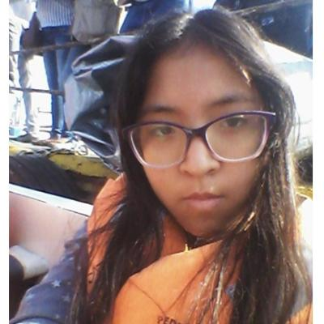

<h3 align="center"> Universidad Peruana de Ciencias Aplicadas </h3>

<h3 align="center"> Ingeniería de Software </h3>
<h3 align="center"> Ciclo 2024 - 1 </h3>

 

  

 

<h1 align="center"> TP Report </h1>

<h3 align="center"> Desarrollo de Aplicaciones Open Source - WS53 </h3>

<h3 align="center"> Docente: Juan Antonio Flores Moroco </h3>

| Member                           |    Code    |
| :------------------------------- | :--------: |
| Aliaga Pimentel, George Arturo   | U20211c273 |
| Chirinos Arevalo, Daniel Rodrigo | U202019577 |
| Jimena Alessandra Cossio Jimenez | U202117854 |
| Vittorio Marcelo Eduardo Espinoza| U202120448 |
| Sagastegui Rodriguez, Luis Jesus | U202014249 |

<h3 align="center">2024</h3>

  

# Registro de Versiones del Informe

| Versión | Fecha | Autor | Descripción de modificación |
| :-----: | :---: | :---: | :-------------------------- |
|    TB1     |   08/04    |   Todo el team    |     Se estableció la solución propuesta, se realizó un análisis Lean UX, se definió el segmento objetivo y se recopilaron los requisitos necesarios para desarrollar las herramientas necesarias (User persona, User story, Product Backlog, Impact Mapping, entre otros) y se implementó la landing page. |
|    TP     |   28/04    |   Todo el team    |     Se corrigieron las observaciones dadas por el profesor y se realizó el frontend de acuerdo a los user stories establecidos. |

  

# Project Report Collaboration Insights

# Contenido

## Tabla de Contenidos

### [Registro de versiones del informe](#registro-de-versiones-del-informe)

### [Project Report Collaboration Insights](#project-report-collaboration-insights)

### [Contenido](#contenido)

### [Student Outcome](#student-outcome-1)

### [Capítulo I: Introducción](#capc3adtulo-i-introduccic3b3n-1)

- [1.1. Startup Profile](#11-startup-profile)
  - [1.1.1. Descripción de la Startup](#111-description-de-la-startup)
  - [1.1.2. Perfiles de integrantes del equipo](#112-perfiles-de-integrantes-del-equipo)
- [1.2. Solution Profile](#12-solution-profile)
  - [1.2.1 Antecedentes y problemática](#121-antecedentes-y-problemática)
  - [1.2.2 Lean UX Process](#122-lean-ux-process)
    - [1.2.2.1. Lean UX Problem Statements](#1221-lean-ux-problem-statements)
    - [1.2.2.2. Lean UX Assumptions](#1222-lean-ux-assumptions)
    - [1.2.2.3. Lean UX Hypothesis Statements](#1223-lean-ux-hypothesis-statements)
    - [1.2.2.4. Lean UX Canvas](#1224-lean-ux-canvas)
- [1.3. Segmentos objetivo](#13-segmentos-objetivo)

### [Capítulo II: Requirements Elicitation & Analysis](#capc3adtulo-ii-requirements-elicitation--analysis-1)

- [2.1. Competidores](#21-competidores)
  - [2.1.1. Análisis competitivo](#211-análisis-competitivo)
  - [2.1.2. Estrategias y tácticas frente a competidores](#212-estrategias-y-tácticas-frente-a-competidores)
- [2.2. Entrevistas](#22-entrevistas)
  - [2.2.1. Diseño de entrevistas](#221-diseño-de-entrevistas)
  - [2.2.2. Registro de entrevistas](#222-registro-de-entrevistas)
  - [2.2.3. Análisis de entrevistas](#223-análisis-de-entrevistas)
- [2.3. Needfinding](#23-needfinding)
  - [2.3.1. User Personas](#231-user-personas)
  - [2.3.2. User Task Matrix](#232-user-task-matrix)
  - [2.3.3. User Journey Mapping](#233-user-journey-mapping)
  - [2.3.4. Empathy Mapping](#234-empathy-mapping)
  - [2.3.5. As-is Scenario Mapping](#235-as-is-scenario-mapping)
  - [2.4. Ubiquitous Language](#24-ubiquitous-language)

### [Capítulo III: Requirements Specification](#capc3adtulo-iii-requirements-specification-1)

- [3.1. To-Be Scenario Mapping](#31-to-be-scenario-mapping)
- [3.2. User Stories](#32-user-stories)
- [3.3. Impact Mapping](#33-impact-mapping)
- [3.4. Product Backlog](#34-product-backlog)

### [Capítulo IV: Product Design](#capc3adtulo-iv-product-design-1)

- [4.1. Style Guidelines](#41-style-guidelines)
  - [4.1.1. General Style Guidelines](#411-general-style-guidelines)
  - [4.1.2. Web Style Guidelines](#412-web-style-guidelines)
- [4.2. Information Architecture](#42-information-architecture)
  - [4.2.1. Organization Systems](#421-organization-systems)
  - [4.2.2. Labeling Systems](#422-labeling-systems)
  - [4.2.3. SEO Tags and Meta Tags](#423-seo-tags-and-meta-tags)
  - [4.2.4. Searching Systems](#424-searching-systems)
  - [4.2.5. Navigation Systems](#425-navigation-systems)
- [4.3. Landing Page UI Design](#43-landing-page-ui-design)
  - [4.3.1. Landing Page Wireframe](#431-landing-page-wireframe)
  - [4.3.2. Landing Page Mock-up](#432-landing-page-mock-up)
- [4.4. Web Applications UX/UI Design](#44-web-applications-uxui-design)
  - [4.4.1. Web Applications Wireframes](#441-web-applications-wireframes)
  - [4.4.2. Web Applications Wireflow Diagrams](#442-web-applications-wireflow-diagrams)
  - [4.4.3. Web Applications Mock-ups](#443-web-applications-mock-ups)
  - [4.4.4. Web Applications User Flow Diagrams](#444-web-applications-user-flow-diagrams)
- [4.5. Web Applications Prototyping](#45-web-applications-prototyping)
- [4.6. Domain-Driven Software Architecture](#46-domain-driven-software-architecture)
  - [4.6.1. Software Architecture Context Diagram](#461-software-architecture-context-diagram)
  - [4.6.2. Software Architecture Container Diagrams](#462-software-architecture-container-diagrams)
  - [4.6.3. Software Architecture Components Diagrams](#463-software-architecture-components-diagrams)
- [4.7. Software Object-Oriented Design](#47-software-object-oriented-design)
  - [4.7.1. Class Diagrams](#471-class-diagrams)
  - [4.7.2. Class Dictionary](#472-class-dictionary)
- [4.8. Database Design](#48-database-design)
  - [4.8.1. Database Diagram](#481-database-diagram)

### [Capítulo V: Product Implementation, Validation & Deployment](#capc3adtulo-v-product-implementation-validation--deployment-1)

- [5.1. Software Configuration Management](#51-software-configuration-management)
  - [5.1.1. Software Development Environment Configuration](#511-software-development-environment-configuration)
  - [5.1.2. Source Code Management](#512-source-code-management)
  - [5.1.3. Source Code Style Guide & Conventions](#513-source-code-style-guide--conventions)
  - [5.1.4. Software Deployment Configuration](#514-software-deployment-configuration)
- [5.2. Landing Page, Services & Applications Implementation](#52-landing-page-services--applications-implementation)
  - [5.2.1. Sprint 1](#521-sprint-1)
    - [5.2.1.1. Sprint Planning 1](#5211-sprint-planning-1)
    - [5.2.1.2. Sprint Backlog 1](#5212-sprint-backlog-1)
    - [5.2.1.3. Development Evidence for Sprint Review](#5213-development-evidence-for-sprint-review)
    - [5.2.1.4. Testing Suite Evidence for Sprint Review](#5214-testing-suite-evidence-for-sprint-review)
    - [5.2.1.5. Execution Evidence for Sprint Review](#5215-execution-evidence-for-sprint-review)
    - [5.2.1.6. Services Documentation Evidence for Sprint Review](#5216-services-documentation-evidence-for-sprint-review)
    - [5.2.1.7. Software Deployment Evidence for Sprint Review](#5217-software-deployment-evidence-for-sprint-review)
    - [5.2.1.8. Team Collaboration Insights during Sprint](#5218-team-collaboration-insights-during-sprint)

### [Conclusiones](#conclusiones-1)

- [Conclusiones y recomendaciones](#conclusiones-y-recomendaciones)

### [Bibliografía](#bibliografc3ada-1)

### [Anexos](#anexos-1)

  

# Student Outcome

Participa en equipos multidisciplinarios con eficacia, eficiencia y objetividad, en el marco de un proyecto en soluciones de ingeniería de software.

Conoce al menos un sector empresarial o dominio de aplicación de soluciones de software.

<table>
<tr>
    <td><b>Criterio específico</b></td>
    <td><b>Acciones realizadas</b></td>
    <td><b>Conclusiones</b></td>
</tr>
<tr>
    <td><b>Participa en equipos multidisciplinarios con eficacia, eficiencia y objetividad, en el marco de un proyecto en soluciones de ingeniería de software.</b></td>
    <td>TB1 
    <b>Chirinos Arevalo, Daniel Rodrigo</b>
         
        - Realicé mis tareas asignadas en el horario correspondiente 
        - Realicé las partes importantes como el diagrama de clases, diagrama de base de datos, el Domain-Driven Sotfware Arquitecture, parte del Lean UX, user stories y aporté ideas para el trabajo. 
         
    <b>Aliaga Pimentel, George Arturo</b>
     
     
    <b>Sagastegui Rodriguez, Luis Jesus</b>
     
     
    <b>Jimena Alessandra Cossio Jimenez</b>
     
     
    <b>Vittorio Marcelo Eduardo Espinoza</b>
         
     
    <td>TB1
     
    Se logró desarrollar la Landing page en base a las reuniones colaborativas y practicas que se tuvieron. Además, se consiguió implementarlo mediante la comprensión de metodología GitFlow
    </td>

</tr>
<tr>
<td><b>
Conoce al menos un sector empresarial o dominio de aplicación de soluciones de software.</b></td>
<td> TB1 
<b>Chirinos Arevalo, Daniel Rodrigo</b>
         
        -Desarrollé la hypothesis y canvas del Lean UX de acuerdo a nuestro problema. 
        -Realicé el diagrama de clases, base de datos y el Domain-Driven Sotfware Arquitecture de acuerdo a la plataforma realizada. 
        -Desarrollé algunos user stories y user personas de acuerdo a nuestros entrevistados. 
          
<b>Aliaga Pimentel, George Arturo</b>
     
     
<b>Sagastegui Rodriguez, Luis Jesus</b>
     
     
<b>Jimena Alessandra, Cossio Jimenez</b>
     
     
<b>Vittorio Marcelo, Eduardo Espinoza</b>
         
     

</td>
    <td>TB1
     
    Se identificó una oportunidad de negocio a partir de una problemática actual. A partir de ello, se comenzó a desarrollar una solución de software aplicando los conocimientos aprendidos en los diferentes cursos.
    </td>
</tr>
</table>

  

## Capítulo I: Introducción

## 1.1. StartUp Profile

### 1.1.1. Description de la StartUp

**TasteTeam** es una StartUp formada por un grupo de estudiantes de la carrera de Ingeniería de Software. El objetivo de nuestra StartUp es conseguir soluciones eficientes e innovadoras en base a la problematica, para mejorar la calidad de vida de las personas. Nuestro proyecto consistirá en una aplicación diseñada para las personas que están interesadas en la gastronomía peruana. 

**Misión**

Fomentar la creatividad y el emprendimiento a través de soluciones innovadoras que impacten positivamente en la sociedad.

**Visión**

Ser la plataforma líder en el desarrollo de soluciones tecnológicas que empoderen a las personas para que expresen su potencial creativo, emprendan sus sueños y construyan un futuro mejor.

### 1.1.2. Perfiles de integrantes del equipo

<table>
  <tr>
    <td></td>
    <td> Me llamo Daniel Chirinos Arevalo y soy de la carrera de Ingeniería de Software. Mi experiencia en la universidad es bastante normal y me encuentro cursando el sexto ciclo. A lo largo del tiempo, sí que tuve algunas dificultades con algunos cursos, pero logré enfrentarlos. Mi habilidad es ser líder en algunas ocasiones, trabajar con tiempo y lo más importante, ser siempre amistoso con el equipo.

</td>
  </tr>
</table>

<table>
 <tr>
   <td></td> 
   <td>Me llamo George Arturo Aliaga Pimentel y soy de la carrera de Ingeniería de Software. Estoy cursando el sexto ciclo. Me considero una persona cooperativa y responsable, lo cual es lo requerido para un proyecto grupal. Tengo la meta de ser un gran ingeniero y espero mejorar todo lo aprendido en la carrera.
   </td>
    </tr>
</table>

<table>
 <tr>
   <td></td> 
   <td>Me llamo Jimena Alessandra Cossio Jimenez. Soy de la carrera de Ingeniería de Software. Estoy cursando el quinto ciclo. Me considero una persona flexible y dispuesta a esuchar las diferentes opiniones de mis compañeros con el respeto que todos merecemos y estoy dispuesta a apoyar a mis compañeros en lo que necesiten. Mi objetivo es ser una desarrolladora web, por lo que haré todo lo que esté a mi alcance para conseguirlo.
   </td>
  </tr>
</table>

<table>
 <tr>
   <td></td> 
   <td>Me llamo Vittorio Marcelo Eduardo Espinoza y soy un estudiante de la UPC que estudia la carrera de Ingeniería de Software. Soy una persona solidaria, calmada, honesta y en la cual se puede confiar. Me esforzaré en ayudar a mi equipo en todo lo que pueda para que entre todos podamos terminarlo de manera adecuada y satisfactoria.
   </td>
    </tr>
</table>

<table>
 <tr>
   <td></td> 
   <td> Actualmente estoy estudiando la carrera de Ingeniería de Software en la Universidad Peruana de Ciencias Aplicadas (UPC). Desde muy corta edad me interesaba todo lo relacionado a los avances tecnológicos. Tengo conocimientos en programación web (JS, HTML, Angular, Vue, TS, etc)  . Me considero un estudiante con mucha persistencia, por lo que nunca me rindo hasta cumplir con mis objetivos. Y siempre quiero aprender algo nuevo cada día.
   </td>
    </tr>
</table>

## 1.2. Solution Profile

### 1.2.1. Antecedentes y problemática

### 1.2.2. Lean UX Process

#### 1.2.2.1. Lean UX Problem Statements

Nuestra plataforma "TasteTour" busca abordar la crisis de inseguridad alimentaria en el Perú al conectar a los amantes de la cocina peruana con restaurantes locales y promover una mayor apreciación de la gastronomía peruana. Reconocemos que existe una reducción del consumo de alimentos peruanos debido a la inflación y la falta de una cultura gastronómica arraigada. Esta situación impacta negativamente tanto a los aficionados a la cocina peruana como a los trabajadores de restaurantes peruanos, especialmente en momentos de inflación y pérdida de empleo.

¿Cómo podemos facilitar el acceso a una amplia variedad de alimentos peruanos y fomentar una mayor apreciación de la gastronomía del país? Al comprender las barreras que enfrentan los usuarios para explorar la gastronomía peruana, buscamos encontrar formas de superar estos obstáculos y promover una mayor diversidad en la elección de alimentos peruanos. Nuestra meta es cerrar la brecha entre los amantes de la cocina peruana y los restaurantes locales, ofreciendo una plataforma que facilite la exploración y celebración de la rica diversidad culinaria del Perú.

#### 1.2.2.2. Lean UX Assumptions

<h4>Business Assumptions</h4>

<ul>
  <li><b>Los usuarios estarán dispuestos a adoptar y utilizar tecnologías de turismo gastronómico para explorar la cocina peruana y mejorar su experiencia culinaria, especialmente aquellos interesados en la cultura culinaria local y el turismo gastronómico.</b></li>
  <li><b>La demanda de experiencias auténticas de turismo gastronómico peruano está creciendo debido al interés en la cocina peruana y el turismo culinario.</b></li>
  <li><b>Los restaurantes peruanos y los proveedores locales estarán interesados en asociarse con una plataforma de turismo gastronómico para promocionar sus servicios y atraer a clientes interesados en explorar la gastronomía del país.</b></li>
  <li><b>Existe una capacidad técnica y recursos disponibles para desarrollar y mantener la plataforma TasteTour.</b></li>
  <li><b>La accesibilidad y la usabilidad serán características clave para el éxito de la plataforma, asegurando que sea fácil de usar para personas con diferentes niveles de experiencia en tecnología.</b></li>
  <li><b>El mercado de turismo gastronómico está en crecimiento y presenta oportunidades para el éxito comercial de TasteTour.</b></li>
  <li><b>La seguridad y la privacidad de los usuarios serán aspectos fundamentales, y los usuarios confiarán en que sus datos estarán protegidos y utilizados de manera responsable.</b></li>
  <li><b>La plataforma será capaz de adaptarse a diferentes preferencias gastronómicas y necesidades de los usuarios, lo que atraerá a una amplia variedad de amantes de la cocina peruana y turistas interesados en explorar la gastronomía local.</b></li>
</ul>

<h4>User Assumptions</h4>

<ul>
  <li><b>¿Quién es el usuario?:</b> Nuestro segmento objetivo son los amantes de la cocina peruana, tanto locales como turistas interesados en explorar la gastronomía del país. También incluye a restaurantes peruanos que deseen promocionar sus servicios.</li>
  <li><b>¿Dónde encaja nuestro producto, en su trabajo o vida?:</b> Encaja en la vida de las personas interesadas en explorar la cocina peruana, así como en el entorno de los restaurantes peruanos y proveedores locales que deseen promocionar sus servicios gastronómicos.</li>
  <li><b>¿Qué problemas tiene nuestro producto y cómo se pueden resolver?:</b> Nuestro producto se enfrenta a desafíos como la competencia en el mercado de turismo gastronómico, la necesidad de asociaciones estratégicas con restaurantes y proveedores locales, la seguridad de datos y la privacidad, y la educación sobre las experiencias gastronómicas disponibles en la plataforma. Estos problemas pueden abordarse mediante una estrategia de marketing sólida, colaboraciones estratégicas con restaurantes y proveedores locales, medidas de seguridad robustas y campañas de concienciación para educar a los usuarios sobre las experiencias gastronómicas disponibles.</li>
  <li><b>¿Cuándo y cómo es usado nuestro producto?:</b> TasteTour se utiliza durante el tiempo libre de los usuarios para explorar la gastronomía peruana y planificar experiencias culinarias en Perú. Esto incluye participar en tours gastronómicos, clases de cocina y degustaciones según las preferencias y paquetes adquiridos.</li>
  <li><b>¿Qué características son importantes?:</b> Es importante que TasteTour ofrezca una variedad de experiencias auténticas de turismo gastronómico peruano, una interfaz fácil de usar para reservar experiencias, opciones de personalización para adaptarse a las preferencias culinarias individuales y la seguridad de datos del usuario.</li>
  <li><b>¿Cómo debe verse nuestro producto y cómo debe comportarse?:</b> TasteTour debe presentar una interfaz intuitiva y atractiva que permita a los usuarios explorar y reservar experiencias gastronómicas de manera fácil y segura. La plataforma debe ofrecer una amplia variedad de opciones de turismo gastronómico, desde tours gastronómicos hasta clases de cocina, con funciones de búsqueda y filtrado para facilitar la navegación del usuario.</li>
</ul>

#### 1.2.2.3. Lean UX Hypothesis Statements

<ol>
<li> <b>Creemos que</b> los usuarios de 17 años a más estarán satisfechos con las diferentes opciones que hay dentro de la plataforma. <b>Sabremos que</b> esta afirmación sea cierta <b>cuando</b> observemos que la cantidad de personas que hay en la plataforma sea muy alta.
</li>
<li> <b>Creemos que</b> nuestra plataforma solucionará la problematica de la crisis de inseguridad alimentaria en el perú <b>Sabremos que</b> nuestra suposición sea cierta <b>cuando</b> se reduzca la cantidad de perdidas de empleo y cierres de restaurantes peruanos..
</li>
<li> <b>Creemos que</b> el recorrido por los restaurantes será una oportunidad para que los usuarios disfruten de la diversidad gastronómica que ofrecen, mientras que las clases de cocina peruana les proporcionarán habilidades prácticas. <b>Sabremos que</b> esta afirmación es cierta <b>cuando</b> notemos que nuestros usuarios eligen tanto el servicio gratuito como el servicio premium.
</li>
</ol>

#### 1.2.2.4. Lean UX Canvas

<td></td>

# 1.3. Segmentos Objetivo

# Capítulo II: Requirements Elicitation & Analysis

## 2.1. Competidores

### 2.1.1. Análisis competitivo

### 2.1.2. Estrategias y tácticas frente a competidores

## 2.2. Entrevistas

### 2.2.1. Diseño de entrevistas

Se establecieron preguntas dirigidas a nuestro publico objetivo, con el fin de obtener información, como opiniones o descripciones. Toda la información que nos darán será bastante útil en la creación de nuestra solución.

**Para los amantes de la cocina peruana:**

- ¿Con qué frecuencia exploras nuevas experiencias gastronómicas o pruebas platos de diferentes culturas?
- ¿Qué es lo que más te atrae de la cocina peruana?
- ¿Has participado anteriormente en tours gastronómicos o experiencias culinarias durante tus viajes?
- ¿Qué tipo de actividades relacionadas con la gastronomía te gustaría experimentar en un tour o viaje?
- ¿Has tenido dificultades para encontrar opciones de calidad para experimentar la cocina peruana durante tus viajes anteriores?
- ¿Qué te motiva a elegir un restaurante o experiencia gastronómica en particular durante tus viajes?
- ¿Te parece importante seleccionar un tour gastronómico o una agencia de viajes especializada en turismo culinario?
- ¿Estarías interesado en utilizar una plataforma en línea especializada en turismo gastronómico peruano, que además ofrezca clases de cocina peruana como parte de sus servicios?
- ¿Qué beneficios esperarías obtener al optar por un servicio premium de una agencia de viajes gastronómicos?
- ¿Qué otras actividades relacionadas con la gastronomía y la cultura peruana te gustarían incluir en un paquete de viaje?

**Para los restaurantes peruanos:**

- ¿Cuáles crees que son los principales desafíos a los que se enfrenta tu restaurante en la actualidad?
- ¿Qué piensas sobre la idea de promover tu restaurante a través de experiencias gastronómicas únicas?
- ¿Has considerado la posibilidad de asociarte con una plataforma de turismo gastronómico para atraer a nuevos clientes a tu restaurante?
- ¿Te parece atractivo la propuesta de incluir tu restaurante en recorridos gastronómicos y tours culinarios dirigidos por guías especializados?
- ¿Qué aspectos consideras más importantes al decidir asociarte con una agencia de viajes especializada en turismo gastronómico?
- ¿Qué aspectos valoras más al colaborar con una plataforma de turismo gastronómico, como la posibilidad de llegar a un nuevo público o la generación de ingresos adicionales?
- ¿Te interesaría formar parte de una plataforma especializada en turismo gastronómico peruano como TasteTour para promocionar tu restaurante y atraer más clientes?
- ¿Te gustaría ofrecer clases de cocina peruana o degustaciones en tu restaurante como parte de la experiencia para los usuarios de la plataforma? 
- ¿Considerarías ofrecer descuentos especiales o promociones exclusivas para los usuarios de TasteTour como una estrategia para atraer más clientes a tu restaurante?
- ¿Tienes alguna otra sugerencia o comentario sobre cómo una plataforma como TasteTour podría ser más útil para promocionar y potenciar tu restaurante peruano?

### 2.2.2. Registro de entrevistas

<b>Entrevista 1</b> 

- Nombre: Adrian
- Apellidos: Zapata Mongrut
- Edad: 21 años
- Distrito: Lima - Carabayllo
- Link de la entrevista: <a href="https://upcedupe-my.sharepoint.com/:v:/g/personal/u202019577_upc_edu_pe/Ec8iciWlY4xIpoxvkOKrdiMBm1jS37eaZHX4OuRkDXr3aw?nav=eyJyZWZlcnJhbEluZm8iOnsicmVmZXJyYWxBcHAiOiJTdHJlYW1XZWJBcHAiLCJyZWZlcnJhbFZpZXciOiJTaGFyZURpYWxvZy1MaW5rIiwicmVmZXJyYWxBcHBQbGF0Zm9ybSI6IldlYiIsInJlZmVycmFsTW9kZSI6InZpZXcifX0%3D&e=zRI40V ">Entrevista</a>
- Minuto donde empieza: 0:00
- Duración: 17:10 minutos

Evidencia de la reunión:

    

Resumen de la entrevista:

Adrián Zapata expresa preocupación por los desafíos fiscales que enfrenta su negocio gastronómico debido a la formalización, lo que ha llevado a un aumento en los impuestos y una reducción en las ganancias. Reconoce la importancia de mantener precios competitivos para atraer clientes, pero también señala la dificultad de mantener la rentabilidad en medio de los aumentos de costos.

Muestra interés en asociarse con un servicio turístico para ampliar su negocio y atraer más clientes, lo que considera vital para mantener la rentabilidad y el crecimiento. Destaca la importancia de la reputación y la imagen de su empresa al asociarse con servicios turísticos.

Adrián valora la experiencia gastronómica única y reconoce la importancia de los clientes en el éxito de su negocio. Se muestra dispuesto a explorar opciones que le brinden más clientes y mayor reconocimiento.

En resumen, Adrián busca soluciones para enfrentar los desafíos fiscales, expandir su negocio y mejorar la experiencia gastronómica para sus clientes. Reconoce la importancia de la asociación con servicios turísticos para aumentar la visibilidad de su empresa y atraer más clientes.

 

<b>Entrevista 2</b> 

- Nombre: Fabian de Jesus
- Apellidos: Solis Perez
- Edad: 22 años
- Distrito: Lima - Callao
- Link de la entrevista: <a href="https://upcedupe-my.sharepoint.com/:v:/g/personal/u202019577_upc_edu_pe/Ec8iciWlY4xIpoxvkOKrdiMBm1jS37eaZHX4OuRkDXr3aw?nav=eyJyZWZlcnJhbEluZm8iOnsicmVmZXJyYWxBcHAiOiJTdHJlYW1XZWJBcHAiLCJyZWZlcnJhbFZpZXciOiJTaGFyZURpYWxvZy1MaW5rIiwicmVmZXJyYWxBcHBQbGF0Zm9ybSI6IldlYiIsInJlZmVycmFsTW9kZSI6InZpZXcifX0%3D&e=zRI40V&referrer=StreamWebApp%2EWeb&referrerScenario=AddressBarCopiedShareExpTreatment%2Eview">Entrevista</a>
- Minuto donde empieza: 17:09
- Duración: 11:20 minutos

Evidencia de la reunión:

    

Resumen de la entrevista:

Fabián Solís Pérez comparte su experiencia gastronómica, destacando su interés en probar nuevas comidas y explorar diferentes culturas culinarias, aunque reconoce que no es una práctica frecuente en su vida cotidiana. Valora la singularidad de la cocina peruana y su deseo de experimentar platos auténticos durante sus viajes.

Destaca la dificultad de encontrar productos específicos de ciertas regiones durante sus viajes, lo que a veces limita su capacidad para cocinar platos locales en ubicaciones remotas. Aprecia la oportunidad de interactuar con chefs y obtener explicaciones detalladas sobre los platos que prueba durante sus experiencias gastronómicas.

Fabián expresa interés en los beneficios que podría obtener al optar por un servicio premium de una agencia de viajes gastronómicos, como clases de cocina personalizadas y atención especializada durante las experiencias gastronómicas. Además, menciona actividades adicionales que le gustaría incluir en un paquete de viajes, como visitas a mercados locales, degustaciones de pisco y cenas con vistas panorámicas.

En resumen, Fabián busca enriquecer su experiencia gastronómica durante sus viajes, valorando la autenticidad de los platos locales y la oportunidad de aprender sobre la cultura culinaria peruana. Está interesado en servicios turísticos que le brinden experiencias personalizadas y actividades únicas que complementen su pasión por la comida y los viajes.

 

<b>Entrevista 3</b> 

- Nombre: Ana
- Apellidos: Mendoza
- Edad: 30 años
- Distrito: Lima
- Link de la entrevista: <a href="https://upcedupe-my.sharepoint.com/:v:/g/personal/u202019577_upc_edu_pe/Ec8iciWlY4xIpoxvkOKrdiMBm1jS37eaZHX4OuRkDXr3aw?nav=eyJyZWZlcnJhbEluZm8iOnsicmVmZXJyYWxBcHAiOiJTdHJlYW1XZWJBcHAiLCJyZWZlcnJhbFZpZXciOiJTaGFyZURpYWxvZy1MaW5rIiwicmVmZXJyYWxBcHBQbGF0Zm9ybSI6IldlYiIsInJlZmVycmFsTW9kZSI6InZpZXcifX0%3D&e=zRI40V ">Entrevista</a>
- Minuto donde empieza: 28:29
- Duración: 05:03 minutos

Evidencia de la reunión:

    

Resumen de la entrevista:

 

**Link de las entrevistas**: https://upcedupe-my.sharepoint.com/:v:/g/personal/u202019577_upc_edu_pe/Ec8iciWlY4xIpoxvkOKrdiMBm1jS37eaZHX4OuRkDXr3aw?nav=eyJyZWZlcnJhbEluZm8iOnsicmVmZXJyYWxBcHAiOiJTdHJlYW1XZWJBcHAiLCJyZWZlcnJhbFZpZXciOiJTaGFyZURpYWxvZy1MaW5rIiwicmVmZXJyYWxBcHBQbGF0Zm9ybSI6IldlYiIsInJlZmVycmFsTW9kZSI6InZpZXcifX0%3D&e=zRI40V

### 2.2.3. Análisis de entrevistas

<h3> Primer entrevistado: Adrian Zapata </h3> 

<b>Desafíos Fiscales y Rentabilidad del Negocio Gastronómico:</b>
Adrián muestra preocupación por los desafíos fiscales que enfrenta su negocio gastronómico debido a la formalización, lo que ha resultado en un aumento en los impuestos y una reducción en las ganancias. Esta preocupación refleja su compromiso con la rentabilidad de su negocio y su comprensión de los desafíos financieros que enfrenta en el mercado actual.

<b>Interés en Asociarse con un Servicio Turístico:</b>
Adrián muestra interés en asociarse con un servicio turístico para ampliar su negocio y atraer más clientes. Reconoce la importancia de la reputación y la imagen de su empresa al asociarse con servicios turísticos, lo que indica una búsqueda activa de soluciones para mejorar la visibilidad de su negocio y atraer una base de clientes más amplia.

<b>Valoración de la Experiencia Gastronómica Única:</b>
Adrián valora la experiencia gastronómica única y reconoce la importancia de los clientes en el éxito de su negocio. Su interés en mejorar la experiencia gastronómica para sus clientes demuestra su compromiso con la satisfacción del cliente y su disposición a explorar nuevas oportunidades para ofrecer un servicio excepcional.

<b>Búsqueda de Soluciones y Mejora Continua:</b>
En resumen, Adrián está buscando soluciones para enfrentar los desafíos fiscales, expandir su negocio y mejorar la experiencia gastronómica para sus clientes. Su disposición para asociarse con servicios turísticos y su enfoque en la reputación y la imagen de su empresa sugieren una mentalidad empresarial proactiva y una búsqueda constante de mejora y crecimiento.

Basándonos en el análisis de la entrevista, Adrián parece ser un potencial cliente para la aplicación de TasteTour. Su compromiso con la rentabilidad del negocio, su interés en asociarse con servicios turísticos para atraer más clientes y mejorar la experiencia gastronómica, y su búsqueda de soluciones para enfrentar desafíos financieros sugieren que podría beneficiarse de las soluciones y servicios que ofrece TasteTour.

<h3> Segundo entrevistado: Fabian Solis Pérez </h3> 

<b>Exploración de Nuevas Experiencias Gastronómicas:</b>
Fabian menciona que aunque no es muy frecuente, le gusta explorar nuevas experiencias gastronómicas cuando tiene la oportunidad. Su disposición para probar comida local durante sus viajes sugiere un interés en la gastronomía y la cultura culinaria, lo que podría hacerlo receptivo a las ofertas de TasteTour para descubrir nuevas experiencias culinarias.

<b>Atracción por la Cocina Peruana y su Unicidad:</b>
Fabian expresa su atracción por la cocina peruana y destaca su unicidad en comparación con otras cocinas internacionales. Su interés en la autenticidad y la singularidad de la cocina peruana sugiere que podría estar interesado en experiencias gastronómicas que le permitan explorar y disfrutar plenamente de la diversidad culinaria del país.

<b>Interés en Tours Gastronómicos y Experiencias Únicas:</b>
Fabian muestra interés en participar en tours gastronómicos y experiencias culinarias únicas durante sus viajes. Su curiosidad por probar platos auténticos y experiencias gastronómicas locales indica una disposición a sumergirse en la cultura culinaria de un destino, lo que podría hacerlo un cliente potencial para las ofertas de tours gastronómicos de TasteTour.

<b>Valoración de la Experiencia Personalizada y Auténtica:</b>
Fabian valora la experiencia personalizada y auténtica durante sus viajes gastronómicos, destacando la importancia de la textura y la calidad de los platos. Su búsqueda de experiencias auténticas y personalizadas sugiere que podría estar interesado en ofertas de TasteTour que ofrezcan experiencias gastronómicas únicas y adaptadas a sus preferencias individuales.

<b>Interés en Actividades Complementarias y Culturales:</b>
Fabian menciona su interés en actividades complementarias durante sus viajes, como visitas a mercados locales, degustaciones de pisco y cenas con vistas panorámicas. Su deseo de explorar actividades culturales y gastronómicas adicionales indica una disposición a participar en experiencias más allá de la comida, lo que podría hacerlo receptivo a las ofertas de TasteTour que incluyan actividades complementarias.

Basándonos en el análisis de la entrevista, Fabian parece ser un potencial cliente para la aplicación de TasteTour. Su interés en explorar nuevas experiencias gastronómicas, su valoración de la autenticidad y la unicidad de la cocina peruana, su disposición a participar en tours gastronómicos y experiencias personalizadas, y su interés en actividades complementarias y culturales sugieren que podría estar abierto a las ofertas de TasteTour que ofrecen una amplia gama de experiencias culinarias y culturales en el Perú.

## 2.3. Needfinding

### 2.3.1. User Personas

<td></td>
    <td>

<td></td>
    <td>

### 2.3.2. User Task Matrix

### 2.3.3. User Journey Mapping

<td></td>
    <td>

### 2.3.4. Empathy Mapping

<td></td>
    <td>

<td></td>
    <td>

### 2.3.5. As-is Scenario Mapping

<td></td>
    <td>

<td></td>
    <td>

### 2.4. Ubiquitous Language

# Capítulo III: Requirements Specification

## 3.1. To-Be Scenario Mapping

<td></td>
    <td>

<td></td>
    <td>

## 3.2. User Stories

## 3.3. Impact Mapping

## 3.4. Product Backlog

# Capítulo IV: Product Design

## 4.1. Style Guidelines.

### 4.1.1. General Style Guidelines

### 4.1.2. Web Style Guidelines

## 4.2. Information Architecture

### 4.2.1. Organization Systems

### Organizacion de contenido

### 4.2.2. Labeling Systems

### 4.2.3. SEO Tags and Meta Tags

### 4.2.4. Searching Systems

### 4.2.5. Navigation Systems

## 4.3. Landing Page UI Design

### 4.3.1. Landing Page Wireframe

### 4.3.2. Landing Page Mock-up

## 4.4. Web Applications UX/UI Design

### 4.4.1. Web Applications Wireframes

### 4.4.2. Web Applications Wireflow Diagrams

### 4.4.3. Web Applications Mock-ups

### 4.4.4. Web Applications User Flow Diagrams

## 4.5. Web Applications Prototyping

## 4.6. Domain-Driven Software Architecture

### 4.6.1. Software Architecture Context Diagram

### 4.6.2. Software Architecture Container Diagrams

### 4.6.3. Software Architecture Components Diagrams

## 4.7. Software Object-Oriented Design

### 4.7.1. Class Diagrams

### 4.7.2. Class Dictionary

## 4.8. Database Design

### 4.8.1. Database Diagram

# Capítulo V: Product Implementation, Validation & Deployment

## 5.1. Software Configuration Management

### 5.1.1. Software Development Environment Configuration

<table border="1">

  <tr>
    <td>Project Management</td>
    <td>Microsoft 365 Alojamiento de los videos de entrevistas, explicación de prototipos y otros relacionados al proyecto</td>
  </tr>
  <tr>
    <td></td>
    <td>Discord Plataforma de mensajería instantánea donde se realizaron las reuniones, repartición de tarea y desarrollo del proyecto colaborativo.</td>
  </tr>
  <tr>
    <td></td>
    <td>Whatsapp Aplicación de mensajería instantánea donde se realizaron recordatorios de las reuniones.</td>
  </tr>
  <tr>
    <td></td>
    <td>Trello Software de administración Y gestión de proyectos que se utilizó para establecer y designar las tareas</td>
  </tr>
  <tr>
    <td>Requirements Management</td>
    <td>Structurizr Structurizr es una herramienta de modelado y documentación que permitió el desarrollo de los diagramas C4</td>
  </tr>
  <tr>
    <td></td>
    <td>MySQL Workbench Herramienta de diseño para el modelado de diagrama de bases de datos.</td>
  </tr>
  <tr>
    <td></td>
    <td>LucidChart Herramienta de diseño para el modelado de diagramas UML.</td>
  </tr>
  <tr>
    <td></td>
    <td>Miro Herramienta de diseño para la creación de los As-Is y To-Be Scenario Mapping</td>
  </tr>
  <tr>
    <td>Product UX/UI Design</td>
    <td>Figma Herramienta que se utilizó para la creación de wireframes, mockups y prototipos.</td>
  </tr>
  <tr>
    <td>Software Development</td>
    <td>Git Es un software de control de versiones para los trabajos en equipos y confiabilidad del desarrollo.</td>
  </tr>
  <tr>
    <td></td>
    <td>Node.js Node.js es un entorno de ejecución de JavaScript del lado del servidor, que permite desarrollar aplicaciones web escalables y de alto rendimiento fuera del navegador.</td>
  </tr>
  <tr>
    <td></td>
    <td>GitHub Sistema de control de versiones Git.</td>
  </tr>
  <tr>
    <td></td>
    <td>HTML5 Lenguaje de etiquetas, utilizado para la estructuración y la presentación de contenido.</td>
  </tr>
  <tr>
    <td></td>
    <td>CSS CSS es un lenguaje utilizado para estilizar y dar formato a documentos HTML.</td>
  </tr>
  <tr>
    <td></td>
    <td>JavaScript JavaScript es un lenguaje de programación de alto nivel, interpretado y multi-paradigma, utilizado para crear interactividad en páginas web.</td>
  </tr>
  <tr>
    <td></td>
    <td>VScode Es un editor de código fuente con extensiones que ayudan al desarrollo.</td>
  </tr>
  <tr>
    <td></td>
    <td>Angular Framework Framework para el desarrollo de frontend</td>
  </tr>
  <tr>
    <td>Software Deployment</td>
    <td>Github Pages Plataforma que nos facilitó realizar el despliegue de nuestro landing page de manera rápida y práctica.</td>
  </tr>
</table>

### 5.1.2. Source Code Management

gitflow

URL del repositorio del Report en GitHub: https://github.com/TasteTeam-Projects/REPORT

URL del repositorio del Landing Page en GitHub: https://github.com/TasteTeam-Projects/Landing-Page

### 5.1.3. Source Code Style Guide & Conventions

HTML: Lenguaje utilizado para diseñar páginas web. Este lenguaje utiliza etiquetas para marcar y definir el contenido de la página web; Como un texto, imagenes, videos, etc.

Convenciones:

- Se tiene que declarar el tipo de documento en la primera línea de la siguiente manera:
- Las etiquetas siempre tienen que esta en minúscula, ya que es más claro a la vista y es de facil escritura para los desarrolladores.
- Usar las comillas para darle un valor a los atributos para una mejor legibilidad.

CSS: Lenguaje que permite dar formatos o estilos a los elementos html. Con este lenguaje se pueden crear diseños web agradables e intuitivos para el usuario.

Convenciones:

- Unir los nombres de las clases compuestas con guiones: box-container{}
- Usar la unidad de medida rem para mantener un diseño responsive: 1rem

### 5.1.4. Software Deployment Configuration

Para despliegar el landing page, usamos las siguientes herraminetas.

- Git: Para realizar el manejo de las versiones del proyecto.
- GitHub: Dentro de la plataforma tenemos un repositorio, lo usamos para almacenar todo el proyecto con sus respectivas versiones.
- GitFlow: Esto permite visualizar y controlar el flujo de trabajo hecho por el equipo de desarrollo.

## 5.2. Landing Page, Services & Applications Implementation

### 5.2.1. Sprint 1

#### 5.2.1.1. Sprint Planning 1

#### 5.2.1.2. Sprint Backlog 1

#### 5.2.1.3. Development Evidence for Sprint Review

#### 5.2.1.4. Testing Suite Evidence for Sprint Review

#### 5.2.1.5. Execution Evidence for Sprint Review

#### 5.2.1.6. Services Documentation Evidence for Sprint Review

#### 5.2.1.7. Software Deployment Evidence for Sprint Review

#### 5.2.1.8. Team Collaboration Insights during Sprint

  

# Conclusiones

## Conclusiones y recomendaciones

  

# Bibliografía

  

# Anexos