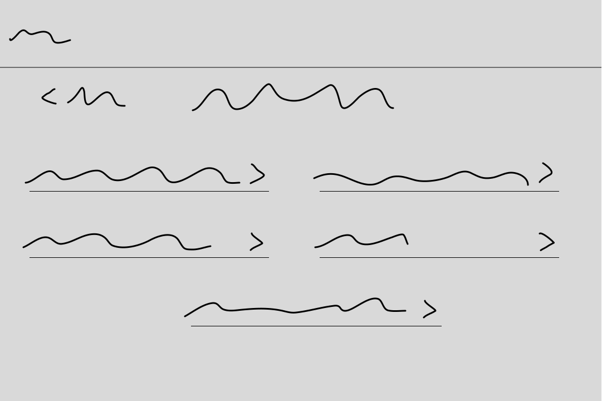
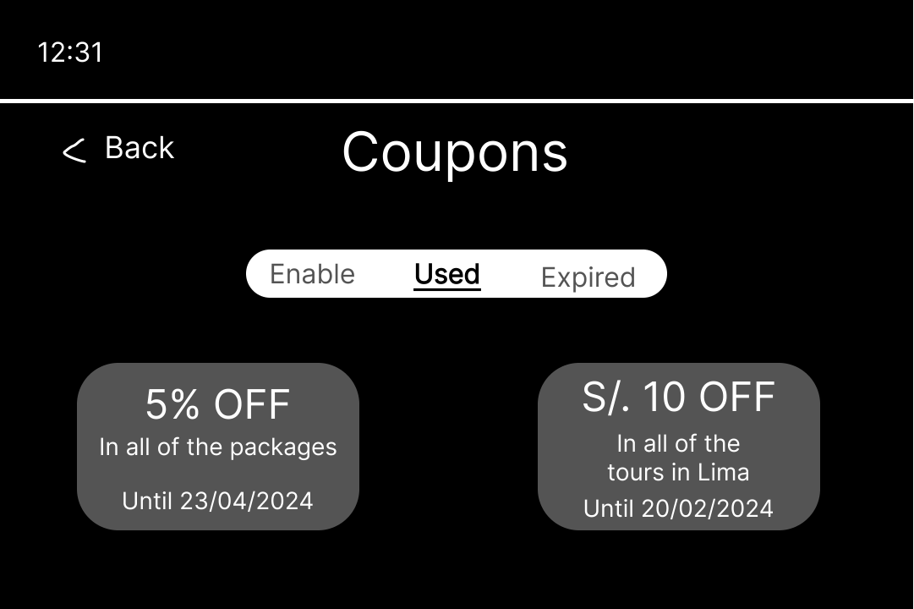

<h3 align="center"> Universidad Peruana de Ciencias Aplicadas </h3>

<h3 align="center"> Ingeniería de Software </h3>
<h3 align="center"> Ciclo 2024 - 1 </h3>

 

  

 

<h1 align="center"> TP Report </h1>

<h3 align="center"> Desarrollo de Aplicaciones Open Source - WS53 </h3>

<h3 align="center"> Docente: Juan Antonio Flores Moroco </h3>

| Member                           |    Code    |
| :------------------------------- | :--------: |
| Aliaga Pimentel, George Arturo   | U20211c273 |
| Chirinos Arevalo, Daniel Rodrigo | U202019577 |
| Jimena Alessandra Cossio Jimenez | U202117854 |
| Vittorio Marcelo Eduardo Espinoza| U202120448 |
| Sagastegui Rodriguez, Luis Jesus | U202014249 |

<h3 align="center">2024</h3>

  

# Registro de Versiones del Informe

| Versión | Fecha | Autor | Descripción de modificación |
| :-----: | :---: | :---: | :-------------------------- |
|    TB1     |   08/04    |   Todo el team    |     Se estableció la solución propuesta, se realizó un análisis Lean UX, se definió el segmento objetivo y se recopilaron los requisitos necesarios para desarrollar las herramientas necesarias (User persona, User story, Product Backlog, Impact Mapping, entre otros) y se implementó la landing page. |
|    TP     |   28/04    |   Todo el team    |     Se corrigieron las observaciones dadas por el profesor y se realizó el frontend de acuerdo a los user stories establecidos. |

  

# Project Report Collaboration Insights

# Contenido

## Tabla de Contenidos

### [Registro de versiones del informe](#registro-de-versiones-del-informe)

### [Project Report Collaboration Insights](#project-report-collaboration-insights)

### [Contenido](#contenido)

### [Student Outcome](#student-outcome-1)

### [Capítulo I: Introducción](#capc3adtulo-i-introduccic3b3n-1)

- [1.1. Startup Profile](#11-startup-profile)
  - [1.1.1. Descripción de la Startup](#111-description-de-la-startup)
  - [1.1.2. Perfiles de integrantes del equipo](#112-perfiles-de-integrantes-del-equipo)
- [1.2. Solution Profile](#12-solution-profile)
  - [1.2.1 Antecedentes y problemática](#121-antecedentes-y-problemática)
  - [1.2.2 Lean UX Process](#122-lean-ux-process)
    - [1.2.2.1. Lean UX Problem Statements](#1221-lean-ux-problem-statements)
    - [1.2.2.2. Lean UX Assumptions](#1222-lean-ux-assumptions)
    - [1.2.2.3. Lean UX Hypothesis Statements](#1223-lean-ux-hypothesis-statements)
    - [1.2.2.4. Lean UX Canvas](#1224-lean-ux-canvas)
- [1.3. Segmentos objetivo](#13-segmentos-objetivo)

### [Capítulo II: Requirements Elicitation & Analysis](#capc3adtulo-ii-requirements-elicitation--analysis-1)

- [2.1. Competidores](#21-competidores)
  - [2.1.1. Análisis competitivo](#211-análisis-competitivo)
  - [2.1.2. Estrategias y tácticas frente a competidores](#212-estrategias-y-tácticas-frente-a-competidores)
- [2.2. Entrevistas](#22-entrevistas)
  - [2.2.1. Diseño de entrevistas](#221-diseño-de-entrevistas)
  - [2.2.2. Registro de entrevistas](#222-registro-de-entrevistas)
  - [2.2.3. Análisis de entrevistas](#223-análisis-de-entrevistas)
- [2.3. Needfinding](#23-needfinding)
  - [2.3.1. User Personas](#231-user-personas)
  - [2.3.2. User Task Matrix](#232-user-task-matrix)
  - [2.3.3. User Journey Mapping](#233-user-journey-mapping)
  - [2.3.4. Empathy Mapping](#234-empathy-mapping)
  - [2.3.5. As-is Scenario Mapping](#235-as-is-scenario-mapping)
  - [2.4. Ubiquitous Language](#24-ubiquitous-language)

### [Capítulo III: Requirements Specification](#capc3adtulo-iii-requirements-specification-1)

- [3.1. To-Be Scenario Mapping](#31-to-be-scenario-mapping)
- [3.2. User Stories](#32-user-stories)
- [3.3. Impact Mapping](#33-impact-mapping)
- [3.4. Product Backlog](#34-product-backlog)

### [Capítulo IV: Product Design](#capc3adtulo-iv-product-design-1)

- [4.1. Style Guidelines](#41-style-guidelines)
  - [4.1.1. General Style Guidelines](#411-general-style-guidelines)
  - [4.1.2. Web Style Guidelines](#412-web-style-guidelines)
- [4.2. Information Architecture](#42-information-architecture)
  - [4.2.1. Organization Systems](#421-organization-systems)
  - [4.2.2. Labeling Systems](#422-labeling-systems)
  - [4.2.3. SEO Tags and Meta Tags](#423-seo-tags-and-meta-tags)
  - [4.2.4. Searching Systems](#424-searching-systems)
  - [4.2.5. Navigation Systems](#425-navigation-systems)
- [4.3. Landing Page UI Design](#43-landing-page-ui-design)
  - [4.3.1. Landing Page Wireframe](#431-landing-page-wireframe)
  - [4.3.2. Landing Page Mock-up](#432-landing-page-mock-up)
- [4.4. Web Applications UX/UI Design](#44-web-applications-uxui-design)
  - [4.4.1. Web Applications Wireframes](#441-web-applications-wireframes)
  - [4.4.2. Web Applications Wireflow Diagrams](#442-web-applications-wireflow-diagrams)
  - [4.4.3. Web Applications Mock-ups](#443-web-applications-mock-ups)
  - [4.4.4. Web Applications User Flow Diagrams](#444-web-applications-user-flow-diagrams)
- [4.5. Web Applications Prototyping](#45-web-applications-prototyping)
- [4.6. Domain-Driven Software Architecture](#46-domain-driven-software-architecture)
  - [4.6.1. Software Architecture Context Diagram](#461-software-architecture-context-diagram)
  - [4.6.2. Software Architecture Container Diagrams](#462-software-architecture-container-diagrams)
  - [4.6.3. Software Architecture Components Diagrams](#463-software-architecture-components-diagrams)
- [4.7. Software Object-Oriented Design](#47-software-object-oriented-design)
  - [4.7.1. Class Diagrams](#471-class-diagrams)
  - [4.7.2. Class Dictionary](#472-class-dictionary)
- [4.8. Database Design](#48-database-design)
  - [4.8.1. Database Diagram](#481-database-diagram)

### [Capítulo V: Product Implementation, Validation & Deployment](#capc3adtulo-v-product-implementation-validation--deployment-1)

- [5.1. Software Configuration Management](#51-software-configuration-management)
  - [5.1.1. Software Development Environment Configuration](#511-software-development-environment-configuration)
  - [5.1.2. Source Code Management](#512-source-code-management)
  - [5.1.3. Source Code Style Guide & Conventions](#513-source-code-style-guide--conventions)
  - [5.1.4. Software Deployment Configuration](#514-software-deployment-configuration)
- [5.2. Landing Page, Services & Applications Implementation](#52-landing-page-services--applications-implementation)
  - [5.2.1. Sprint 1](#521-sprint-1)
    - [5.2.1.1. Sprint Planning 1](#5211-sprint-planning-1)
    - [5.2.1.2. Sprint Backlog 1](#5212-sprint-backlog-1)
    - [5.2.1.3. Development Evidence for Sprint Review](#5213-development-evidence-for-sprint-review)
    - [5.2.1.4. Testing Suite Evidence for Sprint Review](#5214-testing-suite-evidence-for-sprint-review)
    - [5.2.1.5. Execution Evidence for Sprint Review](#5215-execution-evidence-for-sprint-review)
    - [5.2.1.6. Services Documentation Evidence for Sprint Review](#5216-services-documentation-evidence-for-sprint-review)
    - [5.2.1.7. Software Deployment Evidence for Sprint Review](#5217-software-deployment-evidence-for-sprint-review)
    - [5.2.1.8. Team Collaboration Insights during Sprint](#5218-team-collaboration-insights-during-sprint)

### [Conclusiones](#conclusiones-1)

- [Conclusiones y recomendaciones](#conclusiones-y-recomendaciones)

### [Bibliografía](#bibliografc3ada-1)

### [Anexos](#anexos-1)

  

# Student Outcome

Participa en equipos multidisciplinarios con eficacia, eficiencia y objetividad, en el marco de un proyecto en soluciones de ingeniería de software.

Conoce al menos un sector empresarial o dominio de aplicación de soluciones de software.

<table>
<tr>
    <td><b>Criterio específico</b></td>
    <td><b>Acciones realizadas</b></td>
    <td><b>Conclusiones</b></td>
</tr>
<tr>
    <td><b>Participa en equipos multidisciplinarios con eficacia, eficiencia y objetividad, en el marco de un proyecto en soluciones de ingeniería de software.</b></td>
    <td>TB1 
    <td>TB1
     
    </td>

</tr>
<tr>
<td><b>
Conoce al menos un sector empresarial o dominio de aplicación de soluciones de software.</b></td>
<td> TB1 
</td>
    <td>TB1
     
    </td>
</tr>
</table>

  

## Capítulo I: Introducción

## 1.1. StartUp Profile

### 1.1.1. Description de la StartUp

**TasteTeam** es una StartUp formada por un grupo de estudiantes de la carrera de Ingeniería de Software. El objetivo de nuestra StartUp es conseguir soluciones eficientes e innovadoras en base a la problematica, para mejorar la calidad de vida de las personas. Nuestro proyecto consistirá en una aplicación diseñada para las personas que están interesadas en la gastronomía peruana. 

**Misión**

Fomentar la creatividad y el emprendimiento a través de soluciones innovadoras que impacten positivamente en la sociedad.

**Visión**

Ser la plataforma líder en el desarrollo de soluciones tecnológicas que empoderen a las personas para que expresen su potencial creativo, emprendan sus sueños y construyan un futuro mejor.

### 1.1.2. Perfiles de integrantes del equipo

<table>
  <tr>
    <td></td>
    <td> Me llamo Daniel Chirinos Arevalo y soy de la carrera de Ingeniería de Software. Mi experiencia en la universidad es bastante normal y me encuentro cursando el sexto ciclo. A lo largo del tiempo, sí que tuve algunas dificultades con algunos cursos, pero logré enfrentarlos. Mi habilidad es ser líder en algunas ocasiones, trabajar con tiempo y lo más importante, ser siempre amistoso con el equipo.

</td>
  </tr>
</table>

<table>
 <tr>
   <td></td> 
   <td>Me llamo George Arturo Aliaga Pimentel y soy de la carrera de Ingeniería de Software. Estoy cursando el sexto ciclo. Me considero una persona cooperativa y responsable, lo cual es lo requerido para un proyecto grupal. Tengo la meta de ser un gran ingeniero y espero mejorar todo lo aprendido en la carrera.
   </td>
    </tr>
</table>

<table>
 <tr>
   <td></td> 
   <td>Me llamo Jimena Alessandra Cossio Jimenez. Soy de la carrera de Ingeniería de Software. Estoy cursando el quinto ciclo. Me considero una persona flexible y dispuesta a esuchar las diferentes opiniones de mis compañeros con el respeto que todos merecemos y estoy dispuesta a apoyar a mis compañeros en lo que necesiten. Mi objetivo es ser una desarrolladora web, por lo que haré todo lo que esté a mi alcance para conseguirlo.
   </td>
  </tr>
</table>

<table>
 <tr>
   <td></td> 
   <td>Me llamo Vittorio Marcelo Eduardo Espinoza y soy un estudiante de la UPC que estudia la carrera de Ingeniería de Software. Soy una persona solidaria, calmada, honesta y en la cual se puede confiar. Me esforzaré en ayudar a mi equipo en todo lo que pueda para que entre todos podamos terminarlo de manera adecuada y satisfactoria.
   </td>
    </tr>
</table>

<table>
 <tr>
   <td></td> 
   <td> Actualmente estoy estudiando la carrera de Ingeniería de Software en la Universidad Peruana de Ciencias Aplicadas (UPC). Desde muy corta edad me interesaba todo lo relacionado a los avances tecnológicos. Tengo conocimientos en programación web (JS, HTML, Angular, Vue, TS, etc)  . Me considero un estudiante con mucha persistencia, por lo que nunca me rindo hasta cumplir con mis objetivos. Y siempre quiero aprender algo nuevo cada día.
   </td>
    </tr>
</table>

## 1.2. Solution Profile

### 1.2.1. Antecedentes y problemática

### 1.2.2. Lean UX Process

#### 1.2.2.1. Lean UX Problem Statements

#### 1.2.2.2. Lean UX Assumptions

#### 1.2.2.3. Lean UX Hypothesis Statements

#### 1.2.2.4. Lean UX Canvas

# 1.3. Segmentos Objetivo

# Capítulo II: Requirements Elicitation & Analysis

## 2.1. Competidores

### 2.1.1. Análisis competitivo

### 2.1.2. Estrategias y tácticas frente a competidores

## 2.2. Entrevistas

### 2.2.1. Diseño de entrevistas

### 2.2.2. Registro de entrevistas

### 2.2.3. Análisis de entrevistas

## 2.3. Needfinding

### 2.3.1. User Personas

### 2.3.2. User Task Matrix

### 2.3.3. User Journey Mapping

### 2.3.4. Empathy Mapping

### 2.3.5. As-is Scenario Mapping

### 2.4. Ubiquitous Language

# Capítulo III: Requirements Specification

## 3.1. To-Be Scenario Mapping

## 3.2. User Stories

## 3.3. Impact Mapping

## 3.4. Product Backlog

# Capítulo IV: Product Design

## 4.1. Style Guidelines.

### 4.1.1. General Style Guidelines

### 4.1.2. Web Style Guidelines

## 4.2. Information Architecture

### 4.2.1. Organization Systems

### Organizacion de contenido

### 4.2.2. Labeling Systems

### 4.2.3. SEO Tags and Meta Tags

### 4.2.4. Searching Systems

### 4.2.5. Navigation Systems

## 4.3. Landing Page UI Design

### 4.3.1. Landing Page Wireframe

Wireframes para la versión web de la landing page

Wireframes para la versión móvil de la landing page

### 4.3.2. Landing Page Mock-up

## 4.4. Web Applications UX/UI Design

### 4.4.1. Web Applications Wireframes

Wireframes para la versión web del web applications

### 4.4.2. Web Applications Wireflow Diagrams

### 4.4.3. Web Applications Mock-ups

Mockups para la versión web del web applications

### 4.4.4. Web Applications User Flow Diagrams

## 4.5. Web Applications Prototyping

## 4.6. Domain-Driven Software Architecture

### 4.6.1. Software Architecture Context Diagram

### 4.6.2. Software Architecture Container Diagrams

### 4.6.3. Software Architecture Components Diagrams

## 4.7. Software Object-Oriented Design

### 4.7.1. Class Diagrams

### 4.7.2. Class Dictionary

## 4.8. Database Design

### 4.8.1. Database Diagram

# Capítulo V: Product Implementation, Validation & Deployment

## 5.1. Software Configuration Management

### 5.1.1. Software Development Environment Configuration

### 5.1.2. Source Code Management

### 5.1.3. Source Code Style Guide & Conventions

### 5.1.4. Software Deployment Configuration

## 5.2. Landing Page, Services & Applications Implementation

### 5.2.1. Sprint 1

#### 5.2.1.1. Sprint Planning 1

#### 5.2.1.2. Sprint Backlog 1

#### 5.2.1.3. Development Evidence for Sprint Review

#### 5.2.1.4. Testing Suite Evidence for Sprint Review

#### 5.2.1.5. Execution Evidence for Sprint Review

#### 5.2.1.6. Services Documentation Evidence for Sprint Review

#### 5.2.1.7. Software Deployment Evidence for Sprint Review

#### 5.2.1.8. Team Collaboration Insights during Sprint

  

# Conclusiones

## Conclusiones y recomendaciones

  

# Bibliografía

  

# Anexos